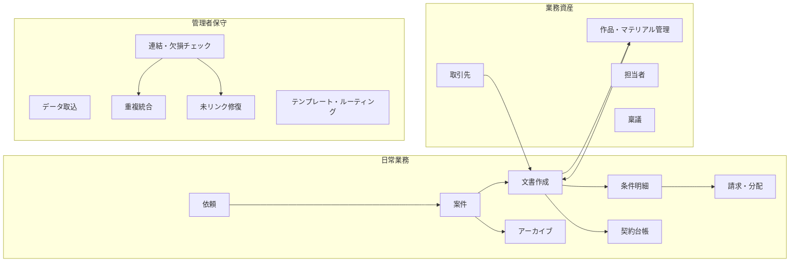
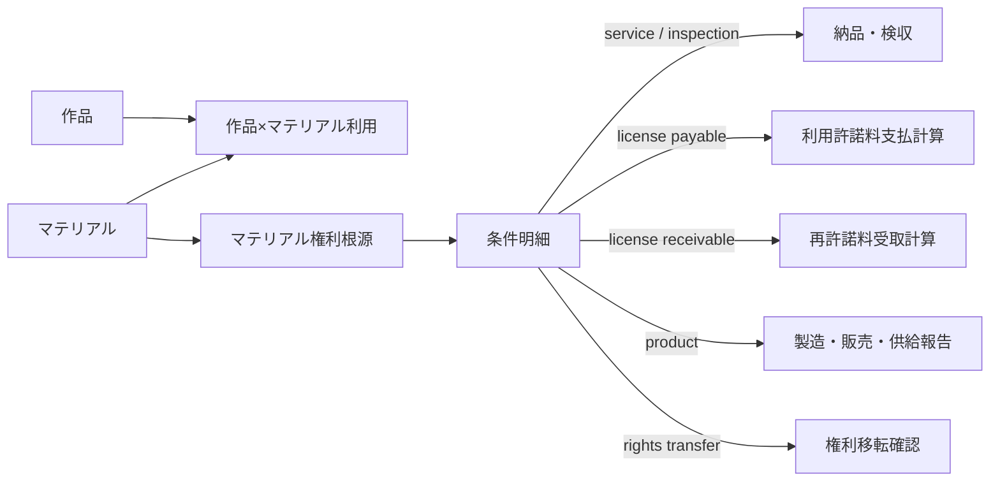
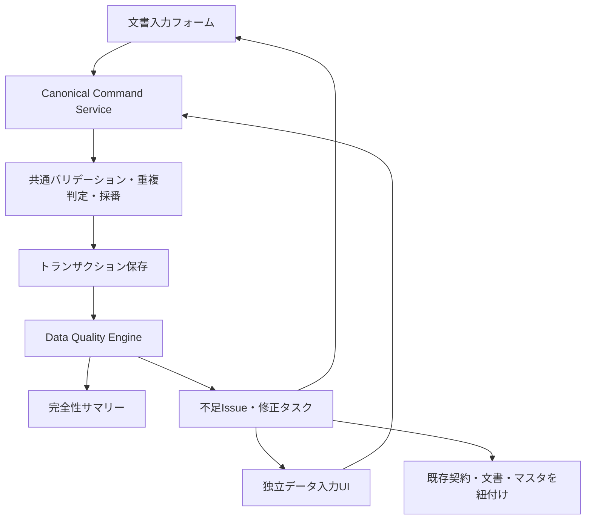

# LegalBridge AI UI・機能統合 修正設計書

**作品・マテリアル・作品系譜・権利根源・契約条件・請求分配・データ完全性・全フォームUI・検索基盤・レガシーコードの責務再編**

| 項目 | 内容 |
|---|---|
| 対象リポジトリ | `tatsuyakuramchi/LegalBridge_AI_GCP` |
| レビュー基準 | `main` / `22efb853c71c68894876f7cf261456528f2fd7c1` |
| 作成日 | 2026年7月18日 |
| 版 | Version 1.4 |
| 前提文書 | `docs/plans/legalbridge-remediation-plan-20260714.md` |
| 推奨配置先 | `docs/design/legalbridge-ui-function-consolidation-design-20260718.md` |
| 対象 | Admin UI、search-api検索ポータル、文書フォーム、独立データ入力UI、業務処理フォーム、作品・マテリアル・作品群・作品関係・権利根源・契約・条件・請求分配・データ完全性・保守画面、旧UI・旧ルート・重複API・不要コード |

> [!CAUTION]
> **CONFIDENTIAL / INTERNAL USE**  
> 本文書は、現行ソースコードに基づく画面・API・データ編集責務の再設計案である。画面削除は、後記の移行・撤去ゲートを満たした後に段階実施する。

## 目次

- [0. 本設計書の目的](#0-本設計書の目的)
- [1. エグゼクティブサマリー](#1-エグゼクティブサマリー)
- [2. 設計原則](#2-設計原則)
- [3. 現行機能の棚卸し](#3-現行機能の棚卸し)
- [4. 重複・責務衝突の詳細評価](#4-重複責務衝突の詳細評価)
- [5. 目標情報アーキテクチャ](#5-目標情報アーキテクチャ)
- [6. 作品管理の目標設計](#6-作品管理の目標設計)
- [7. マスター・台帳・保守の目標設計](#7-マスター台帳保守の目標設計)
- [8. データ完全性・不足アラート・入力経路設計](#8-データ完全性不足アラート入力経路設計)
- [9. 文書作成画面のUI修正設計](#9-文書作成画面のui修正設計)
- [10. Matter画面・一覧画面のUI修正設計](#10-matter画面一覧画面のui修正設計)
- [11. 全フォームUIリニューアル設計](#11-全フォームuiリニューアル設計)
- [12. 不要コード撤去・search-api検索再編](#12-不要コード撤去search-api検索再編)
- [13. ルート・コンポーネント統廃合表](#13-ルートコンポーネント統廃合表)
- [14. API・書込み責務の再編](#14-api書込み責務の再編)
- [15. 段階別実装計画](#15-段階別実装計画)
- [16. テスト・受入基準](#16-テスト受入基準)
- [17. GitHub Issue案](#17-github-issue案)
- [18. 撤去ゲート・完了定義](#18-撤去ゲート完了定義)
- [付録A. レビュー対象ファイル](#付録a-レビュー対象ファイル)

---

## 0. 本設計書の目的

本設計書は、前回の修正計画に基づき実装されたMatter中心化、文書フォーム3ペイン化、固定アクションバー、セクションナビ等を再評価するとともに、現在なお残る次の問題を解消するための詳細設計である。

1. **作品・原作・素材を同じAPIで編集する画面が複数存在し、原作という概念が作品・台帳・素材分類に重複している。**
2. **条件明細を文書フォーム以外から作成・更新する経路が残っている。**
3. **「マスター」の中に、参照データ、業務台帳、請求業務、修復ツールが混在している。**
4. **検索ポータルとAdmin UIの双方に編集UIが残っている。**
5. **画面上の情報量は増えたが、主操作・参照情報・例外操作の視覚階層が未整理である。**
6. **作品・マテリアル登録後に、作品系譜、権利根源、契約・条件・証憑、利用料名目が不足していても、利用者がその欠損を継続的に認識できない。**
7. **文書フォームでは新UI基盤への移行が進んでいる一方、作品・マテリアル・取引先・Finance・保守・旧ポータル等には個別Field、個別CSS、個別アクション配置が残り、システム全体の操作体系が統一されていない。**
8. **リニューアル後も旧コンポーネント、旧SSR編集画面、重複ルート、互換検索、未使用CSS・ヘルパが残存すると、誤った編集入口の復活、バンドル肥大化、検索結果の不整合、保守対象の二重化が継続する。**

本設計では、画面を単純に削除するのではなく、各機能を次の4種に分類し、正しい所属へ移す。

| 区分 | 定義 | 例 |
|---|---|---|
| **業務処理** | 案件を進めるための日常操作 | 文書作成、送信、検収、請求、分配 |
| **資産管理** | 作品・マテリアル・作品群・権利根源等の継続的な業務資産 | 作品管理、取引先、担当者 |
| **台帳** | 文書・契約・条件・支払等の確定済み事実の参照・状態管理 | 契約台帳、条件明細、アーカイブ |
| **保守** | 重複統合、未リンク修復、移行取込等の管理者作業 | ID統合、未リンクCL、レガシー移行 |

---

## 1. エグゼクティブサマリー

### 1.1 結論

現行実装は、データ重複防止APIや画面誘導バナーが追加され、以前より安全になっている。しかし、**重複を作りにくくしただけで、編集入口そのものはまだ一本化されていない**。

特に重要な衝突・完全性リスクは次の4点である。

> [!IMPORTANT]
> **最重要修正 1：条件明細の唯一の書込み口**  
> `condition_lines`の条件値、料率、MG・AG、地域・言語、期間等は、Document Editorまたは独立データ入力UIから共通Command Serviceへ登録する。作品管理・素材管理は、条件値を直接編集せず、条件書の作成・再編集、独立入力、参照リンクのいずれかへ誘導する。

> [!IMPORTANT]
> **最重要修正 2：作品管理の唯一の編集口**  
> 作品・作品群・作品関係・マテリアル・権利根源・製品・条件参照リンクは`/works`および`/works/:id`へ集約する。`WorkEntryPanel`、`WorkModelPanel`、`LedgersPanel`、`MaterialEntryPanel`、`WorkMaterialLinkPanel`を恒久的な編集入口として残さない。

> [!IMPORTANT]
> **最重要修正 3：作品起点のデータ完全性管理**  
> 作品・マテリアルを登録した時点で、作品群・派生元、権利根源、必要な契約、権利者、対象地域・言語、条件明細、利用料名目、元文書・証憑の不足を自動判定する。不足は一時的なtoastで終わらせず、永続的なデータ品質Issueとして保存し、「文書フォームから作成」「独立データ入力UIで登録」「既存契約を紐付け」の3つの修正導線を提示する。

> [!IMPORTANT]
> **最重要修正 4：「原作マテリアル」の廃止と権利根源の明示**  
> エンティティ名としての「原作マテリアル」は廃止し、すべて「マテリアル」に統一する。「原作」は独立マスターではなく、①作品間の派生元、②作品群・シリーズの源流、③マテリアルの権利根源、④利用許諾計算書の利用料名目として保持する。シリーズ源流と金銭支払の権利根源は別々に指定できるものとする。

> [!IMPORTANT]
> **最重要修正 5：編集可能な全フォームのUIリニューアル**  
> 文書作成フォームだけでなく、作品・マテリアル・作品群・作品関係・権利根源・取引先・担当者・稟議・検収・利用許諾計算・請求分配・インポート・重複統合・未リンク修復・各種モーダルを含むすべての編集UIを、共通フォームシェル、共通フィールド、共通バリデーション、データ完全性表示、固定アクションバーへ移行する。旧検索ポータルのサーバレンダリング編集フォームはread-only化またはAdmin UIへリダイレクトし、編集UIを残さない。

> [!IMPORTANT]
> **最重要修正 6：リニューアル完了と同時に旧コードを撤去し、search-apiを検索専用へ再編**  
> 新UIへの移行を「旧画面を残したままの追加実装」で終わらせない。利用ゼロ・書込みゼロ・参照ゼロを計測したうえで、旧DocumentFormフォールバック、ページ固有Field、旧作品・原作・素材画面、旧SSR編集フォーム、重複API、旧ナビ、不要CSS・ヘルパを物理削除する。search-apiは参照・検索・ダウンロードに責務を限定し、作品・シリーズ・作品関係・マテリアル・権利根源・契約・条件・データ品質を横断検索できる内容へ更新する。

### 1.2 目標構成



### 1.3 修正優先度

| 優先度 | テーマ | 主要内容 |
|---|---|---|
| **P0** | 書込み責務の固定 | 文書フォームと独立データ入力UIを正規入力経路とし、同一ドメインサービス・同一検証規則へ集約。Works・Material画面の直書きを停止 |
| **P0** | データ完全性基盤 | 作品起点の不足契約検知、永続アラート、完全性サマリー、修正キューを導入 |
| **P0** | 作品編集入口の一本化 | WorkEntry・WorkModel・MaterialEntry・WorkMaterialLinkの機能を`/works`へ統合 |
| **P0** | UI安全性 | 真のstickyアクションバー、Matterのみ下書き、真のreadonly、一覧アクセシビリティ修正 |
| **P0** | 全フォーム共通基盤 | AppFormShell、FormField、ValidationSummary、DataQualityAlert、StickyActionBarを実装し、新規個別Field/CSSを禁止 |
| **P1** | 情報アーキテクチャ再編 | 契約台帳・請求分配・データ保守をMasterから分離 |
| **P1** | レガシー撤去準備 | Ledgers/旧WorkModel/旧Vendor UIをread-only化し、移行計測とリダイレクトを導入 |
| **P1** | 画面密度改善 | 右パネル、上部コンテキスト、Matter詳細の重複表示を削減 |
| **P1** | 全フォーム移行 | 文書、資産・マスター、業務処理、Finance、保守、モーダルを波次移行し、旧DocumentFormフォールバックと旧HTML編集フォームを撤去 |
| **P1** | search-api検索再編 | 検索対象を新データモデルへ切替え、作品・契約・条件・取引先・データ品質の横断検索、権限別フィールド制御、統一レスポンスを実装 |
| **P1** | 不要コード撤去 | 旧画面・旧ルート・旧CSS・重複API・未使用依存を計測後に物理削除し、再導入防止CIを追加 |
| **P2** | デザインシステム | タイポグラフィ、ブレークポイント、Combobox、カード・色・余白の統一 |

---

## 2. 設計原則

### 2.1 一つのデータに一つの正規書込みサービス

| データ | 正規入力UI | 正規書込みサービス | 他画面で許容する操作 |
|---|---|---|---|
| Matter | Matter詳細 | Matter Service | 参照、Matterへのリンク |
| 文書・契約条件 | Document Editor／独立データ入力UI | Contract & Condition Command Service | 元文書を開く、条件を参照、関係をリンク |
| 作品・作品群・作品関係・マテリアル・権利根源・製品 | Works Workspace／独立データ入力UI | Work Asset Service | 検索、参照、文書作成へのコンテキスト引継ぎ |
| 取引先 | Admin UI 取引先／独立データ入力UI | Vendor Service | 検索ポータルでは検索・閲覧のみ |
| 担当者 | Admin UI 担当者 | Staff Service | 各フォームでは選択のみ |
| 契約状態 | 契約台帳／独立データ入力UI | Contract Command Service | 文書エディタでは契約本文・条件を編集 |
| 受領・分配実績 | 請求・分配 | Finance Service | Worksでは集計参照のみ |
| 重複・欠損 | Data Quality Center | Data Quality Service | 通常画面からは警告・修正導線を表示 |

正規入力経路は次の2つとする。**UIは2つ存在してよいが、書込みサービス、バリデーション、採番、重複判定、監査ログは共通化する。**

1. **文書入力フォーム**  
   契約書、発注書、条件書等の作成を通じて、文書・契約・条件・当事者・作品関係を登録する。元文書が存在する通常経路。
2. **独立データ入力UI**  
   既存締結書面の後追い登録、口頭・包括合意の整理、移行データ、文書化前の単独マスタ登録等を行う。元文書が無い場合は、登録理由・根拠・確認者・確認日を必須とする。

Works、Matter、契約台帳、検索ポータル等の表示画面が、独自にテーブルへ直接書き込むことは禁止する。作品群・作品関係・マテリアル権利根源もWork Asset Serviceを経由する。

### 2.2 マスター画面の定義を限定する

「マスター」は、頻繁に発生する案件処理ではなく、他の業務で選択・引用される比較的安定した参照データに限定する。

**マスターに残すもの**

- 取引先
- 担当者
- 稟議
- ルーティング規則
- 必要に応じて会社プロフィール・共通設定

**マスターから外すもの**

- 作品・作品群・作品関係・マテリアル・権利根源：独立した「作品管理」
- 契約：独立した「契約台帳」
- 請求・分配：独立した業務モジュール
- 条件明細：独立した業務台帳
- 重複統合・未リンク修復・一括移行：管理者保守
- Drafts：文書作成・保守の作業キュー

### 2.3 条件と関係リンクを区別する

- **条件値の作成・修正**：Document Editorまたは独立データ入力UI
- **作品・マテリアル・権利根源・製品への関係付け**：Works Workspaceまたは保守画面
- **条件の消化・受領・支払**：条件明細／請求分配

Works Workspaceで許可する`condition_lines`操作は、原則として次に限定する。

```text
GET    条件の一覧・権利ツリー表示
PATCH  source_work_id / source_material_id / product_id / counterparty_vendor_id 等の関係リンク
POST   component relation（既存条件行を作品へ結線）
DELETE component relation（作品との結線解除）
```

条件値、料率、MG・AG、期間、地域・言語、計算式の作成・更新は、次のいずれかのCommandを通す。

```text
Document Command      文書フォームから、文書と条件を同時登録
Standalone Data Command  独立UIから、文書なし又は外部文書参照付きで単独登録
```

WorksやMaterialの表示コンポーネントが、次の生APIを直接呼び出すことは禁止する。

```text
POST/PUT 条件値、料率、MG、AG、期間、地域、言語、計算式の作成・全置換
```

### 2.4 削除より先に導線と権限を止める

画面廃止は次の順で進める。

1. 正規画面を完成させる
2. 旧画面の新規作成を停止する
3. 旧画面をread-onlyにする
4. 旧URLを正規画面へリダイレクトする
5. アクセス・書込みがゼロであることを計測する
6. コンポーネント・API・DB互換を削除する

---

## 3. 現行機能の棚卸し

### 3.1 作品・原作・素材関連

| 現行画面 | 主な実体／API | 現在の機能 | 評価 |
|---|---|---|---|
| `/works` `WorksListPanel` | `/api/v3/works`, `/api/v3/source-ips` | 原作・自社作品の一覧、titleのみ新規作成 | **正規入口候補**。一覧APIは二系統をクライアント結合 |
| `/works/:id` `WorkGraphPanel` | graph, works, source-ips, materials, products, condition-lines | 3カード表示、作品編集、素材・製品追加、関係リンク、条件編集 | **責務過多**。条件値直接編集が設計原則と衝突 |
| `/master/work-entry` | 同じv3 works/source-ips API | 原作・作品の検索、新規、編集、削除 | `/works`と完全重複 |
| `/master/work-model` | v3 source-ips/works/contracts | 原作・作品・契約CRUD、CSV、派生ツリー | WorksとContractsの複合重複 |
| `/master/ledgers` | `ledgers`, `materials` | 旧原作・旧素材CRUD | レガシー移行専用に限定すべき |
| `/master/materials` | `work_materials`, condition-lines | 素材CRUD、条件値作成・全置換、文書引継ぎ | Works・Document Editorと重複・衝突 |
| `/master/work-material-link` | component-lines, graph | 作品とマテリアルの結線・解除 | WorkGraph内の関係編集と重複 |
| `/master/pub-license` | work/material/vendor + Document Editor prefill | 対象出版物作成、出版条件の二重入力、文書フォームへ遷移 | Document Editorの前置フォームとして重複 |
| `/master/sublicense-conditions` | work conditions | 再許諾条件の閲覧、文書フォーム起票 | 機能は有効だがMaster所属が不適切 |
| `/master/receivable-map` | receivable-map API | 作品別の上流分配・当社留保・下流受領表示 | Works/Financeに所属すべき |

### 3.2 契約・条件・請求関連

| 現行画面 | 現在の機能 | 評価 |
|---|---|---|
| `/master/contracts` | 契約検索、旧簡易登録、旧編集、状態変更、CloudSign、文書再編集 | 契約台帳として有効。ただし旧CRUDが残る |
| `/condition-lines` | 条件横断検索、検収待ち、消化・残高 | 独立業務台帳として維持 |
| `/master/sublicense-conditions` | 再許諾条件閲覧 | Worksの権利アウトまたは契約台帳へ統合 |
| `/master/billing` | 再許諾受領・上流分配・payment同期 | 日常の請求分配業務。Masterではない |
| `/master/billing-dashboard` | 全作品の請求・分配集計 | Financeのダッシュボード |
| `/master/pub-license` | 出版条件書作成前の重複入力 | 廃止しDocument Editorへ直接遷移 |

### 3.3 管理・修復関連

| 現行画面 | 現在の機能 | 目標所属 |
|---|---|---|
| `/master/bulk-import` | 原作・素材・契約・条件の一括upsert | データ保守／移行 |
| `/master/unlinked-conditions` | 未リンク条件を素材へ後付け | データ保守 |
| `/master/merge` | 作品・原作・案件・取引先・担当者・素材・依頼の統合 | データ保守 |
| `/master/drafts` | 文書下書きの掃除 | 文書作業キュー／データ保守 |
| `/data-linkage` | 整合性点検・修復 | データ保守の入口 |
| `/data-import` | 全テーブルCSV取込 | 管理者専用データ保守 |

### 3.4 検索ポータルとAdmin UI

| 対象 | Admin UI | search-apiポータル | 問題 |
|---|---|---|---|
| 取引先 | `/master/vendors` CRUD | `/master/vendors`にもCRUD・CSVが残る | 物理的な編集入口が二つ |
| 作品 | `/works` CRUD | `/work-model`検索表示 | 検索と編集の役割を明示すれば共存可能 |
| 契約 | 契約台帳 | 検索ポータル | ポータルはread-only、Adminは状態管理とすべき |

---

## 4. 重複・責務衝突の詳細評価

### 4.1 原作・作品CRUDが少なくとも3系統存在する

同じ`/api/v3/works`および`/api/v3/source-ips`に対し、次の3画面が作成・編集機能を持つ。

- `WorksListPanel` + `WorkGraphPanel`
- `WorkEntryPanel`
- `WorkModelPanel`

さらに旧`LedgersPanel`が別の`ledgers/materials`系を編集する。

#### 問題

- 画面ごとに入力項目が異なり、一方で登録した値を他方が表示・編集できないことがある。
- 同名ガードは追加されているが、利用者がどの入口を使うべきか判断できない。
- 原作と作品のkind表現が`source`、`licensed_in`、`source_ip`等で揺れる。
- 新規登録時の初期値・必須項目・削除確認が画面ごとに異なる。

#### 改修

- 新規・編集は`/works`と`/works/:id`だけにする。
- `WORK_FIELDS`相当の定義を共通Schemaへ移し、一覧、詳細、API DTO、CSVテンプレートで共用する。
- `WorkEntryPanel`を削除する。
- `WorkModelPanel`の作品ツリー・派生元設定の有用部分だけをWorksへ移植し、画面自体を削除する。
- `LedgersPanel`は移行結果の照合画面へ縮退し、通常編集を禁止する。

### 4.2 WorkGraphPanelが巨大な複合エディタになっている

`WorkGraphPanel`は、次の責務を一コンポーネント内に持つ。

- 作品基本情報
- 原作作成・リンク
- 素材作成
- 製品作成
- 取引先リンク
- 条件書の検索・結線
- 条件値の編集
- V3ライセンスマトリクス保存
- 原作別利用作品の逆引き
- マテリアル別条件ツリー
- 権利ツリー

#### 問題

- 状態変数が多数存在し、表示モードごとの副作用が複雑になる。
- 条件書を唯一の真実源とする設計と、ライセンスマトリクスの直接保存が衝突する。
- 読取りビュー、マスター編集、契約条件編集、関係修復が同一画面に混在する。

#### 改修

`WorkGraphPanel`を次の独立コンポーネントに分割する。

```text
WorkWorkspacePage
├─ WorkOverviewTab
├─ WorkSourceMaterialsTab
├─ WorkProductsTab
├─ WorkRightsTab
├─ WorkFinanceTab
├─ WorkDocumentsTab
└─ WorkAdminTab
```

`WorkRightsTab`では条件値を編集せず、次だけを行う。

- 権利ツリー表示
- 出所文書を開く
- 条件書を新規起票
- 既存条件を原作／素材／製品／取引先へリンク
- 未リンク状態を警告し、保守画面へ誘導

### 4.3 MaterialEntryPanelが素材マスターと条件書を同時に作る

`MaterialEntryPanel`は、素材属性のCRUDに加えて、条件行の作成・全置換、条件書番号の発行、PDF有無の分岐を持つ。

#### 問題

- 素材マスターの編集と契約条件の編集が不可分になっている。
- PDFありではDocument Editorへ遷移する一方、PDFなしでは画面自身が条件を作るため、同一業務に二つの保存経路がある。
- 条件書本文と条件行の整合性が、選んだ経路によって変わる。

#### 改修

- 素材属性のCRUDはWorksの「素材」タブへ移す。
- 条件値入力、`postConditions`、`putConditions`、V3固定条件行編集を撤去する。
- 素材ごとに次のCTAを表示する。

```text
［個別利用許諾条件書を作成］
［出版等利用許諾条件書を作成］
［既存条件書をリンク］
［条件書を開く］
```

- Document EditorにはID中心で引き継ぐ。

```json
{
  "work_id": 123,
  "material_id": 456,
  "vendor_id": 789,
  "matter_id": 101
}
```

画面間で日本語formData一式を`sessionStorage`へ複製する方式は段階的に縮小し、Document EditorがIDから最新マスターを解決する。

### 4.4 WorkMaterialLinkPanelはWorks内の関係編集と重複する

専用画面の結線・解除APIは有用であるが、業務上は特定作品を開いた状態で行う操作である。

#### 改修

- APIは維持する。
- UIを`WorkSourceMaterialsTab`に統合する。
- 大量結線や修復用途だけは、データ保守画面に「一括結線」として残す。
- `/master/work-material-link`は`/works?focus=source-material-link`へリダイレクトする。

### 4.5 PubLicenseEntryPanelはDocument Editorの前置きフォームになっている

現在は、出版条件を一度Master画面で入力し、同内容をDocument Editorへprefillして再確認する。

#### 問題

- 許諾者、日付、地域、言語、紙・電子料率等が二つの画面に存在する。
- フィールド追加・必須判定を両方で同期する必要がある。
- 利用者は「Masterに保存されたのか」「文書が作成されたのか」を理解しにくい。

#### 改修

- `/master/pub-license`を廃止する。
- Worksの素材行に「出版条件書を作成」を置く。
- Document Editorを直接開き、原作ID・素材ID・許諾者候補だけを引き継ぐ。
- 紙・電子料率等の入力はDocument Editor内で一度だけ行う。

### 4.6 契約台帳に旧簡易登録・旧編集が残る

`ContractsPanel`は、契約台帳として必要な検索、状態更新、原本参照、CloudSign、文書再編集を持つ一方、旧簡易登録・旧フォーム編集・削除も残る。

#### 改修

- 画面名を「契約台帳」へ変更し、トップレベル`/contracts`へ移す。
- 新規登録はDocument Editorのみ。
- 本文・条件・当事者の修正は元文書の再編集のみ。
- 台帳上で許可するインライン変更は、契約状態、有効／無効、運用担当、アラート等の**台帳メタ情報**に限定する。
- `簡易登録（旧フォーム）`と旧詳細編集を削除する。
- 物理削除は通常UIから外し、保守画面で参照プレビュー付きにする。

### 4.7 再許諾条件・分配マップ・請求分配はMasterではない

- 再許諾条件一覧：作品・契約の権利アウト参照
- 分配マップ：作品別の収益・上流分配分析
- 請求・分配：受領・分配実績の入力
- 請求ダッシュボード：全作品の業務監視

これらは参照マスターではなく、日常の権利・金銭業務である。

#### 改修

```text
/finance
├─ dashboard        請求・分配ダッシュボード
├─ receipts         受領・分配入力
├─ distribution     分配マップ
└─ statements       計算書・支払関連文書
```

Worksの「収益・分配」タブには作品別サマリーを表示し、詳細操作は`/finance`へ遷移する。

### 4.8 保守画面が通常のMasterタブに露出している

`BulkImportPanel`、`UnlinkedConditionsPanel`、`EntityMergePanel`は、誤操作時の影響が大きく、通常利用者が日常的に開く画面ではない。

#### 改修

```text
/data-maintenance
├─ overview
├─ imports
├─ unlinked-conditions
├─ duplicates
├─ merge
├─ drafts
├─ pending-pdf
└─ migration-status
```

- adminロールのみ表示・操作可能とする。
- 連結チェックの検出結果から該当保守画面へdeep-linkする。
- 一括取込は「マスター取込」と「レガシー移行」を分離する。
- 全書込みでdry-run、差分プレビュー、実行者、実行日時、undo可否を表示する。

### 4.9 取引先UIが物理的には二重のまま

検索ポータル側の旧`/master/vendors`は、誘導バナーが追加された一方、追加・編集・削除・CSV取込ボタンが残っている。

#### 改修

- search-api `/search/vendor`：検索・閲覧のみ。
- Admin UI `/master/vendors`：唯一のCRUD。
- search-api旧`/master/vendors`：adminの場合はAdmin UIへ302、viewerの場合は`/search/vendor`へ302。
- CSV取込は`/data-maintenance/imports?entity=vendor`へ移す。
- APIの旧書込み経路は利用メトリクスを取得後に削除する。

---

## 5. 目標情報アーキテクチャ

### 5.1 サイドバー

```text
概要
  ダッシュボード

業務
  依頼
  案件
  文書作成
  条件明細
  契約台帳
  請求・分配
  アーカイブ

資産
  作品管理
  取引先
  担当者
  稟議

管理（adminのみ）
  データ保守
  テンプレート
  ルーティング
  システム設定

外部検索
  検索ポータル
```

### 5.2 画面責務

| モジュール | 主語 | 主要操作 |
|---|---|---|
| 依頼 | 外部・事業部からのRequest | 受付、Matter化、重複整理 |
| 案件 | 一連の法務業務 | 次アクション、期限、文書、送信、完了 |
| 文書作成 | 発行・登録する書面 | 本文・条件の作成、PDF、DB、Drive |
| 条件明細 | 契約条件と履行状態 | 横断検索、検収、残高、実績 |
| 契約台帳 | 法的関係の確定状態 | 状態、期間、原本、署名、関連文書 |
| 請求・分配 | 金銭実績 | 受領、分配、支払・入金同期 |
| 作品管理 | 原作・作品・素材・製品 | マスター属性、系譜、関係リンク、文書起票 |
| データ保守 | データ品質 | 移行、重複統合、未リンク修復、欠損修復 |

### 5.3 MasterLayoutの再編

MasterLayoutの横スクロールする多数タブは廃止する。`/master`は参照マスターのランディング画面とし、4カード程度に限定する。

```text
マスター
├─ 取引先
├─ 担当者
├─ 稟議
└─ ルーティング
```

CSV取込やID統合をMasterヘッダーに常設しない。対象画面ごとの「その他」またはデータ保守へ移す。

---

## 6. 作品管理の目標設計

### 6.1 用語・概念の確定

本設計では、**「原作」を独立したマスターまたは作品種別として保持しない。**

正準エンティティは次のとおりとする。

| エンティティ | 意味 |
|---|---|
| `works` | 市場・契約・制作上、一つのタイトルまたは制作物として識別する作品 |
| `work_families` | シリーズ、フランチャイズ、世界観、版グループ等の作品群 |
| `work_relations` | 続編、番外編、翻訳、改訂、翻案等の作品間関係 |
| `materials` | 作品を構成し、権利・経済条件を個別管理する単位 |
| `work_material_usages` | 作品がどのマテリアルを利用するかを示すN:N関係 |
| `material_rights_sources` | マテリアルの権利が、どの作品・作品群・権利者・契約に由来するかを示す権利根源 |
| `condition_lines` | 権利根源に基づく支払・受取・検収・利用許諾計算等の条件 |

「原作」という語は、次の4つの**役割または表示名称**として残す。

1. 作品関係の派生元
2. シリーズ・作品群の代表作品または源流作品
3. マテリアルの権利根源となる作品
4. 利用許諾計算書に表示する「原作利用料」の名目

> [!IMPORTANT]
> **シリーズの源流と、利用料支払の権利根源は同一とは限らない。**  
> 例えば「〇〇2」は「〇〇」の続編であっても、利用するキャラクター素材の権利根源が別作品「△△」である場合がある。このため、作品系譜とマテリアル権利根源を別テーブルで保持する。

### 6.2 作品群・シリーズ

「〇〇」「〇〇2」「〇〇番外編」等を同じまとまりとして表示するため、作品群を持つ。

```text
〇〇シリーズ
├─ 〇〇
├─ 〇〇2
├─ 〇〇番外編
└─ 〇〇 海外版
```

推奨テーブル：

```sql
work_families (
  id,
  family_code,
  family_name,
  family_type,
  representative_work_id,
  fee_subject_name,
  status,
  created_at,
  updated_at
)

work_family_members (
  family_id,
  work_id,
  member_role,
  sort_order,
  is_primary
)
```

`family_type`：

```text
series
franchise
universe
edition_group
translation_group
```

`representative_work_id`はUI上の「シリーズ源流」「代表作品」であり、金銭条件上の権利根源を自動的に意味しない。

### 6.3 作品間関係・派生作品

作品の具体的な派生関係は`work_relations`で表現する。

```sql
work_relations (
  id,
  source_work_id,
  derived_work_id,
  relation_type,
  is_primary,
  relation_note,
  created_at,
  updated_at
)
```

`relation_type`：

| 値 | 表示 |
|---|---|
| `sequel_of` | 続編 |
| `prequel_of` | 前日譚 |
| `spinoff_of` | 番外編 |
| `translation_of` | 翻訳 |
| `localization_of` | ローカライズ |
| `edition_of` | 改訂・版違い |
| `adaptation_of` | 翻案 |
| `remake_of` | リメイク |
| `expansion_of` | 拡張 |
| `title_change_of` | 改題 |

例：

```text
〇〇2        sequel_of       〇〇
〇〇番外編  spinoff_of       〇〇
〇〇英語版  translation_of   〇〇
```

UIはツリー表示を提供するが、DB上は複数の関係を持てるグラフとする。`is_primary=true`の関係を主たる系譜としてツリー表示し、その他の関係は関連作品として併記する。

### 6.4 マテリアル

「原作マテリアル」の名称は廃止し、すべて`materials`へ統一する。

```sql
materials (
  id,
  material_code,
  material_name,
  material_type,
  material_role,
  ownership_origin,
  rights_status,
  default_rights_holder_vendor_id,
  is_royalty_bearing,
  status,
  created_at,
  updated_at
)
```

`material_role`：

```text
core_logic
sub_component
```

`material_type`例：

```text
rules
text
scenario
illustration
character
logo
music
translation
layout
game_design
other
```

`ownership_origin`：

```text
in_house
commissioned
licensed_in
acquired
jointly_created
unknown
```

`rights_status`：

```text
owned
licensed
assigned
joint
public_domain
unknown
```

作品とマテリアルは親子固定にせず、N:Nとする。

```sql
work_material_usages (
  id,
  work_id,
  material_id,
  usage_role,
  usage_scope,
  is_primary,
  created_at,
  updated_at
)
```

これにより、共通ロゴ、同一イラスト、共通ルール、キャラクター等を複数作品で再利用できる。

### 6.5 マテリアルの権利根源

マテリアルごとに、利用権・著作権・支払義務の根源を登録する。

```sql
material_rights_sources (
  id,
  material_id,
  source_type,
  source_work_id,
  source_family_id,
  rights_holder_vendor_id,
  source_document_id,
  source_contract_id,
  source_role,
  fee_subject_type,
  fee_subject_name,
  fee_subject_suffix,
  is_primary,
  valid_from,
  valid_to,
  created_at,
  updated_at
)
```

`source_type`：

```text
work
work_family
direct_contract
company_owned
custom
```

`source_role`：

```text
original_work
underlying_work
character_source
design_source
system_source
shared_ip
other
```

1つのマテリアルに複数の権利根源がある場合を許容する。ただし、同一期間・同一用途について`is_primary=true`となる権利根源は原則1件とする。

### 6.6 利用許諾計算書の利用料名目

利用許諾計算書では、対象製品名ではなく、契約上の権利根源名を利用料名目として引用できるようにする。

例：

```text
対象製品：〇〇2
使用マテリアル：〇〇コアロジック
権利根源作品：〇〇
利用料名目：『〇〇』原作利用料
```

名目の決定順序：

1. `condition_lines.fee_subject_override`
2. `material_rights_sources.fee_subject_name`＋`fee_subject_suffix`
3. 権利根源作品のタイトル＋「原作利用料」
4. 権利根源作品群の名称＋「利用料」
5. マテリアル名＋「利用料」

推奨フィールド：

```text
condition_lines.material_id
condition_lines.material_rights_source_id
condition_lines.fee_subject_override
condition_lines.fee_subject_snapshot
condition_lines.source_work_id        // 検索・互換用
condition_lines.source_family_id      // 検索・互換用
```

計算書発行時に解決した名目を`fee_subject_snapshot`へ保存する。作品名やシリーズ名を後日変更しても、過去の計算書の表示は変えない。

```ts
const feeSubject =
  conditionLine.feeSubjectOverride ??
  rightsSource.feeSubjectName ??
  (rightsSource.sourceWorkTitle ? `『${rightsSource.sourceWorkTitle}』原作利用料` : null) ??
  (rightsSource.sourceFamilyName ? `「${rightsSource.sourceFamilyName}」利用料` : null) ??
  `${material.materialName}利用料`
```

### 6.7 条件明細・後続処理との接続



条件明細は次のルーティング属性を持つ。

```text
direction
transaction_kind
payment_scheme
settlement_trigger
material_id
material_rights_source_id
counterparty_vendor_id
```

| 条件 | 後続処理 |
|---|---|
| `transaction_kind=service`かつ`settlement_trigger=inspection` | 検収待ち・検収書 |
| `transaction_kind=license`かつ`direction=payable` | 利用許諾計算書・支払 |
| `transaction_kind=license`かつ`direction=receivable` | 再許諾料計算・入金 |
| `transaction_kind=product` | 製造数・販売数・供給数報告 |
| `transaction_kind=rights_transfer` | 権利移転確認 |

### 6.8 一覧 `/works`

#### 機能

- すべての作品を単一のサーバサイド検索APIで取得
- 作品群、関係種別、事業部、状態、権利ポジション、更新日で絞込
- コード、タイトル、カナ、別名、シリーズ名、権利根源名で検索
- 一覧／カード／系譜表示切替
- 重複候補警告
- 新規作品・新規作品群
- マテリアル不足、権利根源不足、利用料名目不足等の完全性警告
- レガシー未移行件数の管理者向け表示

#### API

```http
GET /api/v3/works?q=&family_id=&relation_type=&rights_position=&division=&status=&page=&limit=
```

応答例：

```json
{
  "rows": [
    {
      "id": 123,
      "code": "W-2026-0015",
      "title": "〇〇2",
      "family_name": "〇〇シリーズ",
      "primary_source_work_title": "〇〇",
      "material_count": 3,
      "rights_source_count": 2,
      "payable_edge_count": 2,
      "receivable_edge_count": 0,
      "quality_issue_count": 1,
      "duplicate_candidate": false
    }
  ],
  "total": 1,
  "next_cursor": null
}
```

### 6.9 詳細 `/works/:id`

```text
[概要] [作品系譜] [マテリアル] [権利根源・条件] [製品] [収益・分配] [文書・履歴] [管理]
```

#### 概要

- コード、タイトル、カナ、別名
- 事業部、作品種別、状態、権利ポジション
- 所属作品群・代表作品
- 主たる派生元・派生種別
- 主要な警告と次に必要な文書

#### 作品系譜

- シリーズ・作品群
- 主たる派生元
- 続編・番外編・翻訳・改訂・翻案等の関係
- 派生元・派生先のツリー／グラフ表示
- 循環・孤児・重複関係の警告

#### マテリアル

- この作品が利用するマテリアル
- コアロジック／サブコンポーネント
- マテリアル属性CRUD
- 他作品での利用状況
- 権利根源・条件書・証憑の不足警告

#### 権利根源・条件

- マテリアルごとの権利根源作品・作品群・権利者
- 利用料名目のプレビュー
- 上流支払／下流受取の権利ツリー
- 条件は読み取り表示
- 出所文書へのリンク
- 条件書作成／再編集
- 未リンク、地域重複、親条件未設定、主要権利根源重複等の警告

#### 製品

- SKU・製品属性CRUD
- 対象作品・使用マテリアル
- 外部ライセンス先・販売先との関係表示

#### 収益・分配

- 作品単位の受領、分配、留保サマリー
- 利用料名目別・権利根源別集計
- 期間フィルタ
- 詳細はFinanceへ遷移

#### 文書・履歴

- 対象作品・マテリアル・権利根源・製品に紐づく文書
- 発行日、版、状態、Drive、Matter
- 条件リンク変更、系譜変更、統合、名称変更の監査履歴

#### 管理

- 重複統合候補
- 無効化
- 削除影響プレビュー
- レガシーID対応
- adminのみ表示

### 6.10 Works内で禁止する操作

- 金銭条件の新規作成・全置換
- 文書の存在しない条件書番号の自動発番
- 料率・MG・AG・地域・言語をWorksだけで更新
- 利用料名目の過去スナップショットの上書き
- 通常利用者による強制削除

### 6.11 可視化ビュー

3カード表示はページ全体ではなく、権利・経済関係を理解するための可視化として残す。

- 左：権利根源作品・作品群、マテリアル、上流条件
- 中：対象作品、派生作品、製品
- 右：外部ライセンス先・販売先、下流条件

作品系譜は別途、シリーズ／派生ツリーとして表示する。編集はカード内へ大量のフォームを埋め込まず、対象エンティティのDrawerまたはタブ内編集へ遷移する。

### 6.12 移行方針

| 現行 | 移行後 |
|---|---|
| `works` | `works`へ維持・属性補強 |
| `source_ips` | `works`へ統合。外部作品は`work_origin=external`、`rights_position=licensed_in` |
| `ledgers` | タイトル単位は`works`、シリーズ名は`work_families`、汎用権利名は`material_rights_sources.custom`へ分類移行 |
| `work_materials` / `materials` | 正準名`materials`へ統一。段階的にVIEW／API互換後、物理名称を統合 |
| `parent_work_id` | `work_relations`の主関係へ移行 |
| 原作マスター | 廃止。作品一覧の「外部作品」「権利根源」フィルターへ置換 |
| 原作マテリアル | 名称廃止。すべて「マテリアル」へ変更 |
| 原作名 | `work_relations`、`work_families`、`material_rights_sources`から用途別に解決 |

## 7. マスター・台帳・保守の目標設計

### 7.1 取引先

- Admin UIを唯一のCRUDとする。
- 検索ポータルはread-only。
- 法人番号・正規化名・別名による重複候補を保存前に表示する。
- 重複候補がある場合は「既存を選択」「差分比較」「別物として作成（理由必須）」を表示する。
- CSV取込はデータ保守へ移す。

### 7.2 担当者

- StaffPanelを維持する。
- Slack ID、メール、部署、在籍状態を正規属性とする。
- `created_by`等の文字列参照を将来的にstaff IDへ移行する。
- 重複統合はデータ保守から実行する。

### 7.3 契約台帳

```text
/contracts
├─ 一覧・検索
├─ 契約詳細
├─ 原本文書・版履歴
├─ 当事者・期間・状態
├─ 条件サマリー
├─ 送信・署名履歴
└─ 関連Matter・作品
```

- 新規作成ボタンはDocument Editorを開く。
- 編集ボタンは元文書の再編集を開く。
- 台帳メタ情報の軽微なPATCHのみ許可する。
- 旧簡易登録、旧フォーム編集、通常削除を撤去する。

### 7.4 請求・分配

- Masterから切り離し、業務メニューに置く。
- `BillingTablePanel`と`BillingDashboardPanel`を同一モジュールへ統合する。
- 作品別サマリーはWorksに埋め込む。
- 受領・分配の入力はFinanceが正規入口。

### 7.5 データ保守

- admin専用
- すべての破壊的操作に差分プレビュー
- 監査ログと実行者
- 可能な操作はundo
- レガシー移行状況を可視化

---

## 8. データ完全性・不足アラート・入力経路設計

### 8.1 目的

LegalBridgeのデータベースは、単にレコードが存在するだけでなく、業務判断に必要な関係がつながっている状態を「完全」と定義する。

特に作品・マテリアル登録では、次の状態を防止する。

- 作品は登録されているが、所属作品群・主たる派生元・作品関係が不足している
- マテリアルは登録されているが、権利根源となる作品・作品群・権利者が未設定
- 作品が外部権利マテリアルを利用しているが、対応する契約・条件書・証憑へ結線されていない
- 利用許諾計算の対象であるが、「原作利用料」等の利用料名目を解決できない
- ライセンスアウト・出版・プロダクトアウトを行っているが、受取条件、地域・言語、相手方が不足
- 契約は存在するが、対象作品・素材・当事者・期間・金銭条件のいずれかが未リンク
- 独立UIから登録されたデータについて、根拠・確認者・確認日が残っていない

完全性判定は、保存をすべて拒否するためのものではない。下書き・準備段階では不足を許容しつつ、公開、発注、締結、利用開始、請求・分配等の重要な状態遷移で必要条件を強制する。

### 8.2 正規入力経路



#### 文書入力フォーム

- 文書、契約、条件、当事者、作品・素材関係を一つの処理として保存する。
- 文書番号、元ファイル、Matter、外部依頼等の証跡を自動保持する。
- 契約内容の正規入力経路として優先する。

#### 独立データ入力UI

- 文書を新規作成せず、既存事実・単独データを登録する。
- 使用例：
  - 既存締結書面を後追いでDB化
  - 口頭・包括合意を整理
  - 作品、作品群、作品関係、マテリアル、権利根源、取引先等の単独登録
  - 外部システムから移行した契約情報
  - 元文書は存在するが、LegalBridgeでPDFを生成しない登録
- Document Editorの「DB登録のみ」を隠し機能として残すのではなく、独立した正規UIとして明示する。
- 契約・条件を登録する場合は、元文書、外部URL、登録理由、根拠メモ、確認者、確認日のいずれかを必須とする。

### 8.3 入力元・証憑の保持

各主要エンティティには、入力経路と根拠を追跡できるようにする。

```text
origin_type:
  document_form
  standalone_ui
  import
  migration
  repair

source_document_id
source_file_id
source_url
source_matter_id
source_external_request_id
entered_by
entered_at
verified_by
verified_at
evidence_type
evidence_note
```

一つの作品・契約・条件に複数の根拠が存在し得るため、推奨モデルは共通中間表である。

```sql
entity_sources (
  id,
  entity_type,
  entity_id,
  origin_type,
  source_document_id,
  source_file_id,
  source_url,
  source_matter_id,
  evidence_type,
  evidence_note,
  entered_by,
  entered_at,
  verified_by,
  verified_at,
  is_primary
)
```

### 8.4 データ完全性ルールエンジン

ルールはフロントエンドへ直書きせず、サーバ側で定義・評価する。

```text
data_quality_rules
  rule_code
  entity_type
  stage
  severity
  predicate/version
  remediation_type
  is_active

data_quality_issues
  entity_type / entity_id
  rule_code
  severity
  status
  detected_at
  last_detected_at
  resolved_at
  assignee_staff_id
  due_at
  resolution_type
  resolution_note

entity_completeness_summary
  entity_type / entity_id
  identity_status
  relationship_status
  contract_status
  financial_status
  evidence_status
  blocker_count
  error_count
  warning_count
  score
  evaluated_at
```

評価タイミング：

1. 文書フォーム保存後
2. 独立UI保存後
3. 作品・素材・契約・条件のリンク変更後
4. Matter工程または作品ステータス変更前
5. 夜間または定期の全件再スキャン
6. migration・import・merge・repair完了後

### 8.5 アラートの重大度

| 重大度 | 意味 | UI挙動 |
|---|---|---|
| **BLOCKER** | その状態遷移や金銭処理を許可できない | 保存は可能な場合があるが、公開・締結・請求等をブロック |
| **ERROR** | データ関係が不完全で、早期是正が必要 | 永続バナー、一覧Badge、担当・期限付きIssue |
| **WARNING** | 現段階では許容されるが将来必要 | 黄色表示、次工程前の解消を促す |
| **INFO** | 推奨情報や補足 | 折りたたみ表示、スコアには軽く反映 |

アラートはtoastだけで終了させない。`data_quality_issues`へ保存し、解消後の再評価で自動クローズする。

### 8.6 作品・マテリアル起点の主要完全性ルール

| Rule | 対象 | 判定 | 初期重大度 | 修正導線 |
|---|---|---|---|---|
| `WORK-ID-001` | 全作品 | タイトル・種別・有効状態がある | BLOCKER | 作品基本情報を編集 |
| `WORK-FAM-001` | シリーズ作品 | 作品群またはシリーズ名がある | WARNING | 作品群へ追加／作品群を作成 |
| `WORK-REL-001` | 派生作品 | 主たる派生元と関係種別がある | ERROR | 派生元作品を選択 |
| `WORK-REL-002` | 作品関係 | 循環参照・自己参照がない | BLOCKER | 関係を修復 |
| `WORK-REL-003` | 作品関係 | 参照先が削除済み・孤児でない | BLOCKER | Data Maintenanceで修復 |
| `MAT-ID-001` | 全マテリアル | 名称、種別、コア／サブ区分がある | ERROR | マテリアルを編集 |
| `MAT-RGT-001` | 外部権利マテリアル | 主要な権利根源が1件以上ある | BLOCKER（利用開始時） | 権利根源を登録 |
| `MAT-RGT-002` | 外部権利マテリアル | 権利者取引先または権利者名称がある | ERROR | 取引先を選択／独立UIで登録 |
| `MAT-RGT-003` | 主要権利根源 | 同一期間・用途に主要権利根源が複数ない | ERROR | 主要設定を整理 |
| `MAT-DOC-001` | 外部権利マテリアル | 利用根拠となる契約・条件・証憑がある | ERROR | 条件書作成／独立契約登録／既存契約紐付け |
| `MAT-FEE-001` | 継続払い対象 | 利用料名目を解決できる | BLOCKER（計算書発行時） | 権利根源名目または条件上書きを設定 |
| `MAT-FEE-002` | 計算書発行済み条件 | `fee_subject_snapshot`が保存されている | BLOCKER | 計算書データを修復 |
| `WORK-MAT-001` | 制作・公開作品 | 1件以上の使用マテリアルが登録されている | ERROR | マテリアルを追加・紐付け |
| `WORK-MAT-002` | 外部権利利用作品 | 利用マテリアルごとに対応する支払条件が結線されている | BLOCKER（制作・利用開始時） | ライセンスイン条件を選択 |
| `WORK-MAT-003` | 発注・委託マテリアル | 発注書または権利取得根拠がある | ERROR | 発注書作成／既存発注書紐付け |
| `COND-ROUTE-001` | 全条件 | direction、transaction_kind、payment_scheme、settlement_triggerが整合する | BLOCKER（後続処理開始時） | 条件書または独立条件入力 |
| `COND-RGT-001` | マテリアル条件 | material_idとmaterial_rights_source_idがある | BLOCKER（利用開始時） | 権利根源を選択 |
| `COND-FIN-001` | royalty-bearing条件 | 料率・計算基礎・通貨がある | BLOCKER（計算開始時） | 条件書を補完 |
| `COND-SCOPE-001` | 許諾条件 | 地域・言語・期間が必要な類型では値がある | ERROR | 契約条件を補完 |
| `WORK-OUT-001` | ライセンスアウト等 | 相手方、対象製品・作品、受取条件がある | BLOCKER（請求開始時） | 再許諾条件書作成／独立登録 |
| `WORK-EVD-001` | 独立入力 | 元文書または登録理由・確認者・確認日がある | BLOCKER（検証済み化時） | 証憑を追加 |

### 8.7 ステータス・工程別の必須化

同じ不足でも、作品の段階によって重大度を変える。

| 作品・業務状態 | 必須となる完全性 |
|---|---|
| `planning` | タイトル、種別、担当、作品群・派生元候補。権利根源・契約不足はWARNING |
| `in_production` | 使用マテリアル、権利根源、権利者、取得根拠、発注・ライセンス契約。未設定はBLOCKER |
| `released` | 利用地域・言語・期間、クレジット、製品、適用条件。未設定はBLOCKER |
| ライセンスアウト開始 | 相手方、対象、受取条件、親ライセンスとの整合 |
| 請求・分配開始 | 料率、計算基礎、通貨、期間、親条件、入出金方向、利用料名目スナップショット |
| 完了・アーカイブ | 未解消BLOCKERが0。ERRORは権限者の理由付き例外のみ |

### 8.8 作品管理UIでの表示

#### 作品一覧

```text
W-2026-0012　〇〇ゲーム
制作中

データ完全性：72%
● 基本情報 完了
▲ 契約情報 2件不足
▲ マテリアル 1件未リンク
● 金銭条件 完了

［不足を修正］
```

一覧ではスコアだけでなく、最も重要な不足理由を表示する。

Badge例：

- `完全`
- `契約不足 2`
- `素材未リンク 1`
- `証憑未確認`
- `請求ブロック`

#### 作品詳細

ヘッダー直下に「データ完全性」カードを置く。

```text
データ完全性　72%　ERROR 2件・WARNING 1件

最優先
マテリアル「イラスト」に権利根源または利用根拠となる契約がありません。

［文書フォームで契約を作成］
［独立UIで契約データを登録］
［既存契約を紐付け］
［担当・期限を設定］
```

各タブにも不足件数を表示する。

```text
[基本情報 ✓] [作品系譜 !1] [マテリアル !1] [権利根源・契約 !2] [製品 ✓] [利用状況] [履歴]
```

### 8.9 文書フォーム・独立UIへの引継ぎ

アラートから入力画面を開く際は、対象をIDで引き継ぐ。

```text
/documents/new
  ?template=individual_license_terms
  &work_id=123
  &material_id=456
  &vendor_id=789
  &quality_issue_id=987
```

```text
/data-entry/contracts/new
  ?work_id=123
  &material_id=456
  &quality_issue_id=987
```

保存完了後は`quality_issue_id`を再評価し、解消した場合は元作品へ戻して解消表示する。

### 8.10 独立データ入力UI

推奨ルート：

```text
/data-entry
/data-entry/work
/data-entry/contract
/data-entry/condition
/data-entry/evidence
/data-entry/relation
```

トップ画面で「何を補完するか」を選択する。

```text
不足データを登録

○ 作品・作品群・作品関係・マテリアル・権利根源
○ 契約・当事者・期間
○ 金銭条件
○ 元文書・証憑
○ 作品と契約の紐付け
```

契約・条件の独立登録フォームでは次を必須化する。

- 対象作品・マテリアル・権利根源
- 当事者
- 契約類型
- 有効期間
- 地域・言語（該当する場合）
- 金銭条件（該当する場合）
- 入力根拠
- 元文書URLまたはファイル
- 元文書がない場合の理由
- 確認者・確認日
- 登録状態：`未検証`／`検証済み`

`未検証`で保存することは許可するが、請求・利用開始等ではBLOCKERとして扱う。

### 8.11 Data Quality Center

サイドバーの管理領域に「データ品質」を設ける。

```text
/data-quality
├─ 要対応
├─ 作品
├─ 契約
├─ 条件
├─ 証憑
├─ 孤児・未リンク
├─ 重複候補
└─ ルール・例外
```

一覧項目：

- 重大度
- 対象
- 不足内容
- 現在工程・作品状態
- 担当者
- 期限
- 検出日
- 入力元
- 修正ボタン

ダッシュボードには次を表示する。

- BLOCKER件数
- 契約不足作品
- 元文書なし条件
- 未検証の独立入力
- マテリアル未リンク
- 期限超過
- 前週比

### 8.12 DB制約・監査・例外処理

アプリケーションのアラートだけに依存せず、DBでも可能な範囲を強制する。

- 外部キーと孤児防止
- `direction`、`transaction_kind`、`payment_scheme`等のCHECK制約
- 正本・主証憑の部分UNIQUE
- 同一作品・素材・契約関係の重複防止
- Command Service内のトランザクション
- 保存後のData Quality再評価をoutbox/eventで保証
- 例外完了は権限者、理由、期限、監査ログを必須
- 例外は恒久的なルール無効化ではなく、対象Issue単位の期限付きwaiverとする
- ルールバージョンを保存し、過去判定を再現可能にする

---

## 9. 文書作成画面のUI修正設計

### 9.1 固定アクションバーを実際にsticky化する

現行の「固定アクションバー」は通常フロー内の`div`である。Editor Cardを縦flexにし、フォームだけをスクロールさせる。

```tsx
<Card className="flex h-[calc(100dvh-9rem)] min-h-0 flex-col">
  <EditorHeader />
  <div className="min-h-0 flex-1 overflow-y-auto">
    <EditorBody />
  </div>
  <div className="sticky bottom-0 z-30 border-t bg-background/95 backdrop-blur">
    <EditorActionBar />
  </div>
</Card>
```

### 9.2 Matterのみでも下書きを保存できるようにする

`selectedIssue`を必須識別子とせず、次の優先順位で下書きコンテキストを解決する。

```ts
const draftContext =
  selectedIssue
    ? { type: "external_request", key: selectedIssue }
    : matterContext?.id
      ? { type: "matter", key: String(matterContext.id) }
      : null
```

将来的には`document_drafts`に`matter_id`と`external_request_id`を明示保存する。

### 9.3 閲覧モードを真のreadonlyにする

- `pointer-events-none`だけで制御しない。
- `DocumentForm readOnly`を追加する。
- Inputは`readOnly`、Select・Checkbox・Buttonは`disabled`。
- コピー可能性を維持する。
- Tab移動で編集可能フィールドへ入らないことをテストする。

### 9.4 3ペインの表示条件を見直す

| 画面幅 | レイアウト |
|---|---|
| `< 1280px` | フォームのみ。セクション・案件情報はDrawer |
| `1280–1535px` | セクションナビ + フォーム |
| `>= 1536px` | セクションナビ + フォーム + 右パネル |

右パネルはstickyかつ折りたたみ可能とする。「集中モード」で左右パネルを閉じられるようにする。

### 9.5 重複情報を削る

**上部コンテキストに残す**

- Matter／Request
- 作成文書
- 取引先／担当者
- 請求方向

**右パネルに残す**

- 次アクション
- 現在工程・ブロッカー
- 親契約・関連文書
- 依頼原票
- 参照検索

**フッターに残す**

- エラー・警告
- 保存状態
- 主操作

必須未入力件数、Matterコード、案件を開くボタンを複数箇所に重複表示しない。

### 9.6 Schemaベースのバリデーション

DOM走査だけで必須判定を行わず、テンプレートSchemaからエラー・警告を返す。

```ts
type ValidationIssue = {
  level: "error" | "warning"
  sectionId: string
  fieldId?: string
  message: string
}
```

動的明細、成果物、FinancialConditionTable、地域・言語、親契約等を含める。

表示は「必須項目入力済み」ではなく次とする。

```text
作成可能　エラー 0件・警告 2件
```

### 9.7 セクションナビ

- `IntersectionObserver`で現在位置を表示する。
- Schemaからセクション一覧を生成する。
- 現在位置、完了、エラー、警告を区別する。
- キー入力ごとのDOM全走査を避ける。

### 9.8 主操作と発行設定を分離する

主操作：

```text
［下書き保存］［プレビュー］［文書を作成］
```

発行設定Popover／Sheet：

```text
保存方法：内部修正／再発行
付随文書：個人情報取得同意書
付随出力：会計Excel
```

例外・管理操作は別Sheetへ移す。

### 9.9 検索Input + NativeSelectをComboboxへ統一する

対象：

- テンプレート
- 取引先
- 担当者
- 作品・作品群・作品関係・マテリアル・権利根源
- 文書・契約

検索と選択を1コントロールにし、キーボード操作、候補の補足情報、最近使った項目を共通実装する。

---

## 10. Matter画面・一覧画面のUI修正設計

### 10.1 Matter詳細をタブ化する

```text
[概要] [文書・送信] [条件・履行] [ファイル] [履歴] [管理]
```

概要には次だけを表示する。

- 次アクション
- 担当・期限・工程
- ブロッカー
- 最新文書
- 最新アクティビティ

Backlog統合、Matter統合、削除は「管理」へ移す。

### 10.2 次アクションの視覚優先度

「次に行う操作」を最も大きく表示し、工程・担当・期限を補助情報とする。

```text
次に行う操作
発注書を受注者へ送付

担当：山田　期限：7月20日
工程：発注書作成
```

### 10.3 案件一覧のレスポンシブ化

- `xl`以上：現在の作業中心テーブル
- `md–xl`：2カラムカード
- `md`未満：1カラムカード

モバイルでは各値にラベルを付ける。行全体をbuttonにせず、詳細リンクと統合カートボタンを兄弟要素にする。

### 10.4 一覧のアクセシビリティ

- interactive elementのネストを禁止する。
- 行は`div`または`li`、詳細遷移は`Link`。
- 統合・スター・削除等は独立した`Button`。
- Enter・Space・Escapeの挙動をテストする。

### 10.5 デザインシステム

- 日本語本文と見出しはSansを基本とする。
- monoはコード、文書番号、日付、金額、IDに限定する。
- 10pxはBadge・補助IDだけに限定する。
- 色は状態意味に限定する。
  - 青：リンク・選択
  - 緑：完了・正常
  - 橙：要対応・警告
  - 赤：エラー・ブロック・破壊操作
- 外枠の多重化を避ける。
- 画面幅トークンを共通化する。


---

## 11. 全フォームUIリニューアル設計

### 11.1 対象範囲と完了状態

本リニューアルの対象は、**利用者が値を入力、選択、変更、確定、削除、統合または実行するすべての画面・モーダル・Drawer**である。文書フォームだけを新UIへ変更して完了とはしない。

| フォーム群 | 主な対象 | 目標状態 |
|---|---|---|
| 文書作成 | 全テンプレート、下書き、再編集、再発行、プレビュー設定 | 全テンプレートをSchema／共通フォーム基盤へ移行し、旧`DocumentForm`フォールバックを撤去 |
| 作品・権利資産 | 作品、作品群、作品関係、マテリアル、利用関係、権利根源 | WorkWorkspaceまたは独立入力UIで共通フォーム部品を使用 |
| 参照マスター | 取引先、担当者、稟議、ルーティング、会社プロフィール | 一覧・詳細・編集のレイアウト、検索選択、保存操作を統一 |
| 業務処理 | Matter、タスク、発注、納品、検収、利用許諾計算、送信 | 対象コンテキスト、処理条件、確認、完了結果を共通パターン化 |
| Finance | 受領、支払、分配、計算、会計出力 | 金額・期間・通貨・根拠条件・計算結果の表示と入力を統一 |
| データ保守 | 取込、未リンク修復、重複統合、ID統合、移行照合、Draft/PDF修復 | 通常編集と明確に区別した管理者向け処理フォームへ統一 |
| 補助UI | Dialog、Sheet、Drawer、インライン追加、確認画面 | 親画面と同じフィールド、検証、エラー、保存状態を使用 |
| 旧ポータル | search-apiのサーバレンダリング編集フォーム | viewer検索は維持し、編集はread-onlyまたはAdmin UIへリダイレクト |

「全フォームリニューアル済み」とは、単に色や角丸が揃った状態ではなく、次が成立した状態をいう。

1. 入力部品、ラベル、必須表示、説明、エラー、警告、保存状態、主操作の配置が共通化されている。
2. 同じエンティティの検索・選択・インライン作成が同じEntity Comboboxを使用する。
3. 文書フォームと独立入力UIが同じCommand Service、バリデーション、重複判定、監査ログを使用する。
4. データ完全性Issueが全フォームで同じ形式で表示され、修正対象フィールドへ移動できる。
5. 旧フォーム固有の`Field()`、生の入力CSS、画面ごとの保存フッターが残っていない。

### 11.2 共通フォームアーキテクチャ

```text
AppFormShell
├─ FormHeader
│   ├─ 画面名・対象名
│   ├─ 状態・権限・入力元
│   └─ 主要コンテキスト
├─ ContextSummary
│   ├─ Matter／文書／作品／取引先
│   └─ 元文書・証憑・関連データ
├─ ValidationSummary
├─ FormBody
│   ├─ SectionNavigation
│   ├─ FormSection
│   │   └─ FormField／EntityCombobox／LineEditor
│   └─ RelatedDataPanel
├─ DataQualityPanel
└─ StickyActionBar
    ├─ 保存状態
    ├─ 下書き／取消し
    ├─ プレビュー
    └─ 保存／確定／実行
```

共通基盤の推奨コンポーネントは次のとおりとする。

| コンポーネント | 責務 |
|---|---|
| `AppFormShell` | 最大幅、3ペイン、スクロール領域、レスポンシブ、readonly制御 |
| `FormHeader` | タイトル、対象コード、状態、入力元、権限、パンくず |
| `ContextSummary` | Matter、作品、取引先、元文書等の確定コンテキスト |
| `FormSection` | セクション見出し、説明、状態、折りたたみ、エラー件数 |
| `FormField` | ラベル、必須、説明、値、単位、エラー、警告、readonly |
| `EntityCombobox` | 取引先、担当者、作品、マテリアル、文書等の検索・選択・既存採用 |
| `LineEditor` | 明細、条件、成果物、料率等の行編集。行単位のエラーと並び替えを提供 |
| `ValidationSummary` | エラー・警告の集約と該当セクション／フィールドへのフォーカス |
| `DataQualityPanel` | 永続Issue、重大度、担当、期限、修正導線、waiver |
| `RelatedDataPanel` | 関連契約、条件、履歴、証憑、リンク済みデータ |
| `StickyActionBar` | 保存状態、主操作、二重送信防止、破壊操作との分離 |
| `DangerZone` | 削除、統合、強制確定、例外承認等を主操作から隔離 |

共通部品は視覚だけでなく、`aria-*`、フォーカス管理、エラー移動、保存中制御、二重送信防止、変更破棄確認まで内包する。

### 11.3 フォーム定義とカスタムUIの共存

全画面を単純なメタデータフォームに限定しない。標準フィールドはSchemaで定義し、複雑な明細・権利ツリー・計算表は共通フォームシェル内のカスタムセクションとして実装する。

```ts
type AppFormDefinition = {
  id: string
  entityType: string
  mode: "create" | "edit" | "readonly" | "execute"
  sections: AppFormSection[]
  validate: (value: unknown) => ValidationIssue[]
  dataQualityScope?: DataQualityScope
  commands: {
    saveDraft?: string
    save?: string
    execute?: string
    delete?: string
  }
}
```

禁止事項：

- 各ページ内で独自の`function Field()`を新設すること
- ラベル、必須記号、エラー表示をページ側で個別実装すること
- 保存ボタン、取消し、削除を各画面の任意位置へ配置すること
- 生の`<input>`、`<select>`、`retro-input`等を直接フォームへ追加すること。ただし共通primitive内部は除く
- toastだけで保存エラーやデータ不足を通知して画面上の状態を残さないこと

### 11.4 標準フィールド仕様

すべてのフィールドは次を同じ順序・意味で表示する。

```text
ラベル　必須／任意　状態Badge
説明・入力根拠
［入力コントロール　　　　　　　　　］ 単位
エラー／警告／DB引用元／最終確認情報
```

フィールド状態：

| 状態 | 表示 |
|---|---|
| required | 必須表示。未入力時はセクションとサマリーへエラー |
| recommended | 業務上推奨。未入力時は警告 |
| derived | DB・他フィールドから導出。導出元を表示 |
| referenced | 取引先・作品等から引用。引用元へのリンクを表示 |
| verified | 確認者・確認日時を表示 |
| incomplete | Data Quality Issueを表示し、修正方法を提示 |
| readOnly | 選択・入力不可だが、テキスト選択・コピーは可能 |

日付、金額、率、数量、通貨、期間、地域、言語、電話、メール、法人番号等は共通Formatter／Parserを使用する。画面ごとの文字列加工を禁止する。

### 11.5 3種類の標準レイアウト

#### A. 文書作成フォーム

```text
セクションナビ｜文書入力・明細｜案件・関連契約・完全性
　　　　　　　　　　　　固定アクションバー
```

- 文書本文の作成に必要な入力を中心にする。
- Matter、取引先、作品等は上部コンテキストで確定し、フォーム内の重複入力を減らす。
- 発行設定と例外操作を主入力から分離する。

#### B. 独立データ入力・マスターフォーム

```text
登録対象・入力元
基本属性
関係・根拠・証憑
完全性・重複候補
固定アクションバー
```

- 作品、マテリアル、権利根源、取引先等に使用する。
- 新規作成前に重複候補を表示する。
- 文書がない登録では、理由・根拠・確認者・確認期限を必須化する。

#### C. 業務処理・保守フォーム

```text
処理対象一覧｜選択対象・差分｜実行条件・影響
　　　　　　　　　確認・実行バー
```

- 検収、計算、分配、取込、統合、修復に使用する。
- 実行前に対象件数、変更内容、金額影響、不可逆性を表示する。
- 実行後は成功・失敗・スキップを行単位で返し、再実行可能にする。

### 11.6 データ完全性との統合

全フォームは保存前・保存後にData Quality Engineと連携する。

**保存前**

- そのフォームで解消可能なエラー・警告を表示する。
- 既存の未解消Issueが入力対象に関係する場合、該当セクションへ表示する。
- BLOCKERがある状態で確定・実行しようとした場合、理由と修正導線を示す。

**保存後**

- 再評価結果を即時表示する。
- 解消したIssue、残ったIssue、新しく検出したIssueを区別する。
- 文書フォーム、独立UI、インポートのどこから入力しても同じ評価結果となる。

フォームは`dataQualityScope`として、対象作品、マテリアル、権利根源、契約、条件、Matter等のIDをCommandへ渡す。

### 11.7 移行対象の具体化

#### 文書フォーム

- `SchemaDocumentForm`登録済みフォームは共通シェルへの適合を確認する。
- 旧`DocumentForm`で描画される全テンプレートをSchema化する。
- `FinancialConditionTable`、`LineItemTable`、成果物、当事者、地域・言語等を共通`LineEditor`／`FormField`仕様へ移行する。
- 再編集、readonly、プレビュー、再発行で同じフォーム定義を使用する。

#### 作品・マテリアル・権利資産

- `WorkEntryPanel`、`MaterialEntryPanel`等の独自`Field()`を撤去する。
- WorkWorkspaceと`/data-entry/work`が同じフィールド・検索・検証を使用する。
- 作品群、作品関係、マテリアル利用関係、権利根源は専用セクションとして実装する。

#### 取引先・担当者・稟議・設定

- 一覧右側の簡易編集、専用編集ページ、インライン追加の入力部品を統一する。
- 取引先の法人番号・住所・口座・連絡先はセクション化し、重複候補と引用先への影響を表示する。
- 旧ポータルの編集フォームは物理的に書込み不能とする。

#### 検収・利用許諾計算・請求分配

- 条件明細・元文書・対象期間・計算基礎・数量・率・通貨を共通コンテキストとして表示する。
- 計算結果だけでなく、入力根拠と差分を表示する。
- 検収・計算・支払・入金の完了操作は確認ステップを持つ。

#### Data Maintenance

- Import、Merge、Unlinked、Duplicate、Migration、Draft、Pending PDFを業務処理フォーム型へ統一する。
- dry-run、影響件数、差分、rollback可否、実行ログを標準化する。

### 11.8 段階移行と互換方針

1. **棚卸し**：編集可能ルート、Dialog、Drawer、インライン入力を`form_surface_id`付き台帳へ登録する。
2. **基盤導入**：既存フォームを包める`AppFormShell`と互換`LegacyFieldAdapter`を実装する。
3. **新規開発凍結**：新しい独自Field・旧CSS・旧保存フッターをCIで禁止する。
4. **波次移行**：文書 → 作品・権利資産 → 参照マスター → 業務処理 → Finance・保守の順で移行する。
5. **旧UI縮退**：旧画面をread-only化し、新画面へのdeep-linkを表示する。
6. **利用ゼロ確認**：アクセス・保存メトリクスが2リリース連続0件であることを確認する。
7. **物理撤去**：旧コンポーネント、旧CSS、旧ルート、互換Adapterを削除する。

旧UIと新UIが並行する期間も、両者が別々の保存ロジックを持つことは禁止する。互換画面は新Command Serviceを呼ぶか、read-onlyとする。

### 11.9 レスポンシブ・アクセシビリティ

- 390pxでも主操作、エラー、対象名が確認できる。
- 768px未満ではセクションナビと関連情報をDrawerへ移す。
- 1024pxでは2ペイン、1536px以上では3ペインを基本とする。
- 全フィールドをラベルと関連付け、エラーは`aria-describedby`で参照する。
- 最初のエラーへ移動でき、移動後にフォーカスが失われない。
- Dialogを閉じた時は起点ボタンへフォーカスを戻す。
- 色だけで必須、警告、エラー、選択状態を表さない。
- キーボードだけで検索、選択、行追加、並び替え以外の主要操作を完了できる。

### 11.10 UI品質ゲート

CIに次を追加する。

- `scripts/audit/form-surfaces.mjs`：全編集ルートとフォーム基盤利用状況を出力
- ページ配下の新規`function Field`／`const Field`を禁止
- 共通primitive外の新規生`input/select/textarea`を警告または失敗
- `retro-input`等の旧フォームクラスの増加をラチェットで禁止
- 全フォームのStory／スクリーンショットを主要幅でVisual Regression Test
- axe等によるアクセシビリティチェック
- 保存中の二重送信、未保存離脱、エラー時フォーカスのE2E

Visual Regressionの基準幅：

```text
1920 / 1536 / 1366 / 1024 / 768 / 390px
```

### 11.11 全フォームリニューアルのDefinition of Done

- 編集可能な全ルート、Dialog、Drawer、インライン入力がフォーム台帳へ登録されている。
- すべての登録済みフォームが`AppFormShell`または承認済み業務処理シェルを使用する。
- 旧`DocumentForm`フォールバックで描画されるテンプレートが0件である。
- ページ固有の`Field()`、保存フッター、必須表示、エラー表示が0件である。
- 旧検索ポータルに書込み可能なフォームが0件である。
- 文書フォームと独立入力UIが同じ入力部品・Command Service・Data Quality評価を使用する。
- 全フォームでreadonly、保存中、未保存、成功、エラー、警告、BLOCKERの表示が統一されている。
- 主要6画面幅のVisual Regression、キーボード操作、アクセシビリティテストが通る。
- 旧CSS・互換Adapter・旧ルートは利用ゼロ確認後に削除されている。

---

## 12. 不要コード撤去・search-api検索再編

### 12.1 目的

今回のリニューアルは、新UIを追加するだけでは完了としない。旧UIと新UIが併存すると、利用者が旧入口へ戻る、開発者が旧コンポーネントを再利用する、同じデータに異なる検証規則で書き込む、検索結果が旧概念と新概念で食い違う、という問題が再発する。

本章では、次の2つを同一の完了トラックとして扱う。

1. **不要コード・重複機能の段階的な物理削除**
2. **search-apiを新データモデルに基づく参照・検索専用サービスへ再編**

### 12.2 削除対象の分類

| 分類 | 主な対象 | 撤去条件 |
|---|---|---|
| 旧文書フォーム | 旧`DocumentForm`フォールバック、Schema未移行分岐、旧フィールドレンダラ | 全テンプレートSchema化、再編集・下書き・PDF生成E2E通過 |
| 画面固有フォーム部品 | 各ページ内`Field()`、生`input/select/textarea`、`retro-input`等のフォーム専用旧CSS | 共通`AppFormShell`・`FormField`移行、Visual Regression通過 |
| 旧作品・原作・素材UI | `WorkEntryPanel`、旧`WorkModelPanel`、`LedgersPanel`、`MaterialEntryPanel`、`WorkMaterialLinkPanel`、原作専用タブ | `/works`への機能統合、書込みゼロ、リダイレクト期間終了 |
| 旧Master編集UI | search-apiの`vendorMasterHtml`、`staffMasterHtml`等に残るCRUD・CSV編集操作 | Admin UIへの移行完了、search-api側read-only化、利用ゼロ |
| 条件の重複書込み | Works・Material・Sublicense・Publication画面の条件値直接POST/PUT | Document／Standalone Commandへの一本化、CIで直接書込みゼロ |
| 旧ルート・ナビ | `/api/v3/source-ips`の編集系、旧`/search/work`、旧Masterルート、重複メニュー | 互換アクセス計測ゼロ、正規URLへの恒久リダイレクト完了 |
| 旧検索射影 | `source_ip`前提、`kind='own'`限定、旧台帳・互換VIEW依存の検索 | works統合・新検索Projection稼働、件数照合完了 |
| 未使用コード | 未参照export、古いhooks、CSS、型、API client、feature flag、依存package | 静的解析・バンドル解析・E2E通過 |
| 互換DB項目 | `source_ips`相当の旧列、旧ledger識別子等 | データ移行・逆参照ゼロ・ロールバック期間終了後。migration履歴は削除しない |

> [!WARNING]
> migrationファイル、監査ログ、発行済み文書のスナップショット、過去データ再現に必要な列は「未使用に見える」だけで削除してはならない。実行コードの撤去と、履歴・証跡の保持を分けて判断する。

### 12.3 コード撤去の実施順序

```text
Inventory
  ↓
参照・書込み・アクセス計測
  ↓
旧機能をread-only／リダイレクト
  ↓
新UIのE2E・Visual Regression
  ↓
import／route／API参照をゼロ化
  ↓
コンポーネント・CSS・API・依存を削除
  ↓
バンドル・ルート・権限・データ件数を再照合
```

削除PRは、機能追加PRと分離する。原則として次の単位で作成する。

- UIコンポーネント・ルート撤去
- search-api SSR編集画面撤去
- API書込みルート撤去
- 旧検索Projection・互換読取り撤去
- CSS・依存package・未使用export撤去
- DB列・VIEW・関数撤去

### 12.4 撤去監査とCI

次の監査スクリプトを追加する。

```text
scripts/audit/form_ui_legacy_refs.sh
scripts/audit/deprecated_route_refs.sh
scripts/audit/direct_condition_writes.sh
scripts/audit/search_projection_refs.sh
scripts/audit/dead_exports.sh
```

CIゲートは次を満たさなければならない。

- 旧フォームコンポーネントのimportが0件
- 非許可コンポーネントから条件値POST／PUTが0件
- deprecated routeの新規参照が0件
- search-api SSR画面に編集フォーム要素が0件
- `source_ip`を新規ドメイン概念として追加するコードが0件
- 未使用export・未使用依存が基準値以下
- admin-uiの主要bundleがリニューアル前基準より不合理に増加していない
- `tsc`、lint、unit、E2E、Visual Regressionがすべて通過

### 12.5 search-apiの最終責務

search-apiは次に責務を限定する。

```text
検索
閲覧
絞り込み・並び替え
関連情報の横断表示
権限に応じたダウンロード
Admin UI／Matter／Document Viewerへの遷移
```

search-apiで禁止する操作は次のとおりである。

```text
マスターの新規登録・更新・削除
条件値・料率・期間・地域・言語の編集
作品・マテリアル・権利根源の編集
契約状態の手動更新
重複統合・未リンク修復
CSVによる本番データ更新
```

CSV取込、重複統合、修復等はAdmin UIのData Maintenanceへ移す。search-apiに残すCSVは、検索結果のエクスポート等のread-only出力だけとする。

### 12.6 検索情報アーキテクチャ

検索ポータルは、画面名をデータテーブル単位ではなく、利用目的単位に整理する。

| 検索 | 主な利用目的 | 主なデータ源 |
|---|---|---|
| 統合検索 | 名称・番号から対象を素早く特定 | works、vendors、documents、matters、condition_lines |
| 作品・権利検索 | シリーズ、派生元、使用素材、権利根源、利用条件を確認 | works、work_families、work_relations、materials、material_rights_sources |
| 取引先・契約検索 | 相手方に関する契約、文書、期限、状態を確認 | vendors、documents、contracts、matters |
| 条件・権利範囲検索 | 地域・言語・期間・料率・方向・消化状況を確認 | condition_lines、condition_line_regions、condition_line_languages |
| 支払・入金対象検索 | 検収、利用許諾計算、受領・分配の対象を確認 | condition_lines、inspection、royalty calculations、receipts |
| データ品質検索 | 不足、孤児、重複、未検証データを確認 | data_quality_issues、provenance、duplicate candidates |

### 12.7 作品検索の調整

現在の作品検索は自社作品に限定する前提を廃止し、`works`の全レコードを検索対象とする。検索結果で役割を区別する。

**検索対象**

- 作品名、よみ、別題、作品コード
- 作品群・シリーズ名
- 派生元作品名、続編・番外編・翻訳・改訂等の関係
- マテリアル名・コード・カテゴリ
- 権利根源作品名、権利根源シリーズ名
- 権利者・許諾者
- 利用料名目
- 関連文書番号・契約名

**フィルター**

```text
作品区分
作品群
関係種別
制作・公開ステータス
権利ポジション
権利根源の有無
契約の有無
完全性ステータス
データ品質重大度
担当部門
```

**結果表示**

```text
作品名・作品コード
作品群／シリーズ
派生元・関係種別
使用マテリアル件数
権利根源の要約
契約・条件件数
完全性スコア
重大アラート
```

「原作」という固定種別は表示フィルターから外し、必要な場面では「派生元」「シリーズ源流」「権利根源」の文脈ラベルとして表示する。

### 12.8 取引先・契約検索の調整

取引先と契約の検索は維持するが、取引先マスターの全項目を一律表示しない。検索結果のフィールドはロール・部署・利用目的に応じて制御する。

| 情報 | viewer | FIN viewer | admin |
|---|---:|---:|---:|
| 名称、コード、区分、別名 | 表示 | 表示 | 表示 |
| 契約一覧、文書番号、契約状態、期限 | 表示 | 表示 | 表示 |
| 代表住所、代表連絡先 | 業務上必要な範囲 | 表示 | 表示 |
| 法人番号、適格請求書情報、源泉区分 | 原則非表示 | 表示 | 表示 |
| 銀行口座、支払条件 | 非表示 | 権限付与時のみ | 表示 |
| 反社・与信詳細 | 非表示または結論のみ | 結論のみ | 詳細表示 |
| 個人のセンシティブ情報 | 非表示 | 必要最小限 | 権限・目的に応じて表示 |

契約検索には次を追加する。

- 文書番号、契約番号、Matterコード、Backlogキー
- 取引先名・別名
- 作品・マテリアル・作品群
- 契約種別、テンプレート種別、取引方向
- 締結日、発効日、終了日、更新期限、解約予告期限
- lifecycle stage、CloudSign状態
- 元文書の有無、入力元、検証状態
- 未解消データ品質Issue

### 12.9 条件検索の調整

条件検索は`condition_lines`を正本とし、次の軸で検索できるようにする。

```text
line_code／文書番号／条件名
作品／マテリアル／権利根源
相手方／権利者
payable／receivable／none
service／license／product／rights_transfer
lump_sum／royalty／per_unit／subscription／installment
inspection／usage_report／sales_report／effective_date／milestone
地域／言語
適用期間
active／void／expired
未検収／計算待ち／受領待ち／支払待ち
データ品質Issue
```

検索結果は条件値を直接編集させず、次のアクションだけを提供する。

- 元文書を開く
- Document Editorで再編集する
- 独立データ入力UIで根拠を補完する
- 作品・マテリアル・権利根源を確認する
- 検収／計算／受領処理へ進む
- データ品質Issueを開く

### 12.10 統一検索API

検索APIは、画面ごとの独自レスポンスをやめ、次の形へ統一する。

```ts
interface SearchResponse<T> {
  query: string
  total: number
  hits: T[]
  facets: Record<string, Array<{ value: string; count: number }>>
  next_cursor?: string
  applied_filters: Record<string, unknown>
}
```

推奨エンドポイントは次のとおりである。

```text
GET /api/search/unified
GET /api/search/works
GET /api/search/vendors
GET /api/search/contracts
GET /api/search/conditions
GET /api/search/data-quality
GET /api/search/suggestions
GET /api/search/facets
```

既存の`/api/v3/works/search`は互換期間中に新レスポンスへアダプトし、`source-ips`専用検索は廃止する。大量データではoffsetページングではなくcursorページングを優先する。

### 12.11 Search Projection

検索時に多数のテーブルを毎回深くJOINしないよう、検索専用Projectionを設ける。

```text
search_work_projection
search_vendor_projection
search_contract_projection
search_condition_projection
```

Projectionには、表示用要約、正規化済み検索文字列、権限区分、品質ステータス、更新日時を持たせる。

更新方法は次のとおりとする。

1. Command Serviceの保存完了後に対象Projectionを更新
2. 失敗時はoutboxへ積み、非同期で再実行
3. 夜間に全件再構築・件数照合
4. Projection遅延時は画面に最終更新時刻を表示

PostgreSQLでは、名称・別名・コードに正規化列と`pg_trgm`索引を付与し、完全一致、前方一致、部分一致の順位を統一する。検索語の表記揺れは、全角半角、空白、記号、英字大小、法人格の有無を正規化する。

### 12.12 検索結果UI

検索結果は、一覧で判断できる要約と、必要時に開く詳細を分ける。

```text
検索バー
フィルター／Facets
結果一覧
  ├─ 主名称・コード
  ├─ 種別・状態
  ├─ 主要関連情報
  ├─ 完全性・警告
  └─ 詳細展開
       ├─ 関連作品・契約・条件
       ├─ 元文書・Matter
       └─ 正規画面へのリンク
```

検索画面には編集フォームを埋め込まない。編集が必要な場合は、Admin UIの正規フォームを新しいタブまたは同一タブで開く。

### 12.13 検索監査・品質指標

検索品質は次の指標で評価する。

- 0件検索率
- 検索後のクリック率
- 検索語から目的レコード到達までの操作数
- 同一語の再検索率
- 検索結果から旧URLへ遷移した件数
- Projection更新遅延
- 権限で除外したフィールド・結果件数
- 検索結果と正本DBの件数差

検索ログにはセンシティブ情報を平文で長期保存しない。検索語、ユーザー、クリック先の保存期間・閲覧権限を定め、個人情報・契約秘密を含む検索語はマスキングまたは短期保持とする。

---

## 13. ルート・コンポーネント統廃合表

| 現行ルート／コンポーネント | 判定 | 目標 | 移行措置 |
|---|---|---|---|
| 全文書テンプレート／旧`DocumentForm` | **全面移行** | `SchemaDocumentForm` + `AppFormShell` | テンプレート単位でSchema化し、フォールバック利用数を0へ |
| 各画面固有`Field()`・`retro-input` | **撤去** | `FormField`・共通primitive | 互換Adapter経由で波次移行し、CIで新規追加を禁止 |
| 各種Dialog／Drawer内フォーム | **全面移行** | 共通フォームシェルのcompact variant | 保存・検証・フォーカス・Data Quality表示を共通化 |
| `/works` `WorksListPanel` | **改修・維持** | 作品管理の唯一の一覧 | 統一検索API、フィルタ、重複警告 |
| `/works/:id` `WorkGraphPanel` | **分割・改修** | WorkWorkspace | 条件値編集を撤去、タブ分割 |
| `/master/work-entry` | **削除** | `/works` | まずリダイレクト、アクセスゼロ後削除 |
| `/master/work-model` | **削除** | `/works`・`/contracts` | 作品ツリー等の有用機能を移植 |
| `/master/ledgers` | **移行専用→削除** | `/data-maintenance/migration-status` | 通常編集停止、件数照合、移行後削除 |
| `/master/materials` | **削除** | `/works/:id?tab=materials` | 条件直接書込みを先に停止 |
| `/master/work-material-link` | **統合・削除** | Worksマテリアルタブ | 一括修復は保守へ |
| `/master/pub-license` | **削除** | Document Editor | Works素材から直接起票 |
| `/master/sublicense-conditions` | **移動** | Works権利アウト／契約台帳 | read-only機能を統合 |
| `/master/receivable-map` | **移動** | Works収益タブ／Finance | deep-link互換を維持 |
| `/master/contracts` | **移動・改修** | `/contracts` | 旧簡易登録・旧編集を撤去 |
| `/master/billing` | **移動** | `/finance/receipts` | APIは維持 |
| `/master/billing-dashboard` | **移動** | `/finance/dashboard` | Worksから作品別deep-link |
| `/master/bulk-import` | **移動・分割** | `/data-maintenance/imports` | マスター取込と移行取込を分離 |
| `/master/unlinked-conditions` | **移動** | `/data-maintenance/unlinked-conditions` | adminのみ |
| `/master/merge` | **移動** | `/data-maintenance/merge` | DuplicateFinderからdeep-link |
| `/master/drafts` | **移動** | `/data-maintenance/drafts` | 文書キューとの統合検討 |
| `/data-linkage` | **改修** | `/data-quality` | 完全性・孤児・重複・未リンクを統合表示 |
| 新規 `/data-entry/*` | **新設** | 独立データ入力UI | 文書なし・外部文書参照付きの正規入力経路 |
| 新規 `/data-quality` | **新設** | Data Quality Center | 不足Issue、担当、期限、修正導線 |
| `/master/vendors` Admin UI | **維持** | 唯一の取引先CRUD | CSVは保守へ |
| search-api `/master/vendors` | **リダイレクト後削除** | Admin UI／検索ポータル | CRUDボタンを停止 |
| `/master/staff` | **維持** | 参照マスター | API・UI共通化 |
| `/master/ringi` | **維持** | 参照マスター | ラベル日本語統一 |
| `/master/rules` | **維持** | ルーティング設定 | adminのみ |

---

## 14. API・書込み責務の再編

### 14.1 フロントエンドからの条件書込み監査

CIで次を検出し、許可リスト以外の直接条件書込みを禁止する。

```text
POST /api/v3/**/condition-lines
PUT  /api/v3/**/conditions
POST /api/works/**/license-matrix
```

許可される呼出し元：

- workerのDocument生成Command
- 独立データ入力UIのStandalone Data Command
- 明示されたmigration/importジョブ
- 管理者向けレガシー移行機能（期限付き）

Admin UIのWorks・Master表示コンポーネントから生APIを直接呼ぶコードは0件をゲートとする。文書フォームと独立データ入力UIは共通Command Clientを使用する。

### 14.2 Work Asset API

```http
GET    /api/v3/works
GET    /api/v3/works/:id
POST   /api/v3/works
PATCH  /api/v3/works/:id

GET    /api/v3/work-families
POST   /api/v3/work-families
PATCH  /api/v3/work-families/:id
POST   /api/v3/work-families/:id/members
DELETE /api/v3/work-families/:id/members/:workId

GET    /api/v3/works/:id/relations
POST   /api/v3/works/:id/relations
PATCH  /api/v3/work-relations/:id
DELETE /api/v3/work-relations/:id

GET    /api/v3/materials
POST   /api/v3/materials
PATCH  /api/v3/materials/:id
GET    /api/v3/works/:id/material-usages
POST   /api/v3/works/:id/material-usages
DELETE /api/v3/works/:id/material-usages/:usageId

GET    /api/v3/materials/:id/rights-sources
POST   /api/v3/materials/:id/rights-sources
PATCH  /api/v3/material-rights-sources/:id
DELETE /api/v3/material-rights-sources/:id

GET    /api/v3/works/:id/rights-graph
PATCH  /api/v3/condition-lines/:id/graph-link
```

`source-ips`、`ledgers`、`work-materials`等の旧APIは内部互換として段階的に残してよいが、UIは`workAssetClient`だけを使用する。

保存時のドメイン制約：

- `work_relations`に自己参照・循環を作らない。
- `material_rights_sources`は同一用途・期間の主要行を原則1件とする。
- 外部権利マテリアルを利用開始状態へ進める場合、権利根源と根拠文書を要求する。
- 継続払い条件を作成する場合、利用料名目を解決可能にする。

### 14.3 Document Editorへのコンテキスト引継ぎ

URLまたは一時コンテキストAPIを用いる。

```http
/documents/new?template=individual_license_terms&work_id=123&material_id=456&rights_source_id=321&matter_id=789
```

大量の日本語キーを`sessionStorage`に保存する方式は互換用に限定する。

### 14.4 Data Quality API

```http
POST /api/data-quality/evaluate
GET  /api/data-quality/issues
GET  /api/data-quality/entities/:type/:id/summary
PATCH /api/data-quality/issues/:id
POST /api/data-quality/issues/:id/waive
POST /api/data-quality/rescan

POST /api/data-entry/contracts
POST /api/data-entry/conditions
POST /api/data-entry/evidence
POST /api/data-entry/relations
```

すべての正規Commandは保存後に評価イベントを発行する。Data Quality評価が一時的に失敗しても元データ保存を失敗させない場合は、outboxへ未処理イベントを残し、再実行で必ず追いつく設計とする。

### 14.5 旧API書込みの計測

各旧APIに次を付与する。

- route name
- caller UI
- authenticated user
- request ID
- write count
- last used at

2リリース連続で書込み0件になった後、410 Gone → 削除の順で撤去する。

---

## 15. 段階別実装計画

### 横断トラック R：全フォームUIリニューアル

| Wave | 対象 | 完了条件 |
|---|---|---|
| R0 | フォーム棚卸し・Visual baseline | 全編集surfaceにID、所有者、旧／新基盤、利用数を登録 |
| R1 | 共通基盤 | AppFormShell、FormField、ValidationSummary、DataQualityPanel、StickyActionBarを実装 |
| R2 | 全文書フォーム | 全テンプレートSchema化、旧DocumentFormフォールバック0件 |
| R3 | 作品・権利資産・参照マスター | Works、Material、Rights Source、Vendor、Staff、Ringiを移行 |
| R4 | 業務処理・Finance | Matter、検収、利用許諾計算、請求、受領、分配を移行 |
| R5 | Data Maintenance・補助UI | Import、Merge、Unlinked、Draft、Dialog、Drawerを移行 |
| R6 | 旧ポータル・旧CSS撤去 | 書込み0、利用ゼロ確認、旧フォーム・互換Adapterを物理削除 |

各Phaseの機能改修は、その対象フォームをRトラックの共通基盤へ同時移行する。新機能を旧フォーム基盤へ追加しない。

### Phase A：計測・ガード

- 現行作品・契約・条件の完全性ベースラインを集計
- Data Qualityルール台帳と重大度を確定
- 入力元・証憑の既存データ調査
- UIルート別アクセスログ
- 旧書込みAPIメトリクス
- 条件直接書込みCI監査
- feature flag追加
- 既存E2E基準保存
- 編集可能ルート、Dialog、Drawer、インライン入力のフォーム台帳作成
- 主要6画面幅のVisual Regression baseline保存
- 旧フォームクラス・独自Field・生inputの現状ラチェット作成

### Phase B：P0 UI安全修正・完全性基盤

- `data_quality_rules`・`data_quality_issues`・`entity_sources`を追加
- 作品一覧・詳細に完全性Badge／カードを追加
- 文書完了時・独立入力完了時の再評価を実装
- `/data-entry`と`/data-quality`の最小UIを追加
- stickyアクションバー
- Matterのみ下書き
- true readonly
- MattersListのinteractive nesting修正
- Schemaバリデーションの基盤
- AppFormShell、FormField、EntityCombobox、ValidationSummary、DataQualityPanelの共通基盤
- 新規独自Field／旧フォームCSS追加を禁止するCIゲート

### Phase C：条件Command Service一本化

- Document CommandとStandalone Data Commandを共通サービスへ統合
- WorkGraphのV3LicenseMatrix直接保存停止
- MaterialEntryの`postConditions`・`putConditions`停止
- 条件書作成CTA、独立入力CTA、元文書再編集へ置換
- 既存条件の関係リンクAPIだけ維持
- CIゲートを0件へ
- 全文書テンプレートをSchemaDocumentFormへ移行し、旧DocumentFormフォールバックを撤去
- 文書フォームのDialog・明細・当事者・条件入力を共通FormField／LineEditorへ移行

### Phase D：作品・マテリアル・権利根源統合

- `source_ips`を`works`へ統合するWork Schemaを導入
- `work_families`・`work_family_members`・`work_relations`を追加
- 「原作マテリアル」のUI名称を「マテリアル」へ変更
- `materials`・`work_material_usages`・`material_rights_sources`を正準モデル化
- 利用料名目の解決・プレビュー・`fee_subject_snapshot`保存を実装
- WorkWorkspaceを作品系譜／マテリアル／権利根源タブへ再編
- WorkEntry・WorkMaterialLink・WorkModelの固有機能を統合
- 旧WorkEntry/WorkMaterialLinkをリダイレクト
- Works、Material、Work Family、Work Relation、Rights Sourceの全編集フォームを共通シェルへ移行

### Phase E：マスター再編

- MasterLayoutを4項目へ縮小
- Contractsを`/contracts`へ移動
- Financeを`/finance`へ移動
- Data Maintenanceを新設
- 旧ルートに互換リダイレクト
- Vendor、Staff、Ringi、Routing、Finance、Data Maintenanceのフォームを共通シェルへ移行
- 検収・利用許諾計算・請求分配を業務処理フォーム型へ移行

### Phase F：レガシー概念・データ移行

- `source_ips`と`works`の統合照合
- `ledgers`を作品・作品群・カスタム権利根源へ分類移行
- `work_materials`／旧`materials`を正準`materials`へ移行
- `parent_work_id`を`work_relations`へ移行
- 既存条件へ`material_rights_source_id`をバックフィル
- 過去計算書・条件書から利用料名目を抽出し`fee_subject_snapshot`を補完
- 未移行行・権利根源不明・名目不明をData Quality Issue化
- 旧画面read-only化
- search-api旧Vendor UI書込み停止
- 旧ポータルの全編集フォームを書込み不能化し、Admin UIへリダイレクト
- Dialog、Drawer、インライン追加を共通compactフォームへ移行

### Phase G：完全性ゲート運用

- 作品ステータス・Matter工程・請求開始前のBLOCKER判定
- 未検証独立入力の確認ワークフロー
- 担当・期限・例外waiver運用
- 夜間全件スキャンとダッシュボード

### Phase H：物理撤去

- 旧コンポーネント削除
- 旧ルート削除
- 旧API削除
- 不要なAppDataContextキャッシュ削除
- ドキュメント・運用マニュアル更新
- 旧DocumentForm、LegacyFieldAdapter、旧フォームCSS、ページ固有Fieldを削除
- 全フォームVisual Regression・アクセシビリティ・キーボードE2Eを最終実行

---

### Phase I：search-api検索再編・不要コード物理削除

- 統合検索APIとSearch Projectionを実装
- 作品検索をworks全体・作品群・作品関係・マテリアル・権利根源へ拡張
- 取引先・契約・条件検索にフィールド単位の権限制御を実装
- search-apiの編集UI・書込みAPI・CSV本番取込をAdmin UIへ移管
- 旧DocumentForm、旧作品・原作・素材UI、旧SSR編集画面、不要CSS・依存を削除
- deprecated route、direct write、legacy importのCIゲートを0件へ固定
- 検索Projectionと正本DBの件数・表示内容を照合


## 16. テスト・受入基準

### 16.1 作品管理

- 通常の作品・作品群・作品関係・マテリアル・権利根源登録は`/works`、単独・補完登録は`/data-entry/work`から行い、両者が同じWork Asset Serviceを使用する。
- 「原作マスター」「原作マテリアル」という新規登録種別が存在しない。
- 同名候補がある場合、既存採用か明示的な別登録を選べる。
- 作品、作品群、派生関係、マテリアル、権利根源、製品の編集後、一覧・詳細・文書フォームの選択候補が即時更新される。
- 「〇〇2」「〇〇番外編」を作品群と作品関係の双方から辿れる。
- 作品関係に自己参照・循環を作れない。
- 同じマテリアルを複数作品へ紐付け、作品ごとに利用関係を解除できる。
- マテリアルの権利根源作品・作品群・権利者・根拠文書を表示できる。
- 旧`/master/work-entry`から新規作成できない。
- Worksから条件値を直接変更できない。

### 16.2 条件・文書

- 料率等の変更は元条件書の再編集として実行される。
- 文書保存後、条件明細とWorks権利表示が一致する。
- Worksから新規条件書を起票した場合、work/material/material_rights_source/vendor/matterがIDで引き継がれる。
- 利用許諾計算書は権利根源から「『〇〇』原作利用料」等の名目を自動引用できる。
- 計算書発行時の利用料名目が`fee_subject_snapshot`へ保存され、作品名変更後も過去表示が変わらない。
- 元文書のないlegacy条件は明示的に警告される。

### 16.3 UI

- 1920、1536、1366、1024、768、390pxで主操作が欠けない。
- 長いフォームでも主操作が常に画面内にある。
- readonly時にマウス・キーボードの双方で変更できない。
- Matterのみ、Backlog課題なしでも下書き保存・再開できる。
- 左ナビは現在位置、エラー、警告、完了を正しく表示する。
- 一覧の行リンクと統合ボタンをキーボードで個別操作できる。

### 16.4 全フォームUIリニューアル

- 全編集ルート、Dialog、Drawer、インライン入力がフォーム台帳に存在し、未分類が0件である。
- 全文書テンプレートがSchemaベースで描画され、旧`DocumentForm`フォールバック利用が0件である。
- Works、Material、Vendor、Staff、Ringi、Matter、Inspection、Royalty、Finance、Import、Merge、Unlinked等が共通フォームシェルを使用する。
- 全フォームでラベル、必須、説明、エラー、警告、引用元、保存状態、主操作の表示順が同じである。
- 全フォームで保存中の二重送信が防止され、未保存離脱時に確認が表示される。
- ValidationSummaryから最初のエラーへ移動し、フォーカスとスクロール位置が正しく設定される。
- Data Quality Issueから該当フォーム・セクション・フィールドへ遷移できる。
- 主要6画面幅のVisual Regressionで未承認差分が0件である。
- キーボード操作、スクリーンリーダー名、Dialogのフォーカス復帰がE2Eで確認される。
- 旧検索ポータルの編集操作が0件であり、viewer検索機能は維持される。

### 16.5 データ完全性・入力経路

- 作品・マテリアル登録直後に完全性評価が実行され、作品系譜不足、権利根源不足、不足契約、未リンクマテリアル、利用料名目不足、証憑不足が表示される。
- アラートから文書フォーム、独立データ入力UI、既存契約紐付けへ遷移できる。
- 文書フォームと独立UIの双方が同一の採番・重複判定・バリデーションを使用する。
- 独立入力には`origin_type`、入力者、根拠、確認状態が保存される。
- `未検証`の独立入力は表示可能だが、対象ルールに応じて利用開始・請求・完了をブロックする。
- 解消後の再評価でIssueが自動クローズし、履歴が残る。
- Data Quality Engine停止時もoutboxから再評価でき、評価漏れが残らない。
- 同一データに対する重複Issueが無制限に増えず、rule/entity単位でupsertされる。
- 権限者のwaiverには理由・期限・監査ログが必要である。

### 16.6 旧画面撤去

- 旧画面の書込みメトリクスが2リリース連続0件。
- 新旧件数・主要属性・参照件数が一致する。
- 旧URLのリダイレクト先で同じ対象を開ける。
- rollback flagで一時的に旧read-only画面を再開できる。

---

### 16.7 不要コード撤去

- 旧コンポーネント・旧ルート・旧CSSのimport／参照が0件である
- 旧URLが正規URLへリダイレクトされ、404や編集画面を返さない
- 削除後も文書再編集、作品登録、条件登録、検収、計算、検索のE2Eが通る
- bundle解析で削除対象コードが成果物に含まれない
- migration履歴、監査ログ、発行済みスナップショットが保持されている

### 16.8 search-api検索

- 作品名、別題、シリーズ、派生元、マテリアル、権利根源の各検索が目的作品を返す
- 取引先名、別名、法人番号、文書番号、作品名から契約へ到達できる
- 地域、言語、方向、支払方式、settlement triggerから条件を絞り込める
- viewer、FIN viewer、adminで表示フィールドが権限表どおり異なる
- 銀行口座等の制限情報がviewerのHTML・JSON・CSVに含まれない
- Projectionと正本の件数、主要表示値、更新時刻が一致する
- 0件、表記揺れ、全角半角、法人格ありなし、別名検索を検証する
- cursorページングで重複・欠落がない

## 17. GitHub Issue案

### Epic

**EPIC-UIC-01：UI・機能入口の一本化、作品／マスター再編および全フォームUIリニューアル**

### P0

| ID | Issue |
|---|---|
| UIC-01 | Admin UIのcondition_lines直接書込み箇所を監査しCIゲート化 |
| UIC-02 | WorkGraphPanelのV3LicenseMatrix直接保存を撤去し文書起票へ置換 |
| UIC-03 | MaterialEntryPanelの条件作成・全置換を撤去し素材CRUDへ限定 |
| UIC-04 | Document Editorのアクションバーを実際にsticky化 |
| UIC-05 | Matterのみの文書下書き保存・再開を実装 |
| UIC-06 | DocumentFormへtrue readonlyを実装 |
| UIC-07 | MattersListのnested interactive controlを解消 |
| UIC-08 | 動的明細を含むSchemaバリデーション基盤を実装 |
| DQ-01 | Data Qualityルール・Issue・完全性サマリーのDB基盤を実装 |
| DQ-02 | 作品登録後の契約・権利・素材・証憑不足ルールを実装 |
| DQ-03 | 文書フォームと独立データ入力UIを共通Command Serviceへ統合 |
| DQ-04 | 作品一覧・詳細へ完全性Badge・修正CTAを追加 |
| DQ-05 | 独立データ入力UI `/data-entry` を新設 |
| WM-01 | `source_ips`を`works`へ統合し原作マスターを廃止 |
| WM-02 | 原作マテリアル名称を廃止し`materials`へ統一 |
| WM-03 | `work_families`・`work_relations`でシリーズ・派生作品を表現 |
| WM-04 | `material_rights_sources`を導入しマテリアルの権利根源を管理 |
| WM-05 | 利用料名目の解決・プレビュー・snapshot保存を実装 |
| FRM-01 | 全編集surfaceのフォーム台帳・利用メトリクス・Visual baselineを作成 |
| FRM-02 | AppFormShell／FormField／ValidationSummary／DataQualityPanelを実装 |
| FRM-03 | 新規独自Field・生input・旧フォームCSSを禁止するCIラチェットを導入 |
| FRM-04 | 全文書テンプレートをSchemaDocumentFormへ移行し旧DocumentFormフォールバックを撤去 |
| FRM-05 | 共通StickyActionBar・未保存離脱・二重送信防止を全フォームへ適用 |

### P1

| ID | Issue |
|---|---|
| UIC-09 | WorkWorkspaceをタブ分割しWorkGraphPanelを責務分離 |
| UIC-10 | WorkEntryPanelをWorksへ統合しルートをリダイレクト |
| UIC-11 | WorkMaterialLinkPanelをWorksマテリアルタブへ統合 |
| UIC-12 | PubLicenseEntryPanelを廃止しDocument Editorへ直接起票 |
| UIC-13 | WorkModelPanelの作品ツリー・派生設定をWorksへ移植し廃止 |
| UIC-14 | LedgersPanelを移行照合専用read-onlyへ縮退 |
| UIC-15 | 契約台帳を`/contracts`へ移し旧簡易登録を撤去 |
| UIC-16 | Financeモジュールを新設しBilling/ReceivableMapを移動 |
| UIC-17 | Data Maintenanceを新設しImport/Merge/Unlinked/Draftsを移動 |
| UIC-18 | search-api旧Vendor UIをread-only/redirect化 |
| UIC-19 | MasterLayoutを参照マスター4項目へ縮小 |
| UIC-20 | Matter詳細をタブ化 |
| UIC-21 | Works・Matter一覧をレスポンシブカード対応 |
| DQ-06 | Data Quality Center `/data-quality` を新設 |
| DQ-07 | 入力元・証憑・確認者を保持するentity_sourcesを導入 |
| DQ-08 | 作品ステータス・請求開始・案件完了の完全性ゲートを実装 |
| DQ-09 | 担当・期限・例外waiver・監査ログを実装 |
| DQ-10 | 夜間全件再スキャンと評価outboxを実装 |
| WM-06 | 作品詳細に作品系譜・作品群・権利根源タブを追加 |
| WM-07 | 既存条件へmaterial_rights_source_idをバックフィル |
| WM-08 | ledgersを作品・作品群・カスタム権利根源へ分類移行 |
| WM-09 | 利用許諾計算書へ権利根源由来の原作名・利用料名目を引用 |
| FRM-06 | Works・Material・Work Family・Rights Sourceフォームを共通基盤へ移行 |
| FRM-07 | Vendor・Staff・Ringi・Routingフォームを共通基盤へ移行 |
| FRM-08 | Matter・Task・Delivery・Inspectionフォームを業務処理フォーム型へ移行 |
| FRM-09 | 利用許諾計算・受領・支払・分配等Financeフォームを共通基盤へ移行 |
| FRM-10 | Import・Merge・Unlinked・Migration・Draft・Pending PDFを管理者フォーム型へ移行 |
| FRM-11 | Dialog・Drawer・インライン追加をcompact共通フォームへ移行 |
| FRM-12 | 旧検索ポータルの編集フォームをread-only／redirect化 |

### P2

| ID | Issue |
|---|---|
| UIC-22 | 共通Work Schema・workClient・統一一覧APIを実装 |
| UIC-23 | 共通検索Comboboxをテンプレ・取引先・担当者・作品へ展開 |
| UIC-24 | タイポグラフィ・余白・カード・状態色のdesign tokenを整理 |
| UIC-25 | 右パネルの2xl表示・sticky・集中モードを実装 |
| UIC-26 | 外部連携状態を障害時中心の表示へ変更 |
| UIC-27 | legacy route/API usage dashboardを追加 |
| DQ-11 | ルール編集・バージョン管理・影響プレビューを実装 |
| DQ-12 | 完全性トレンド・部門別・作品種別別レポートを追加 |
| FRM-13 | 全フォームのVisual Regression・axe・キーボードE2EをCI化 |
| FRM-14 | 旧フォームCSS・LegacyFieldAdapter・旧DocumentFormを物理削除 |
| FRM-15 | フォーム利用状況・未移行surface・UI品質ゲートのダッシュボードを追加 |

---

### CLEAN：不要コード撤去

| ID | 内容 | 優先度 |
|---|---|---|
| CLEAN-01 | 旧フォーム・旧画面・旧ルート・旧CSSの参照インベントリ作成 | P0 |
| CLEAN-02 | 旧DocumentFormフォールバックの撤去 | P1 |
| CLEAN-03 | WorkEntry／WorkModel／Ledgers／MaterialEntry／WorkMaterialLinkの物理削除 | P1 |
| CLEAN-04 | search-api SSR編集フォーム・書込み操作の撤去 | P1 |
| CLEAN-05 | 条件直接書込みAPI・呼出しの撤去 | P0 |
| CLEAN-06 | deprecated routeリダイレクトとアクセス計測 | P1 |
| CLEAN-07 | 未使用export・CSS・依存packageの削除 | P2 |
| CLEAN-08 | legacy reference CIゲートの追加 | P0 |
| CLEAN-09 | バンドル・権限・E2Eの撤去後照合 | P1 |

### SRCH：search-api検索再編

| ID | 内容 | 優先度 |
|---|---|---|
| SRCH-01 | search-apiを参照専用とする責務・権限の固定 | P0 |
| SRCH-02 | 統合検索API・共通レスポンスの実装 | P1 |
| SRCH-03 | 作品検索を作品群・関係・マテリアル・権利根源へ拡張 | P0 |
| SRCH-04 | 取引先・契約検索の項目再編 | P1 |
| SRCH-05 | 条件・権利範囲検索の項目再編 | P1 |
| SRCH-06 | viewer／FIN／adminのフィールド単位権限制御 | P0 |
| SRCH-07 | Search Projectionと索引の実装 | P1 |
| SRCH-08 | データ品質Issueの検索・Facet追加 | P1 |
| SRCH-09 | 旧source-ip検索・旧検索URLの互換撤去 | P1 |
| SRCH-10 | 検索品質メトリクス・監査ログの実装 | P2 |

## 18. 撤去ゲート・完了定義

### 18.1 条件書込みゲート

- Admin UIのWorks・Master配下から条件値をPOST/PUTするコードが0件。
- 条件値の更新はDocument CommandまたはStandalone Data Commandに限定される。
- Works上の条件表示と元文書の値が一致するE2Eが通る。

### 18.2 Works統合ゲート

- 作品・作品群・作品関係・マテリアル・権利根源・製品の通常編集をWorksで完結でき、単独補完は独立データ入力UIから同一サービスへ登録できる。
- UI・API・文書上の正準名称から「原作マテリアル」が撤去されている。
- `source_ips`の正準書込みが停止し、全行が`works`へ対応している。
- 続編・番外編・翻訳・改訂等を`work_relations`で辿れる。
- 利用許諾計算書の利用料名目を`material_rights_sources`から解決できる。
- WorkEntry、WorkModel、MaterialEntry、WorkMaterialLinkの固有機能が残っていない。
- 旧routeへのアクセスが2リリース連続で閾値以下。

### 18.3 Ledgers・原作概念撤去ゲート

- `ledgers`各行が、作品、作品群またはカスタム権利根源のいずれかへ分類済み。
- `source_ips`と正準`works`の対応率100%。
- 旧`materials`／`work_materials`と正準`materials`の対応率100%。
- `parent_work_id`から`work_relations`への移行率100%。
- 外部権利マテリアルに主要な`material_rights_source_id`がある。
- 継続払い条件に利用料名目または解決可能な権利根源がある。
- 未移行・競合・孤児件数0。
- 文書・条件・作品の参照が正準IDへ移行済み。

### 18.4 Vendor旧UI撤去ゲート

- search-api旧`/master/vendors`の書込み0件。
- Admin UIでCSV以外の全CRUDが可能。
- CSV取込がData Maintenanceで利用可能。
- viewer検索は`/search/vendor`で維持される。

### 18.5 データ完全性ゲート

- 全作品に完全性サマリーが存在し、最終評価時刻を追跡できる。
- `in_production`、`released`、請求開始等の状態遷移で適用BLOCKERが評価される。
- 文書フォームと独立UIの登録結果が同じルールで評価される。
- 元文書のない契約・条件は、根拠・確認者・確認日または期限付きwaiverを持つ。
- 未解消Issueの担当者・期限・修正導線がData Quality Centerから確認できる。
- ルール変更時に全件再評価し、影響件数を事前確認できる。

### 18.6 全フォームUIリニューアルゲート

- フォーム台帳上の編集surface総数と移行済み数が一致する。
- 旧`DocumentForm`フォールバック利用、ページ固有`Field()`、旧保存フッター、旧フォームCSSの残存が0件である。
- 全フォームが共通バリデーション、Data Quality表示、readonly、保存状態、未保存離脱、二重送信防止を備える。
- 旧ポータルの書込み可能フォームが0件である。
- 主要6画面幅のVisual Regression、アクセシビリティ、キーボードE2Eが通過する。
- 旧UIへの保存アクセスが2リリース連続0件である。
- rollbackが必要な場合も、旧画面を編集可能へ戻さず、共通Command Serviceを使う互換UIまたはread-onlyとして復旧する。

### 18.7 不要コード撤去ゲート

- 旧フォーム・旧作品／原作／素材UI・旧SSR編集フォームへの本番アクセスが規定期間0件
- deprecated routeへの書込みが0件
- 旧コンポーネント、旧CSS、旧API clientのimportが0件
- 削除対象コードを除去した状態で全E2E・Visual Regressionが通過
- 監査・履歴・発行済み文書の再現に必要なデータは保持されている
- ロールバック対象と保持期間が記録されている

### 18.8 search-api検索再編ゲート

- search-apiの本番データ更新UI・書込みAPIが0件
- 作品検索がworks全体、作品群、作品関係、マテリアル、権利根源を検索できる
- 契約・条件検索が新しいdirection、transaction kind、payment scheme、settlement triggerに対応
- viewerレスポンスに銀行口座等の制限情報が含まれない
- Search Projectionと正本DBの件数差が許容値内
- 旧source-ip検索・旧検索URLへのアクセスが規定期間0件
- 検索0件率・到達率等の運用指標を取得できる

### 18.9 System Definition of Done

- 利用者が「どの画面で編集するか」を判断する必要がない。
- 文書入力フォームと独立データ入力UIの2経路が、同じ正規書込みサービス・検証・監査へ収斂している。
- 作品管理から条件書起票・独立入力・既存契約紐付けを選べるが、作品管理自身は条件値を生APIへ直接書かない。
- Masterには参照マスターだけが残る。
- 業務、資産、台帳、保守の画面分類がサイドバーと権限に反映されている。
- 旧画面・旧APIは利用計測とデータ照合を経て物理削除されている。
- PC・タブレット・モバイルで主操作と状態が判別できる。
- 文書、資産、マスター、業務処理、Finance、保守を含む全編集フォームが同じフォームシステム、視覚階層、操作規則を使用している。
- 利用者が画面ごとに保存ボタンの位置、必須表示、検索方法、エラー確認方法を学び直す必要がない。
- 作品系譜・マテリアル・権利根源・契約・条件・利用料名目・証憑の不足が永続Issueとして検出され、担当・期限・修正経路が表示される。
- 「原作」は独立エンティティではなく、作品関係、作品群の源流、マテリアル権利根源、計算書名目として用途別に解決される。
- 作品の利用開始、公開、請求・分配、案件完了前に、適用されるBLOCKERが0件であることを確認できる。

---

## 付録A. レビュー対象ファイル

### ルーティング・ナビ

- `src/App.tsx`
- `src/layout/Sidebar.tsx`
- `src/pages/master/MasterLayout.tsx`

### 作品・原作・素材

- `src/pages/works/WorksListPanel.tsx`
- `src/pages/master/WorkGraphPanel.tsx`
- `src/pages/master/WorkEntryPanel.tsx`
- `src/pages/master/WorkModelPanel.tsx`
- `src/pages/master/LedgersPanel.tsx`
- `src/pages/master/MaterialEntryPanel.tsx`
- `src/pages/master/WorkMaterialLinkPanel.tsx`
- `src/pages/master/PubLicenseEntryPanel.tsx`
- `src/pages/master/SublicenseConditionPanel.tsx`
- `src/pages/master/ReceivableMapPanel.tsx`
- `src/components/LegacyWorksBanner.tsx`
- `docs/design/work-3card-unified-editor-spec.md`

### 契約・条件・請求

- `src/pages/master/ContractsPanel.tsx`
- `src/pages/master/BillingTablePanel.tsx`
- `src/pages/master/BillingDashboardPanel.tsx`
- `src/pages/ConditionsHubPage.tsx`

### 保守

- `src/pages/master/BulkImportPanel.tsx`
- `src/pages/master/UnlinkedConditionsPanel.tsx`
- 新規 `src/pages/DataEntryPage.tsx`
- 新規 `src/pages/DataQualityPage.tsx`
- 新規 `src/lib/api/dataEntryClient.ts`
- 新規 `src/lib/api/dataQualityClient.ts`
- 新規 `migrations/*_data_quality_and_entity_sources.sql`
- `src/pages/master/EntityMergePanel.tsx`
- `src/pages/DataLinkagePanel.tsx`

### 取引先二重UI

- `src/pages/master/VendorsPanel.tsx`
- `services/api/src/views/vendorMasterHtml.ts`

### 文書・Matter UI

- `src/pages/DocumentEditorPage.tsx`
- `src/pages/MatterDetailPage.tsx`
- `src/pages/MattersListPage.tsx`

---


## Version 1.4 変更概要

Version 1.4では、全フォームUIリニューアルを「追加実装」で終わらせず、旧コードの物理撤去とsearch-api検索再編までを完了範囲に追加した。

- 旧DocumentForm、ページ固有Field、旧作品・原作・素材UI、旧SSR編集フォーム、重複API、旧CSS・依存の撤去方針を追加
- 利用ゼロ・書込みゼロ・参照ゼロを確認してから削除する撤去監査・CIゲートを追加
- search-apiを検索・閲覧・ダウンロード専用に限定し、編集・本番CSV取込をAdmin UIへ移管
- 作品検索を自社作品限定から、作品群・作品関係・マテリアル・権利根源を含む統合検索へ再設計
- 取引先・契約・条件検索の項目、Facets、共通レスポンス、cursorページングを定義
- viewer／FIN／adminのフィールド単位権限制御を追加し、銀行口座等の表示を制限
- Search Projection、再索引、件数照合、検索品質メトリクスを追加
- Phase I、CLEAN-01〜09、SRCH-01〜10、撤去・検索再編ゲートを追加


- 「原作マテリアル」の概念・名称を廃止し、正準エンティティを`materials`へ統一した。
- 「原作マスター」を廃止し、作品を`works`へ一本化する方針を明記した。
- 〇〇2、番外編、翻訳版等を表現する`work_families`・`work_relations`を追加した。
- シリーズ源流と金銭支払の権利根源を分離する`material_rights_sources`を追加した。
- 利用許諾計算書の「『〇〇』原作利用料」等をデータから解決し、発行時にスナップショット保存する設計を追加した。
- 条件明細から検収、利用許諾料支払、再許諾料受取、製造・販売報告、権利移転確認へ接続するルーティングを明記した。
- 作品系譜、権利根源、利用料名目に関するData Qualityルール、移行計画、Issue、撤去ゲートを追加した。
- 文書フォームだけでなく、作品・マテリアル・取引先・Matter・検収・利用許諾計算・Finance・保守・Dialog・旧ポータルを含む全編集フォームをリニューアル対象とした。
- `AppFormShell`、`FormField`、`ValidationSummary`、`DataQualityPanel`、`StickyActionBar`からなる共通フォーム基盤を定義した。
- 全文書テンプレートのSchema化、旧`DocumentForm`フォールバック撤去、独自Field・旧CSSのCI禁止を追加した。
- 全フォームの波次移行、Visual Regression、アクセシビリティ、キーボードE2E、利用ゼロ後の物理撤去を追加した。
- GitHub Issue案として`FRM-01`〜`FRM-15`を追加した。

## 文書管理ルール

- 実装の完了状況をIssue ID単位で更新する。
- 画面を削除するPRには、代替画面、移行状況、アクセスメトリクス、rollback方法を記載する。
- 条件書込み経路を追加するPRは、Document Editorを経由できない合理的理由と期限付き例外を明記する。
- ルート移動時は最低1リリース、旧URLリダイレクトを維持する。
- 本設計と実装が乖離した場合、コードコメントだけでなく本設計書を同じPRで更新する。
- 新しい編集画面・Dialog・Drawerを追加するPRは、`form_surface_id`、使用する共通シェル、Data Quality対象、Visual Regressionを必須記載とする。
