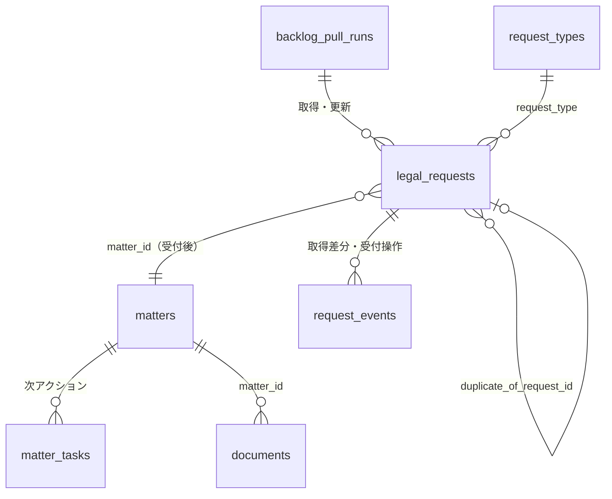

# v3 Backlog 依頼管理スキーム — 受付箱

ステータス: **ドラフト（設計合意フェーズ）** / 2026-09-25 起票・同日改訂（受付箱＋pull 方式へ変更）
画面モック: [`../v3-request-mockup.html`](../v3-request-mockup.html)
関連:
- [`../plans/legalbridge-remediation-plan-20260714.md`](../plans/legalbridge-remediation-plan-20260714.md)（Matter 中心化。§3「外部ID化」「Backlog は外部依頼情報」、§5.5.1「Backlog 課題は Matter 内の依頼原票として参照表示」）
- [`issue-control-consistency-plan.md`](./issue-control-consistency-plan.md)（2フェイズモデル・条件明細背骨）
- [`../system-overview-and-manual.md`](../system-overview-and-manual.md)（v3 work-model 層）
- `src/components/matter/matterStages.ts`（案件工程 12 段。`intake`＝受付 が先頭）

---

## 0. 要旨

v3 では依頼の扱いを次の3点に絞る。

1. **受付箱を作る。** Backlog に起票された依頼は、LegalBridge の「受付箱」に一件ずつ入る。法務はここで受け付けるか、既存案件へ紐付けるか、重複・対象外として処理する。
2. **Backlog は読みに行く。** LegalBridge は Backlog を**定期的に取得（pull）するだけ**で、Backlog へ書き込まない（課題作成・ステータス変更・子課題化・コメントをしない）。Backlog は依頼者が書く「依頼原票」で、状況の正本は LegalBridge の案件側にある。
3. **受け付けた依頼は案件の工程バーの「受付」に繋ぐ。** 受付 = 案件工程 `intake`。以後の進行（振分け → 起案 → … → 完了）は**案件の工程**で管理し、依頼ごとのステータス機械は持たない。

```
依頼者 ──(Slack /法務依頼・GAS・Backlog 直接)──▶ Backlog 課題（依頼原票）
                                                   │  読みに行く（定期 pull ＋「今すぐ取得」）
                                                   ▼
                                     ┌──────── 受付箱 ────────┐
                                     │ 未処理 / 保留 / 更新あり │
                                     └──┬───────┬───────┬──────┘
                          新規案件で受付 │  既存案件へ │  重複・対象外
                                        ▼            ▼
             案件 工程バー: [受付]─振分け─起案─社内レビュー─相手方調整─署名・締結─履行─検収─請求・支払─完了確認─完了
                             ▲ 依頼（原票）はここに接続される
```

---

## 1. 現状（as-is）と問題点

### 1.1 現状の構造（コードで裏取り済み）

| 項目 | 現状 | 根拠 |
|---|---|---|
| 依頼テーブル | `legal_requests`：`backlog_issue_key`(UNIQUE NOT NULL) / `slack_user_id` / `contract_type`(実態は request_type) / `counterparty` / `summary` / `deadline` / `notes` / `merged_into_issue_key` / `parent_issue_key` | `migrations/0001_baseline.sql:122,717,740` |
| 取込み | webhook（type=1）受信で即パイプライン（`processLegalRequestSubmission`：legal_requests INSERT・文書自動生成） | `services/worker/server.ts` `/api/webhooks/backlog` |
| Backlog への書込み | 課題作成（Slack・quick-create・auto-chain・納期変更）、ステータス変更、終結・子課題化・コメント | `server.ts` 各所、`backlogService.ts` |
| ステータス | Backlog 11 種を `issue_workflows.current_status_name` にミラー。経路は `statusFlow.ts`（FE/worker 2ファイルを手動同期） | `src/lib/statusFlow.ts` ほか |
| 一覧 | Requests 画面は Backlog API 直読み、`count=100` 固定・ページングなし | `backlogService.ts` `getIssues` |
| 案件 | `legal_requests` INSERT の AFTER トリガで Matter 自動作成（0103）。`matter_issues` で束ね。工程 `lifecycle_stage` は案件詳細のセレクトで手動 | `0102` / `0103` / `0126` / `MatterDetailPage.tsx` |
| webhook 認証 | 署名・シークレット検証なし | `server.ts` / `docs/service-architecture.md` |

### 1.2 問題点

- **P1. 受け付けたかどうかが分からない。** Backlog に起票された瞬間に自動処理が走り、法務が「受け付けた」という判断・記録の場が無い。誤起票・重複もそのまま案件化される（0103 トリガ）。
- **P2. 二重管理。** 進行を Backlog ステータスと案件工程の両方で持ち、どちらが正か曖昧。Backlog への書込み失敗で半端状態が生まれる。
- **P3. 書込みの副作用が大きい。** auto-chain の子課題作成、統合時の子課題化・終結など、Backlog 側の構造を LB が書き換えている。
- **P4. 一覧が 100 件上限の直読み。** 過去依頼が見えず、案件・成果物で絞れない。
- **P5. 起票経路ごとに挙動が違う**（7経路）。webhook 取りこぼし時の回復手段が無い。

---

## 2. 設計原則

1. **Backlog は依頼原票（読み取り専用）。** LB は取得して保存・表示するだけ。Backlog 側の件名・本文・ステータス・コメントは依頼者と Backlog 利用者のもの。
2. **受付は人が行う。** 取り込んだ依頼は必ず受付箱を通る。自動で案件化しない（候補の提示まで）。
3. **進行は案件の工程で持つ。** 依頼は「受け付けた時点」で役目の大半を終え、以後は案件の工程バーが状況の正本。
4. **1依頼 → 1案件。** 受け付けた依頼は必ず1つの案件の「受付」に接続される。1案件に複数の依頼が接続されてよい（重複・追加依頼・納品報告など）。
5. **取得は冪等・再実行可能。** 取りこぼしは次回の pull で自動回収される。webhook は「すぐ取りに行く合図」としてだけ使う。
6. **外部ID化。** 依頼の内部IDは `request_no`（REQ-YYYY-NNNNN）。Backlog を経由しない依頼（口頭・メール）も受付箱に直接登録できる。

---

## 3. エンティティ



| 概念 | 実体 | 役割 |
|---|---|---|
| **依頼（原票）** | `legal_requests` ＋ Backlog スナップショット | 何を・誰が・いつまでに。受付箱の1行 |
| **受付箱** | `legal_requests` の `inbox_state` 未完了分のビュー | 取得された依頼を受け付ける場所 |
| **案件** | `matters`（`lifecycle_stage`） | 進行の正本。工程バーの先頭「受付」に依頼が接続される |
| **取得ログ** | `backlog_pull_runs` | いつ・何件取得したか。取りこぼし・エラーの確認 |

---

## 4. 取得（pull）

### 4.1 取得方式

| トリガ | 頻度 | 内容 |
|---|---|---|
| 定期 | 5 分ごと（Cloud Scheduler → worker） | `updatedSince = 前回成功時刻 − 5分` で差分取得 |
| 手動 | 受付箱の「今すぐ取得」 | 同上。取得中は重複実行しない（advisory lock） |
| 合図 | Backlog webhook（任意） | 本文は処理せず、差分取得を即時キックするだけ。シークレット照合必須 |
| 全件照合 | 1日1回（深夜） | 未完了案件に接続された依頼の Backlog 状態を全件取得し、削除・移動も検知 |

- Backlog API `GET /api/v2/issues` を `projectId[]`・`updatedSince`・`sort=updated`・`order=asc`・`count=100`・`offset` で**ページングして全件**取得する（現行の 100 件上限を解消）。
- 課題ごとに `GET /issues/:key/comments?minId=` でコメント差分も取得（受付箱の「更新あり」判定に使う）。
- 取得した課題は **Backlog 課題 ID で upsert**（`backlog_issue_id` UNIQUE）。新規は `inbox_state='new'`、既存はスナップショット更新のみ。
- 1回の取得結果は `backlog_pull_runs` に記録（取得件数・新規件数・更新件数・エラー）。失敗時は `updatedSince` を進めない。

### 4.2 取得時の自動解釈（候補づくり）

取得時に次を**推定して候補として保存**する。確定は受付時に人が行う。

| 項目 | 推定元 |
|---|---|
| 依頼種別 `request_type` | 属性「依頼種別」→ 課題種別名（`request_types.backlog_issue_type_name` / 旧名）→ 件名の【】ラベル |
| 相手方 `vendor_id` | 属性「取引先名称」を `vendors` と名寄せ（完全一致 → 別名 → 部分一致の順、候補最大3件） |
| 依頼者 `requester_staff_id` | 説明欄の `<@Uxxxx>` → `staff.slack_user_id`、Backlog 起票者 → `staff.backlog_user_id` |
| 依頼部署・希望納期 | 属性「依頼部署」「希望納期」 |
| 接続先案件の候補 | ① 親課題が接続済みならその案件 ② 説明欄の「対象契約番号」→ 締結文書の `documents.matter_id` ③ 同じ相手方の進行中案件 |
| 重複候補 | 同じ相手方 × 同じ種別 × 7日以内に受け付けた/未処理の依頼、件名の類似度 |

### 4.3 受付後に Backlog が更新された場合

LB は Backlog を書き換えないので、Backlog 側の変化は「知らせる」だけにする。

| Backlog 側の変化 | LB の扱い |
|---|---|
| コメント追加・本文/属性の変更 | 依頼に「更新あり」バッジ。案件の受付ノードにも件数表示。既読にすると消える |
| ステータスが「完了」「キャンセル」「終結」に | 「更新あり（要確認）」。案件が進行中なら案件側で中止/継続を判断する（自動で案件を閉じない） |
| 課題の削除・別プロジェクトへ移動 | 全件照合で検知し「原票なし」表示 |

---

## 5. 受付箱

### 5.1 受付状態 `inbox_state`

| inbox_state | 表示 | 意味 | 受付箱に出すか |
|---|---|---|:-:|
| `new` | 未処理 | 取得済み・まだ誰も判断していない | ● |
| `on_hold` | 保留 | 情報不足で依頼者へ確認中（理由と再確認日） | ● |
| `accepted` | 受付済 | 案件の「受付」に接続した | 「更新あり」のときだけ |
| `duplicate` | 重複 | 別の依頼と同一。重複元の依頼の案件に参考として接続 | — |
| `dismissed` | 対象外 | 誤起票・テスト・法務の対象外（理由必須） | — |

- 依頼ごとのステータス遷移（未対応 → 処理中 → …）は**持たない**。進行は案件の工程で見る。
- Backlog のステータス名は `backlog_status_name` として**参照表示のみ**。

### 5.2 受付の操作

| 操作 | 結果 |
|---|---|
| **新規案件で受付** | 案件を作成（`lifecycle_stage='intake'`、案件名＝「相手方_内容」、相手方・担当・期限を引継ぎ）→ 依頼を受付ノードに接続（`matter_issues.relation='primary'`）→ 次アクション（`matter_tasks`）を作成 |
| **既存案件に接続** | 選んだ案件の受付ノードに接続（`relation='related'`、納品報告・利用報告なら `'partial'`）。案件の工程は変えない。必要なら次アクションを追加 |
| **重複** | 重複元の依頼を選ぶ。重複元の案件に `relation='duplicate'` で参考接続。受付箱から消える |
| **保留** | 理由と再確認日。再確認日を過ぎると受付箱の上に戻る |
| **対象外** | 理由（誤起票 / テスト / 法務対象外 / その他）。受付箱から消える。取消可 |

受付時に**確定させる項目**: 依頼種別・相手方（取引先マスタ）・法務担当・希望納期。確定値は LB 側に保存し、Backlog の値とずれても上書きしない（原票は原票として残す）。

### 5.3 受付後の工程の初期値（新規案件のみ）

| 受付時に決めたもの | 案件の初期工程 |
|---|---|
| 種別・担当とも確定 | `triage` 完了扱いで **`drafting`（起案）** から開始 |
| 担当が未定 | **`triage`（振分け）** から開始 |
| 相談（法務相談） | `drafting` から開始し、完了条件は「回答記録」 |
| 支払準備（納品報告・利用報告）を新規案件で受けた | 例外。原則は既存案件に接続（§4.2 の候補を強く提示） |

既存案件へ接続した場合は工程を動かさない。例: 発注書の案件が `performance`（履行）にあるとき納品報告を接続すると、受付ノードに依頼が増え、次アクション「検収書を作成」が `inspection` 段に追加される。

---

## 6. 案件の工程バーとの接続

工程バーは `matterStages.ts` の 12 段（完了・中止を除く 10 段を表示）。**先頭の「受付」ノードが受付箱からの入口**になる。

```
[受付 ●3] ─ 振分け ─ 起案 ─ 社内レビュー ─ 相手方調整 ─ 署名・締結 ─ [履行] ─ 検収 ─ 請求・支払 ─ 完了確認
  │
  ├ REQ-2026-00398  発注書        LEGAL-1855  受付 08/01  （primary）
  ├ REQ-2026-00401  発注書(重複)  LEGAL-1860  重複        （duplicate）
  └ REQ-2026-00420  納品報告      LEGAL-1881  受付 09/12  （partial）  ● 更新あり
```

- 受付ノードのバッジ = 接続された依頼の数。「更新あり」があれば強調色。
- ノードをクリックすると、接続された依頼（原票の件名・本文・Backlog ステータス・コメント）を読み取り専用で表示。Backlog へのリンクを添える。
- ノードに「＋ 受付箱から接続」を置き、未処理の依頼をこの案件へ直接接続できる。
- 現在工程のノードには次アクション（`matter_tasks.is_primary`）を表示。工程の変更は現行どおり案件側で行う（自動遷移はしない。§5.3 の初期値のみ）。

---

## 7. 依頼種別（request_type）

種別は**受付時の分類と、案件の次アクション・文書作成の初期値**にだけ使う。

| request_type | 表示名 | フェイズ | Backlog 課題種別（推定元） | 受付後の既定の次アクション |
|---|---|---|---|---|
| `nda` | NDA | 締結 | 契約審査 | NDA を作成 |
| `outsourcing` | 業務委託基本契約 | 締結 | 契約審査 | 業務委託基本契約を作成 |
| `license_master` | ライセンス基本契約 | 締結 | 契約審査 | ライセンス基本契約を作成 |
| `lic_individual` | 個別利用許諾条件 | 締結 | 契約審査 | 個別利用許諾条件書を作成 |
| `pub_master` / `pub_terms` / `pub_additional` | 出版基本契約 / 出版利用許諾条件書 / 追加利用許諾条件書 | 締結 | 契約審査 | 各文書を作成 |
| `sales_master` | 売買契約 | 締結 | 契約審査 | 売買契約を作成 |
| `purchase_order` | 発注書 | 締結 | 契約審査 | 発注書を作成 |
| `contract_review` | 契約審査（他社書式） | 締結 | 契約審査 | 相手方書式をレビュー |
| `delivery_inspec` | 納品・検収 | 支払準備 | 納品・検収 | 検収書を作成（`inspection` 段） |
| `license_calc` | 利用許諾料計算 | 支払準備 | 利用許諾計算 | 計算書を作成（`inspection` 段） |
| `legal_consult` | 法務相談 | 相談 | 法務相談 | 回答する |
| `admin_procedure` | 事務手続 | 手続 | 事務手続 | 手続する |
| `deadline_change` | 納期変更依頼 | 手続 | 事務手続（旧「納期変更依頼」） | 明細の納期を変更する |

- 新設コードは `contract_review` / `admin_procedure` の2つ（現行は `契約審査→outsourcing`、`事務手続→legal_consult` と情報を失って逆引きしている）。
- 旧 Backlog 課題種別名（NDA・発注書・納品リクエスト 等）は `request_types.legacy_backlog_type_names` で推定にだけ使う。

---

## 8. 起票側（依頼者）の規約

LB は Backlog に書かないため、推定精度は依頼者側の書き方で決まる。起票フォーム（Slack `/法務依頼`・GAS）が次を満たすようにする。

- 件名: `【{種別ラベル}】{相手方}_{内容}_{YYYYMMDD}`（現行 quick-create と同じ形式）。
- 属性: 「依頼種別」（新設・単一選択）、「取引先名称」、「依頼部署」、「希望納期」を必須にする。
- 説明欄: 依頼者の Slack メンション `<@Uxxxx>`、支払準備の依頼は「対象契約番号: ARC-…」を必ず書く（接続先案件の推定に使う）。
- **Slack `/法務依頼` は Backlog 課題を作るところまで**（依頼者側の起票フォーム）。文書の自動生成は行わず、受付後に案件から作成する。
- 口頭・メールの依頼は Backlog を経由せず、受付箱の「手動で登録」から入れてよい（`source_channel='manual'`、`backlog_issue_key` なし）。

---

## 9. データモデル変更案（DDL ドラフト・未適用）

```sql
-- (A) 取得ログ
CREATE TABLE IF NOT EXISTS backlog_pull_runs (
  id             BIGSERIAL PRIMARY KEY,
  trigger        VARCHAR(20) NOT NULL,          -- scheduled / manual / webhook / full_reconcile
  updated_since  TIMESTAMPTZ,
  started_at     TIMESTAMPTZ NOT NULL DEFAULT now(),
  finished_at    TIMESTAMPTZ,
  fetched_count  INT NOT NULL DEFAULT 0,
  created_count  INT NOT NULL DEFAULT 0,        -- 受付箱に新しく入った件数
  updated_count  INT NOT NULL DEFAULT 0,
  error          TEXT,
  started_by     VARCHAR(120)
);

-- (B) 依頼種別マスタ（推定・次アクションの既定値）
CREATE TABLE IF NOT EXISTS request_types (
  code                      VARCHAR(40) PRIMARY KEY,
  label                     TEXT NOT NULL,
  phase                     VARCHAR(20) NOT NULL CHECK (phase IN ('contracting','settlement','advisory','admin')),
  backlog_issue_type_name   TEXT NOT NULL,
  legacy_backlog_type_names TEXT[] NOT NULL DEFAULT '{}',
  default_task_title        TEXT,
  default_task_stage        VARCHAR(30),       -- matters.lifecycle_stage の値
  default_template_type     TEXT,
  sort_order                INT NOT NULL DEFAULT 0,
  is_active                 BOOLEAN NOT NULL DEFAULT TRUE
);

-- (C) legal_requests を「依頼原票＋受付状態」に拡張
ALTER TABLE legal_requests ALTER COLUMN backlog_issue_key DROP NOT NULL;
ALTER TABLE legal_requests
  ADD COLUMN IF NOT EXISTS request_no              VARCHAR(40) UNIQUE,        -- REQ-YYYY-NNNNN
  ADD COLUMN IF NOT EXISTS source_channel          VARCHAR(20),               -- backlog / manual
  ADD COLUMN IF NOT EXISTS backlog_issue_id        BIGINT UNIQUE,
  ADD COLUMN IF NOT EXISTS backlog_issue_type_name TEXT,
  ADD COLUMN IF NOT EXISTS backlog_status_name     TEXT,                      -- 参照のみ
  ADD COLUMN IF NOT EXISTS backlog_created_at      TIMESTAMPTZ,
  ADD COLUMN IF NOT EXISTS backlog_updated_at      TIMESTAMPTZ,
  ADD COLUMN IF NOT EXISTS backlog_snapshot        JSONB,                     -- 件名・本文・属性・担当・起票者
  ADD COLUMN IF NOT EXISTS backlog_last_comment_id BIGINT,
  ADD COLUMN IF NOT EXISTS last_pulled_at          TIMESTAMPTZ,
  ADD COLUMN IF NOT EXISTS has_unseen_update       BOOLEAN NOT NULL DEFAULT FALSE,
  ADD COLUMN IF NOT EXISTS inbox_state             VARCHAR(20) NOT NULL DEFAULT 'new'
                           CHECK (inbox_state IN ('new','on_hold','accepted','duplicate','dismissed')),
  ADD COLUMN IF NOT EXISTS inbox_reason            TEXT,                      -- 保留/対象外の理由
  ADD COLUMN IF NOT EXISTS hold_until              DATE,
  ADD COLUMN IF NOT EXISTS request_type            VARCHAR(40) REFERENCES request_types(code),
  ADD COLUMN IF NOT EXISTS request_type_guess      VARCHAR(40),               -- 取得時の推定
  ADD COLUMN IF NOT EXISTS vendor_id               INTEGER REFERENCES vendors(id) ON DELETE SET NULL,
  ADD COLUMN IF NOT EXISTS requester_staff_id      INTEGER REFERENCES staff(id) ON DELETE SET NULL,
  ADD COLUMN IF NOT EXISTS assignee_staff_id       INTEGER REFERENCES staff(id) ON DELETE SET NULL,
  ADD COLUMN IF NOT EXISTS department              VARCHAR(100),
  ADD COLUMN IF NOT EXISTS due_date                DATE,
  ADD COLUMN IF NOT EXISTS matter_id               INTEGER REFERENCES matters(id) ON DELETE SET NULL,
  ADD COLUMN IF NOT EXISTS matter_candidates       JSONB,                     -- [{matter_id, reason}]
  ADD COLUMN IF NOT EXISTS duplicate_of_request_id INTEGER REFERENCES legal_requests(id) ON DELETE SET NULL,
  ADD COLUMN IF NOT EXISTS handled_at              TIMESTAMPTZ,
  ADD COLUMN IF NOT EXISTS handled_by              VARCHAR(120),
  ADD COLUMN IF NOT EXISTS updated_at              TIMESTAMPTZ NOT NULL DEFAULT now();
CREATE INDEX IF NOT EXISTS idx_lr_inbox ON legal_requests(inbox_state, backlog_created_at)
  WHERE inbox_state IN ('new','on_hold') OR has_unseen_update;
CREATE INDEX IF NOT EXISTS idx_lr_matter ON legal_requests(matter_id);

-- (D) 依頼の履歴（取得差分・受付操作）
CREATE TABLE IF NOT EXISTS request_events (
  id          BIGSERIAL PRIMARY KEY,
  request_id  INTEGER NOT NULL REFERENCES legal_requests(id) ON DELETE CASCADE,
  kind        VARCHAR(30) NOT NULL,  -- pulled / backlog_changed / comment_added / accepted / linked / held / dismissed / duplicate / reopened
  origin      VARCHAR(20) NOT NULL,  -- backlog / lb
  detail      JSONB,
  actor       VARCHAR(120),
  created_at  TIMESTAMPTZ NOT NULL DEFAULT now()
);
CREATE INDEX IF NOT EXISTS idx_req_events_request ON request_events(request_id, created_at);

ALTER TABLE staff ADD COLUMN IF NOT EXISTS backlog_user_id BIGINT;
```

**バックフィル:** 既存 `legal_requests` は全件 `inbox_state='accepted'`（現行運用で処理済みとみなす）、`matter_id` は `matter_issues`（primary 優先）から、`request_type` は `contract_type` から、`request_no` は作成日順に採番。`merged_into_issue_key` ありは `duplicate`。合成キー `IMPORT-*` は `source_channel='manual'` にして `backlog_issue_key` を NULL 化（旧キーは `notes` に退避）。

**0103 トリガ（INSERT で Matter 自動作成）:** 受付箱導入と同時に停止する。案件化は受付操作でのみ行う。

---

## 10. API

| メソッド | パス | 用途 |
|---|---|---|
| GET | `/api/inbox` | 受付箱（`state`=new/on_hold/updated、種別・相手方・期限で絞込）。DB から返す |
| POST | `/api/inbox/pull` | 今すぐ取得（実行中なら現在の run を返す） |
| GET | `/api/inbox/pull-runs` | 取得ログ |
| POST | `/api/inbox` | 手動で登録（口頭・メール） |
| GET | `/api/requests/:id` | 依頼（原票スナップショット・推定値・候補・履歴） |
| POST | `/api/requests/:id/accept` | `{ mode: "new_matter" \| "existing_matter", matter_id?, request_type, vendor_id, assignee_staff_id, due_date }` |
| POST | `/api/requests/:id/duplicate` | `{ duplicate_of_request_id }` |
| POST | `/api/requests/:id/hold` | `{ reason, hold_until }` |
| POST | `/api/requests/:id/dismiss` | `{ reason }` |
| POST | `/api/requests/:id/reopen` | 受付箱へ戻す（誤操作の取消） |
| POST | `/api/requests/:id/seen` | 「更新あり」を既読にする |
| GET | `/api/matters/:id/requests` | 案件の受付ノードに接続された依頼 |
| POST | `/api/webhooks/backlog` | 合図のみ（シークレット照合 → 差分取得をキック） |

受付系の操作は1トランザクション（`legal_requests`・`matters`・`matter_issues`・`matter_tasks`・`request_events`）。外部呼び出しは無い。

**廃止する書込み系**（段階的に）: `POST /api/backlog/issues/quick-create`、`PATCH /api/backlog/issues/:key/status`、`PATCH /terminate`、`POST /:key/merge`・`/merge-bulk` の Backlog 操作部分、auto-chain の子課題作成、webhook type=1 の文書自動生成パイプライン。

---

## 11. 画面

- **受付箱**（サイドバー最上段・未処理件数バッジ）: 未処理 / 保留 / 更新あり のタブ。各行に取得元（Backlog キー・起票者・起票日時）、推定種別、推定相手方、接続候補の案件。右側の受付パネルで原票を読みながら受付操作する。上部に最終取得時刻と「今すぐ取得」。
- **案件詳細の工程バー**: 先頭「受付」ノードに接続された依頼の件数と「更新あり」を表示。クリックで原票一覧、「＋ 受付箱から接続」。
- **取得ログ**（管理）: `backlog_pull_runs` の一覧とエラー。
- 現行の Requests 画面（Backlog 直読み）は受付箱に置き換える。

---

## 12. 移行計画

| Phase | 内容 | 完了条件 |
|---|---|---|
| **R0 合意** | 本書の決定事項を確定。Backlog に属性「依頼種別」を追加し、Slack/GAS の起票フォームを §8 に合わせる | 起票フォームが属性を必須化 |
| **R1 取得** | §9 の DDL・バックフィル。pull ジョブ（定期・手動）と取得ログ。まだ受付箱は出さず、取得結果を既存データと突き合わせて検証 | 1週間、webhook 経由の既存処理と取得結果の差分 0 |
| **R2 受付箱** | 受付箱画面と受付 API。0103 トリガ停止。webhook type=1 の自動パイプラインを停止し、受付箱経由に切替 | 新規依頼の 100% が受付操作で案件に接続 |
| **R3 工程バー** | 案件詳細に工程バーと受付ノード。`matter_tasks` の既定次アクション | 案件詳細から接続依頼が参照できる |
| **R4 書込み撤去** | Backlog への書込み API・auto-chain・Slack 起票時の文書自動生成を撤去。webhook を合図専用＋シークレット照合に | worker から Backlog 書込み呼び出し 0（CI で検査） |
| **R5 整理** | `issue_workflows` / `statusFlow.ts` / 旧 Requests 画面の退役、`matter_issues` を `legal_requests.matter_id` 由来の VIEW へ | 旧参照 0 |

---

## 13. 決定事項（提案）とオープン事項

### 提案する決定

- **D1.** Backlog は依頼原票として読み取り専用。LB からの書込みは行わない。
- **D2.** 取り込んだ依頼は必ず受付箱を通し、人が受け付ける。自動案件化はしない。
- **D3.** 受け付けた依頼は案件の工程バー「受付」（`intake`）に接続する。進行は案件の工程で管理し、依頼ごとのステータスは持たない。
- **D4.** 取得は定期 pull（5分）＋手動＋webhook 合図＋日次全件照合。Backlog 課題 ID で冪等 upsert。
- **D5.** 受付後の Backlog 側の変化は「更新あり」で知らせるだけで、案件を自動で動かさない。
- **D6.** 依頼の内部識別子は `request_no`。Backlog を経由しない依頼も受付箱に手動登録できる。

### オープン事項

- **O1.** 受付したことを依頼者に伝える手段。Backlog に書かない前提なら Slack DM（`SLACK_NOTIFY_DISABLED` 解除が必要）か、Backlog 側の担当者が手で変える運用か。
- **O2.** Backlog 側のステータスを誰が動かすか（放置してよいか、法務担当が手で「完了」にするか）。
- **O3.** 取得間隔（5分）が Backlog API のレート制限・運用感に合うか。
- **O4.** 納品報告・利用報告を「既存案件へ接続」ではなく、発注書案件から LB 内で予定タスクとして先に作っておくか（auto-chain の代替）。
- **O5.** 相談（法務相談）を1依頼1案件にするか、部署×期間の相談案件に束ねるか。
