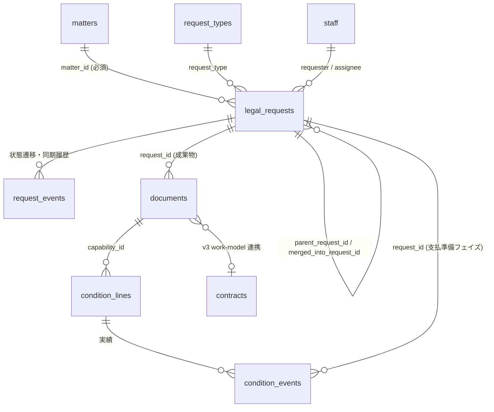

# v3 Backlog 依頼管理スキーム

ステータス: **ドラフト（設計合意フェーズ）** / 2026-09-25 起票
関連:
- [`../plans/legalbridge-remediation-plan-20260714.md`](../plans/legalbridge-remediation-plan-20260714.md)（Matter 中心化・§3 設計原則「外部ID化」「Backlog は外部依頼情報」）
- [`issue-control-consistency-plan.md`](./issue-control-consistency-plan.md)（2フェイズモデル・条件明細背骨・終結の2種類）
- [`unified-issue-ui-plan.md`](./unified-issue-ui-plan.md)（新課題＝契約単位の導出ビュー。Superseded だが導出ルールは有効）
- [`../system-overview-and-manual.md`](../system-overview-and-manual.md)（v3 work-model 層・二層構造）

---

## 0. 本書の位置づけ

「v3」は、次の3点が揃った現行世代の業務基盤を指す。

| 層 | v3 での正本 |
|---|---|
| 業務ハブ | `matters`（案件）＋ `matter_tasks`（次アクション）＋ `lifecycle_stage` |
| 契約・伝票 | `documents`（契約/伝票メタ）＋ `condition_lines`（条件明細）＋ `condition_events`（実績） |
| 作品モデル | `contracts` / `works` / `source_ips`（`/api/v3/*`） |

この v3 世代において **Backlog 課題（依頼）をどう受け付け、どの粒度で持ち、どう同期し、どう閉じるか** を一本の規約として定める。
対象は「依頼(Request)」のライフサイクルのみで、文書生成・条件明細・支払処理の中身は既存設計に従う。

**一言で言うと:** Backlog は「依頼の受付票（外部チケット）」であり、LegalBridge 内の **`legal_requests` を依頼の正本**に格上げし、
**依頼 → 案件(Matter) → 文書 → 条件明細** を FK で串刺しにする。Backlog 課題キーは外部IDとして保持するだけにする。

---

## 1. 現状（as-is）と問題点

### 1.1 現状の構造（コードで裏取り済み）

```
Slack /法務依頼 → search-api slackGateway → worker /api/intake/* ─┐
GAS (納品/利用報告) ─┤                  ┌─ legal_requests (backlog_issue_key UNIQUE, contract_type, …)
Backlog 直起票(webhook type=1) ─┼─ worker ─┼─ issue_workflows (current_status_name ミラー)
admin-ui quick-create ─┤                  ├─ matter_issues / matters（0103 AFTER INSERT トリガで自動束ね）
auto-chain(子課題自動起票) ─┤                  └─ documents.issue_key / condition_events.backlog_issue_key（文字列）
納期変更依頼 / CSV / 手動生成 ─┘
```

| 項目 | 現状 | 根拠 |
|---|---|---|
| 依頼テーブル | `legal_requests`：`backlog_issue_key`(UNIQUE NOT NULL) / `slack_user_id` / `contract_type` / `counterparty` / `summary` / `deadline` / `notes` / `merged_into_issue_key` / `parent_issue_key` のみ | `migrations/0001_baseline.sql:122,717,740` |
| 依頼種別 | `contract_type` 列に request_type キーを格納（列名と意味がずれている） | `services/worker/server.ts` auto-chain の `contract_type AS request_type` |
| Backlog 課題種別 | 実在：契約審査(表示は「文書作成」) / 法務相談 / 事務手続 / 納品・検収 / 利用許諾計算。旧名（NDA・発注書 等 18 種）は逆引き表で吸収 | `server.ts` `ISSUE_TYPE_TO_REQUEST_TYPE` / quick-create `ALLOWED_TYPE_LABELS` |
| ステータス | Backlog 側 11 種（上限 12）。経路は `statusFlow.ts` にハードコード、**FE と worker の2ファイルを手動同期** | `src/lib/statusFlow.ts` / `services/worker/src/lib/statusFlow.ts` |
| ステータスの保持 | `issue_workflows.current_status_name`（文字列ミラー）。webhook type=2 で更新 | `server.ts` `/api/webhooks/backlog` |
| 起票経路 | `legal_requests` への INSERT が worker 内に **7経路** | `migrations/0103_matter_autolink.sql` 冒頭コメント |
| 終結・統合 | `PATCH /terminate`・`POST /:key/merge`・`POST /merge-bulk` の3系統。`mergeIssueInto` は DB 側を1トランザクション化済みだが、Backlog 操作はコミット後の best-effort で失敗は `warnings` に積むだけ（再試行・検知の仕組みなし） | `server.ts` `mergeIssueInto` / `issue-control-consistency-plan.md` H4 |
| 一覧 | Requests 画面は Backlog API を直読み（`getIssues` は `count=100` 固定・ページングなし） | `backlogService.ts` `getIssues` / `sharedReads.ts` |
| 課題種別の解決 | Slack gateway / GAS は旧9種名で解決、見つからなければ `types[0]` へ黙ってフォールバック | `slackGateway.ts` / `server.ts` `processLegalRequestSubmission` |
| Backlog 課題なし | `backlog_issue_key` が NOT NULL のため、取込は `IMPORT-<ts>`、原作登録器は `MLC-<work_code>` の合成キーで行を作る | `server.ts` 取込 / 原作登録 |
| webhook 認証 | `/api/webhooks/backlog` に署名・シークレット検証なし | `server.ts` / `docs/service-architecture.md` |
| workflow_settings | 実質は文書番号プレフィックス（PO/ILT/REQ…）のみに使用 | `services/worker/src/lib/db.ts` |
| 案件連携 | `matter_issues`(relation: primary/duplicate/partial/related) を DB トリガで自動作成 | `0102` / `0103` |
| 課題⇔文書 | `documents.issue_key`・`condition_events.backlog_issue_key` の**文字列 soft join** | `issue-control-consistency-plan.md` §2 |
| 通知 | `SLACK_NOTIFY_DISABLED=true` で停止中 | `migrations/0150_disable_slack_notify.sql` |

### 1.2 問題点

- **P1. 依頼の正本が無い。** 種別・依頼者・期限は `legal_requests`、状態は Backlog＋`issue_workflows`、束ねは `matter_issues` に分散。依頼者は Slack ID のみで `staff` と結ばれていない。
- **P2. 種別体系が三重。** request_type（Slack キー）／Backlog 課題種別（5種）／旧課題種別名（18種）が別々のマップで管理され、`契約審査→outsourcing` のような**情報を失う逆引き**がある。
- **P3. ステータスが文字列ミラー。** Backlog の表示名変更や webhook 取りこぼしで即ずれる。ステータスと Matter `lifecycle_stage` の対応規則が無い。
- **P4. 起票経路ごとに挙動が違う。** 冪等性・Matter 束ね・子課題化・文書自動生成の有無が経路で異なる。
- **P5. 閉じ方が3系統。** 正常完了・統合終結・キャンセルの意味と副作用（文書付け替え・Backlog 操作）が API ごとにばらつき、Backlog 側の失敗が検知されない。
- **P6. フェイズ（締結／支払準備）が依頼に明示されていない。** 新課題（契約単位）への束ねが導出頼み。
- **P7. 依頼一覧が Backlog 直読みで100件上限。** 過去依頼が見えず、LB 側の属性（Matter・成果物）で絞り込めない。
- **P8. 依頼の識別子が Backlog キーしかない。** Backlog を介さない依頼（取込・口頭）に合成キーを発行しており、外部ID化の原則に反する。webhook も無認証。

---

## 2. 設計原則

1. **依頼の正本は LegalBridge。** `legal_requests` を「依頼(Request)」エンティティとして拡張し、全属性をここに持つ。Backlog は外部チケット（受付票・コメント欄・通知チャネル）。
2. **1 Backlog 課題 = 1 依頼 = 1 フェイズ。** 依頼は短命（フェイズの成果物が DB 格納されたら閉じる）。長命なのは Matter と条件明細。
3. **依頼は必ず1つの Matter に属する。** 例外なし（相談も「相談案件」Matter に属す）。
4. **外部ID化。** Backlog 課題キー／ID は `legal_requests` の属性。他テーブルは `request_id`(FK) で参照し、文字列キー参照は段階的に廃止する。
5. **種別・ステータスはコードで持つ。** 表示名（Backlog の名前）は対応表で解決する。対応表は DB マスタ1か所（FE/worker の手動同期をやめる）。
6. **起票は1関数・冪等。** どの経路も `intakeRequest()` を通す。
7. **閉じ方は3種・1 API・1 トランザクション。** `completed` / `merged` / `cancelled`。
8. **段階移行。** 追加 → 読取移行 → 書込移行 → バックフィル → 旧構造削除（修正計画書の原則を踏襲）。

---

## 3. エンティティと関係



| 概念 | 実体 | 寿命 | 役割 |
|---|---|---|---|
| **依頼 (Request)** | `legal_requests` | 短（1フェイズ） | 「何を・誰が・いつまでに」を受け付けた票。Backlog 課題と 1:1 |
| **案件 (Matter)** | `matters` | 中〜長 | 依頼・文書・条件・送信・タスクを束ねる業務ハブ |
| **新課題 (契約単位)** | `documents`(terms) 導出ビュー | 長 | 締結依頼1＋支払準備依頼N を契約で束ねる**表示用**ビュー（新テーブルなし） |
| **成果物** | `documents` | 永続 | 依頼の完了条件 |
| **背骨** | `condition_lines` / `condition_events` | 取引の寿命 | 支払準備フェイズの依頼を条件明細に結ぶ |

**Matter と新課題の関係:** Matter は業務単位（1取引・1相談・1プロジェクト）、新課題は契約単位。通常 1 Matter ⊇ 1〜数個の契約（基本契約＋個別条件書 等）。依頼は Matter に所属し、文書経由で契約（新課題）に紐づく。

---

## 4. 依頼種別体系（request_type）

### 4.1 フェイズと処理カテゴリ

| phase | 意味 | 完了条件 |
|---|---|---|
| `contracting` | 締結フェイズ | 締結文書が `lifecycle_status='final'` で DB 格納、締結(署名/押印)記録 |
| `settlement` | 支払準備フェイズ（N回） | 検収書/計算書が final、`condition_events` 記録 |
| `advisory` | 相談 | 回答記録（コメント or 回答メモ）|
| `admin` | 事務・変更手続 | 手続実行記録（納期変更の反映 等）|

処理カテゴリ（ステータス経路）は現行 `statusFlow.ts` の `active / passive / advisory / deadline_change` を踏襲する。

### 4.2 種別カタログ（v3 正準）

| request_type | 表示名 | phase | flow | Backlog 課題種別 | 主成果物 template_type | 完了時の自動起票(子) |
|---|---|---|---|---|---|---|
| `nda` | NDA | contracting | active | 契約審査 | nda | — |
| `outsourcing` | 業務委託基本契約 | contracting | active | 契約審査 | service_master | — |
| `license_master` | ライセンス基本契約 | contracting | active | 契約審査 | license_master | — |
| `lic_individual` | 個別利用許諾条件 | contracting | active | 契約審査 | individual_license_terms | `license_calc`（トリガー待ち） |
| `pub_master` | 出版基本契約 | contracting | active | 契約審査 | pub_master_individual / pub_master_corporate | — |
| `pub_terms` | 出版利用許諾条件書 | contracting | active | 契約審査 | pub_license_terms | `license_calc`（トリガー待ち） |
| `pub_additional` | 追加利用許諾条件書 | contracting | active | 契約審査 | pub_license_terms | — |
| `sales_master` | 売買契約 | contracting | active | 契約審査 | （売買系） | — |
| `purchase_order` | 発注書 | contracting | active | 契約審査 | purchase_order / intl_purchase_order | `delivery_inspec`（トリガー待ち） |
| `contract_review` | 契約審査（他社書式） | contracting | active | 契約審査 | —（レビュー済ファイル） | — |
| `delivery_inspec` | 納品・検収 | settlement | passive | 納品・検収 | inspection_certificate | — |
| `license_calc` | 利用許諾料計算 | settlement | passive | 利用許諾計算 | royalty_statement | — |
| `legal_consult` | 法務相談 | advisory | advisory | 法務相談 | — | — |
| `admin_procedure` | 事務手続 | admin | advisory | 事務手続 | — | — |
| `deadline_change` | 納期変更依頼 | admin | deadline_change | 事務手続（現行は「納期変更依頼」→無ければ法務相談にフォールバック。v3 で事務手続に統一） | —（`order_line_items` 更新） | — |

- **新設は `contract_review` / `admin_procedure` の2コードのみ。** 現状 `契約審査→outsourcing`、`事務手続→legal_consult` と情報を失って逆引きしている箇所を解消する。
- 汎用キー `contract` / `legal_request`（quick-create で許容）は **受付時の暫定値** とし、トリアージで上表のいずれかに確定させる（未確定は `triage` に留まる）。
- 旧 Backlog 課題種別名（NDA・発注書・納品リクエスト 等 18 種）は `request_types.legacy_backlog_type_names` に集約し、webhook 取込時のみ使う。

### 4.3 Backlog 課題種別は増やさない

Backlog 側は現行 5 種（契約審査 / 法務相談 / 事務手続 / 納品・検収 / 利用許諾計算）で固定する。
細分類は Backlog カスタム属性「**依頼種別**」（単一選択、値＝上表の表示名）と LegalBridge の `request_type` で持つ。
理由: Backlog の課題種別を増やすとプロジェクト設定変更・ステータス設定・GAS の種別ID解決（`gas/Code.gs` `resolveBacklogIssueTypeId_`）が連鎖して壊れるため。

---

## 5. ステータス体系

### 5.1 3層の対応表

Backlog のステータスは**名前を変えず**（11種・上限12を維持）、LegalBridge 内部はコード `status_code` で持つ。Matter の `lifecycle_stage` は依頼ステータスから**推奨値を導出**する（自動上書きはしない。0126 の方針を踏襲）。

| status_code | Backlog 表示名 | 意味 | active | passive | advisory | deadline_change | Matter lifecycle_stage（推奨） |
|---|---|---|:-:|:-:|:-:|:-:|---|
| `waiting_trigger` | トリガー待ち（表示: 納品待ち / 利用許諾報告待ち） | 受動依頼の発火待ち | | ● | | | performance |
| `new` | 未対応 | 受付済・未着手 | ● | ● | ● | ● | intake / triage |
| `in_progress` | 処理中 | 作成・検討中 | ● | ● | ● | | drafting |
| `counterparty_review` | 相手方確認中 | 相手方とドラフト調整 | ● | | | | counterparty_review |
| `approval` | 承認待ち | 社内承認（稟議・上長） | ● | ● | | | internal_review |
| `preparing_execution` | 締結準備中 | 押印/署名準備 | ● | ● | | | signing |
| `ready_to_send` | 送信待ち | 担当者/相手方への送付待ち | ● | ● | | | signing（passive は inspection） |
| `awaiting_signature` | 締結待ち | 相手方署名・返送待ち | ● | | | | signing |
| `done` | 完了 | 正常完了 | ● | ● | ● | ● | （Matter 側の完了ゲートで判定） |
| `merged` | 終結 | 他依頼へ統合終結 | ◇ | ◇ | ◇ | ◇ | — |
| `cancelled` | キャンセル | 取消・差戻し終了 | ◇ | ◇ | ◇ | ◇ | cancelled（Matter 内の最後の依頼の場合のみ） |

● = 経路上のステータス、◇ = どこからでも遷移可（終了系）。

### 5.2 遷移規則

- **順方向**は `request_status_flows`（§9）に定義された経路の次ステータスのみを「推奨」とし、UI は推奨ボタン＋任意選択を出す（現行 `getNextRecommended` と同じ UX）。
- **逆方向（差戻し）**は `new` または `in_progress` への戻しのみ許容し、`request_events` に理由必須で記録する（「差戻し」ステータスは作らない＝現行方針を踏襲）。
- **終了系**（`done` / `merged` / `cancelled`）は §8 の close API 経由でのみ設定する。Backlog 上で直接「完了」「終結」にされた場合は webhook で検知し、§7.3 の整合チェックに回す。
- `done` への遷移ガード（active/passive）: 主成果物（§4.2）が `documents` に final で存在すること。無い場合は警告を出し、`force=true` と理由で上書き可能（`request_events` に記録）。

---

## 6. Backlog 課題の記載規約

### 6.1 件名

```
【{表示ラベル}】{相手方}_{内容}_{YYYYMMDD}
```

- 表示ラベル: 契約審査→「文書作成」、それ以外は課題種別名（現行 quick-create と同じ）。
- 相手方未指定: `(相手方未指定)`、内容未指定: `(内容未指定)`。
- auto-chain の子課題は件名先頭に `[納品報告]` / `[利用許諾報告]` を付ける（現行踏襲）。
- **件名は表示用。** 識別・解析には使わない（解析は §6.2 の属性と `legal_requests` で行う）。

### 6.2 カスタム属性（Backlog）

| 属性 | env | 必須 | 同期方向 | 備考 |
|---|---|:-:|---|---|
| 依頼種別 | `BACKLOG_FIELD_REQUEST_TYPE`（新設） | ● | LB → Backlog | §4.2 の表示名。Backlog 直起票時は Backlog → LB |
| 取引先名称 | `BACKLOG_FIELD_COUNTERPARTY` | ● | LB → Backlog | `vendors` 確定後は vendor_name で上書き |
| 依頼部署 | `BACKLOG_FIELD_DEPT` | ● | 起票時のみ | |
| 希望納期 | `BACKLOG_FIELD_DEADLINE` | | 双方向（最終更新優先） | LB `due_date` と一致させる |
| 文書番号 | `BACKLOG_FIELD_DOC_NUMBER` | | LB → Backlog | 主成果物の文書番号 |
| 案件コード | `BACKLOG_FIELD_MATTER_CODE`（新設） | ● | LB → Backlog | `MTR-YYYY-NNNNN`。Backlog から Matter を辿れるようにする |
| ドラフトURL / 締結方法 / 締結予定日 / 備考 | 既存 env | | LB → Backlog | 現行どおり |

### 6.3 説明欄テンプレート

```
依頼番号: {request_no}
依頼種別: {request_type 表示名} ({request_type})
案件: {matter_code} {matter_title}
依頼者: {staff_name} ({department}) / Slack: <@{slack_user_id}>
希望納期: {YYYY-MM-DD}
親依頼: {parent_issue_key}           ← 子依頼のみ

【相手方情報】
名称: {counterparty} / 取引先コード: {vendor_code}

【詳細】
{details}

※ 起票経路: {source_channel}   ※ LegalBridge: {admin-ui 依頼詳細 URL}
```

説明欄の `<@U…>` 解析（webhook の依頼者推定）は**移行期の互換用**に残すが、正本は `legal_requests.requester_staff_id`。

### 6.4 親子・担当・カテゴリ

- **親子**: auto-chain の受動依頼、および統合時の `mode=child` のみ Backlog の親子を使う。LB 側は `parent_request_id` が正本。
- **担当者**: Backlog 担当者 ⇔ `assignee_staff_id`（`staff.backlog_user_id` で対応。新設）。変更は双方向、最終更新優先。
- **カテゴリ**: 依頼部署（現行運用を維持）。

---

## 7. 起票と同期

### 7.1 起票経路の一本化 `intakeRequest()`

全経路を worker 内の単一関数に集約する。経路差は `source_channel` と前処理のみ。

| source_channel | 入口 | Backlog 課題 | 文書自動生成 |
|---|---|---|---|
| `slack` | `/法務依頼` モーダル（search-api `slackGateway` → worker `/api/intake/create-run`・`link-trigger-run`） | LB が作成 | 種別による（現行 `processLegalRequestSubmission`） |
| `gas` | GAS（納品/利用報告フォーム） | GAS が作成 → webhook | 種別による（`対象契約番号: 複数` は抑止＝現行） |
| `backlog` | Backlog で直接起票 → webhook type=1 | 既存 | 種別による |
| `admin_ui` | quick-create | LB が作成 | しない |
| `auto_chain` | 親依頼 `done` 時 | LB が作成（子課題） | しない（`waiting_trigger` で作成） |
| `deadline_change` | 納期変更依頼 | LB が作成 | しない |
| `import` | CSV / 手動生成の後付け登録 | 既存キーを紐付けのみ | しない |

`intakeRequest()` の手順（1トランザクション＋外部呼出しは後段）:

1. **冪等キー判定** — `intake_key`（下記）で既存依頼があれば、その依頼を返して終了。
2. **種別確定** — `request_type` を §4.2 で解決。解決不能なら `contract` 等の暫定値＋`status_code='new'`＋`needs_triage=true`。
3. **依頼者解決** — Slack ID / メール → `staff.id`。解決不能なら `requester_staff_id=NULL` で続行し、トリアージ項目に積む。
4. **Matter 決定**（§10）— 既存 Matter へ紐付け or 新規 Matter 作成。
5. **`legal_requests` INSERT**（`status_code`、`phase`、`source_channel`、`matter_id`、`due_date` 等）。
6. **`request_events` に `created` を記録。**
7. （コミット後）Backlog 課題作成 or 既存課題の属性補完（案件コード・依頼種別）→ `backlog_issue_key/id` を UPDATE。
8. （コミット後）文書自動生成・通知（`SLACK_NOTIFY_DISABLED` を尊重）。

**冪等キー `intake_key`:**

| 経路 | intake_key |
|---|---|
| backlog / gas | `backlog:{issueKey}` |
| slack | `slack:{view_id}`（モーダル送信ID） |
| admin_ui | `ui:{client_request_uuid}`（FE で発行） |
| auto_chain | `chain:{parent_request_id}:{child_request_type}` |
| deadline_change | `dlc:{order_line_item_id}:{requested_date}` |

Slack 起票と webhook type=1 の二重処理（現行は `受付済み` マークで回避）は、Slack 側で先に `intake_key` と `backlog_issue_key` を確定させることで自然に解消する。

> **移行期の注意:** 0103 の AFTER INSERT トリガ（Matter 自動作成）は `matter_id` が既に入っている行ではスキップするよう変更し、`intakeRequest()` 経由でない残存経路の保険として残す。全経路移行後に撤去する。

### 7.2 フィールド別の正本（Source of Truth）

| 項目 | 正本 | 反対側への反映 |
|---|---|---|
| request_type / phase | LB | Backlog「依頼種別」属性・課題種別 |
| ステータス | **LB**（`status_code`） | LB 操作時に Backlog へ即時反映。Backlog 上の変更は webhook で取込み（§7.3） |
| 担当者 / 希望納期 | 双方向 | 最終更新時刻が新しい側を採用、`request_events` に記録 |
| 件名 / 説明 / コメント | Backlog | LB は件名スナップショットのみ保持 |
| 依頼者 / 依頼部署 | LB（起票時確定） | Backlog は起票時の表示のみ |
| Matter / 成果物文書 / 条件明細 | LB | 案件コード・文書番号を Backlog 属性に表示 |

### 7.3 webhook と定期リコンサイル

- **webhook 認証** — Backlog webhook URL にシークレットのクエリパラメータ（Secret Manager 管理）を付け、worker で照合する（Backlog webhook は署名ヘッダを持たないため）。不一致は 401、`request_events` には記録しない。
- **webhook type=1（課題追加）** → `intakeRequest({source_channel:'backlog'})`。
- **webhook type=2（課題更新）** → Backlog ステータス名を `request_status_map` でコード化し、
  - 経路上の遷移 → `status_code` を更新、`request_events(kind='status_changed', origin='backlog')`。
  - 終了系（完了/終結/キャンセル）への直接変更 → **即時には閉じず** `sync_state='needs_review'` にしてトリアージ一覧に出す（文書付け替え等の副作用を伴う close は §8 の API でのみ行う）。
  - 未知のステータス名 → `sync_state='unknown_status'`。
- **定期リコンサイル**（Cloud Scheduler、1日1回）: 開いている依頼の Backlog 状態・担当・期限を取得し差分を `request_events(origin='reconcile')` に記録。既存の課題整合性監査（`/api/audit/issue-consistency`）に「LB⇔Backlog ステータス乖離」「Matter 未所属依頼」「成果物無し完了」を追加する。
- webhook 受信は `request_events` に生ペイロードのハッシュを記録し、重複配信を無視する。

---

## 8. 依頼の終了（close）

### 8.1 3種の終了

| close_reason | status_code | 意味 | 副作用 |
|---|---|---|---|
| `completed` | `done` | 正常完了（成果物が DB 格納済） | auto-chain 子依頼作成、Matter 完了ゲート再評価 |
| `merged` | `merged` | 重複・部分起票を別依頼へ統合 | 文書・条件実績の付け替え（下記）、`merged_into_request_id` 設定、Backlog 子課題化 or コメント |
| `cancelled` | `cancelled` | 取消・差戻し終了 | 成果物ドラフトを `lifecycle_status='void'` 候補として一覧化（自動削除しない） |

### 8.2 API の一本化

```
POST /api/requests/:id/close
  body: {
    reason: "completed" | "merged" | "cancelled",
    merged_into_request_id?: number,   // reason=merged のとき必須
    merge_mode?: "child" | "comment",  // Backlog 側の扱い（既定 child）
    move_data?: boolean,               // 既定 true
    note?: string,
    force?: boolean                    // done ガード（§5.2）の上書き
  }
```

- DB 更新（`legal_requests`・`documents.request_id`・`condition_events.request_id`・`matter_issues`）は **1トランザクション**（現行 `mergeIssueInto` の方式を completed / cancelled にも広げる）。
- Backlog 操作（ステータス・親子・コメント）はコミット後に実行し、失敗は `sync_state='backlog_pending'` として再試行キューへ。現行の「`warnings` に積むだけ」をやめ、「DB は統合済・Backlog 未変更」の半端状態を**検知・再試行可能な状態**として残す。
- 統合時の文書付け替えは現行 `mergeIssueInto` の「古い重複は superseded に降格して全件付け替え」を正とし、他の経路もこれに揃える。
- 既存 `PATCH /api/backlog/issues/:key/terminate`・`POST /api/backlog/issues/:key/merge`・`POST /merge-bulk` は内部で本 API を呼ぶ薄いラッパに置換し、FE 移行後に廃止する。

---

## 9. データモデル変更案（DDL ドラフト・未適用）

> 本節は合意用のドラフト。適用時は `migrations/` に連番で追加し、非破壊・追加のみで行う。

```sql
-- (A) 依頼種別マスタ（statusFlow.ts / ISSUE_TYPE_TO_REQUEST_TYPE / workflow_settings の一元化）
CREATE TABLE IF NOT EXISTS request_types (
  code                      VARCHAR(40) PRIMARY KEY,         -- nda / purchase_order / …
  label                     TEXT NOT NULL,                   -- Backlog「依頼種別」属性値
  phase                     VARCHAR(20) NOT NULL
                            CHECK (phase IN ('contracting','settlement','advisory','admin')),
  flow                      VARCHAR(20) NOT NULL
                            CHECK (flow IN ('active','passive','advisory','deadline_change')),
  backlog_issue_type_name   TEXT NOT NULL,                   -- 契約審査 / 納品・検収 / …
  legacy_backlog_type_names TEXT[] NOT NULL DEFAULT '{}',    -- 旧課題種別名（逆引き用）
  primary_template_types    TEXT[] NOT NULL DEFAULT '{}',    -- 完了ガード用の主成果物
  chain_child_type          VARCHAR(40) REFERENCES request_types(code),
  is_active                 BOOLEAN NOT NULL DEFAULT TRUE,
  sort_order                INT NOT NULL DEFAULT 0
);

-- (B) ステータス対応と経路
CREATE TABLE IF NOT EXISTS request_status_map (
  status_code         VARCHAR(30) PRIMARY KEY,               -- new / in_progress / …
  backlog_status_name TEXT NOT NULL UNIQUE,                  -- 未対応 / 処理中 / …
  is_terminal         BOOLEAN NOT NULL DEFAULT FALSE,
  suggested_lifecycle_stage VARCHAR(30)
);
CREATE TABLE IF NOT EXISTS request_status_flows (
  flow        VARCHAR(20) NOT NULL,
  seq         INT NOT NULL,
  status_code VARCHAR(30) NOT NULL REFERENCES request_status_map(status_code),
  PRIMARY KEY (flow, seq)
);

-- (C) legal_requests の拡張（依頼の正本化）
--   backlog_issue_key は外部IDとして NULL 許容に変更（Backlog を介さない依頼を合成キー無しで持つ）。
--   内部の依頼番号 request_no（REQ-YYYY-NNNNN、document_sequences kind='request'）を新設。
ALTER TABLE legal_requests ALTER COLUMN backlog_issue_key DROP NOT NULL;
ALTER TABLE legal_requests
  ADD COLUMN IF NOT EXISTS request_no            VARCHAR(40) UNIQUE,
  ADD COLUMN IF NOT EXISTS request_type          VARCHAR(40) REFERENCES request_types(code),
  ADD COLUMN IF NOT EXISTS phase                 VARCHAR(20),
  ADD COLUMN IF NOT EXISTS status_code           VARCHAR(30) REFERENCES request_status_map(status_code),
  ADD COLUMN IF NOT EXISTS matter_id             INTEGER REFERENCES matters(id) ON DELETE SET NULL,
  ADD COLUMN IF NOT EXISTS backlog_issue_id      BIGINT,
  ADD COLUMN IF NOT EXISTS requester_staff_id    INTEGER REFERENCES staff(id) ON DELETE SET NULL,
  ADD COLUMN IF NOT EXISTS assignee_staff_id     INTEGER REFERENCES staff(id) ON DELETE SET NULL,
  ADD COLUMN IF NOT EXISTS department            VARCHAR(100),
  ADD COLUMN IF NOT EXISTS vendor_id             INTEGER REFERENCES vendors(id) ON DELETE SET NULL,
  ADD COLUMN IF NOT EXISTS due_date              DATE,
  ADD COLUMN IF NOT EXISTS source_channel        VARCHAR(20),
  ADD COLUMN IF NOT EXISTS intake_key            TEXT,
  ADD COLUMN IF NOT EXISTS needs_triage          BOOLEAN NOT NULL DEFAULT FALSE,
  ADD COLUMN IF NOT EXISTS parent_request_id     INTEGER REFERENCES legal_requests(id) ON DELETE SET NULL,
  ADD COLUMN IF NOT EXISTS merged_into_request_id INTEGER REFERENCES legal_requests(id) ON DELETE SET NULL,
  ADD COLUMN IF NOT EXISTS close_reason          VARCHAR(20)
                            CHECK (close_reason IS NULL OR close_reason IN ('completed','merged','cancelled')),
  ADD COLUMN IF NOT EXISTS closed_at             TIMESTAMPTZ,
  ADD COLUMN IF NOT EXISTS closed_by             VARCHAR(120),
  ADD COLUMN IF NOT EXISTS sync_state            VARCHAR(20) NOT NULL DEFAULT 'ok',  -- ok / needs_review / backlog_pending / unknown_status
  ADD COLUMN IF NOT EXISTS last_synced_at        TIMESTAMPTZ,
  ADD COLUMN IF NOT EXISTS updated_at            TIMESTAMPTZ NOT NULL DEFAULT now();
CREATE UNIQUE INDEX IF NOT EXISTS uq_lr_intake_key ON legal_requests(intake_key) WHERE intake_key IS NOT NULL;
CREATE INDEX IF NOT EXISTS idx_lr_matter      ON legal_requests(matter_id);
CREATE INDEX IF NOT EXISTS idx_lr_open_status ON legal_requests(status_code) WHERE closed_at IS NULL;
CREATE INDEX IF NOT EXISTS idx_lr_assignee    ON legal_requests(assignee_staff_id) WHERE closed_at IS NULL;

-- (D) 依頼イベント（状態遷移・同期・webhook の監査）
CREATE TABLE IF NOT EXISTS request_events (
  id          BIGSERIAL PRIMARY KEY,
  request_id  INTEGER NOT NULL REFERENCES legal_requests(id) ON DELETE CASCADE,
  kind        VARCHAR(30) NOT NULL,   -- created / status_changed / assigned / due_changed / closed / sync_conflict / webhook
  origin      VARCHAR(20) NOT NULL,   -- lb / backlog / reconcile / system
  from_value  TEXT,
  to_value    TEXT,
  note        TEXT,
  payload_hash TEXT,                  -- webhook 重複排除
  actor       VARCHAR(120),
  created_at  TIMESTAMPTZ NOT NULL DEFAULT now()
);
CREATE INDEX IF NOT EXISTS idx_req_events_request ON request_events(request_id, created_at);
CREATE UNIQUE INDEX IF NOT EXISTS uq_req_events_payload ON request_events(payload_hash) WHERE payload_hash IS NOT NULL;

-- (E) 文字列キー → FK（追加のみ。文字列列は移行完了まで併存）
ALTER TABLE documents        ADD COLUMN IF NOT EXISTS request_id INTEGER REFERENCES legal_requests(id) ON DELETE SET NULL;
ALTER TABLE condition_events ADD COLUMN IF NOT EXISTS request_id INTEGER REFERENCES legal_requests(id) ON DELETE SET NULL;
ALTER TABLE staff            ADD COLUMN IF NOT EXISTS backlog_user_id BIGINT;
```

**バックフィル方針:**

- `request_type` ← `contract_type`（既存値はそのまま正準コード）。NULL は `documents.template_type`・Backlog 課題種別名から推定し、推定不能は `needs_triage=true`。
- `status_code` ← `issue_workflows.current_status_name` を `request_status_map` で変換。`受付済み` 等の非標準値は `new`。
- `matter_id` ← `matter_issues`（relation=primary 優先、次いで最古）。
- `parent_request_id` / `merged_into_request_id` ← 既存の `parent_issue_key` / `merged_into_issue_key` を自己結合。
- `documents.request_id` ← `documents.issue_key`、`condition_events.request_id` ← `condition_events.backlog_issue_key`。
- `close_reason` ← `merged_into_issue_key` 有り＝merged、`完了`＝completed、`キャンセル`＝cancelled。
- `request_no` ← 全行に採番（作成日時順）。合成キー `IMPORT-*` の行は `source_channel='import'` とし、`backlog_issue_key` を NULL 化（旧キーは `notes` に退避）。`MLC-*` は依頼ではなく原作登録器なので対象外（`documents` 側で扱う）。
- `workflow_settings.document_prefix` は文書採番用として残し、依頼管理からは参照しない。

**`issue_workflows` の扱い:** `current_status_name` は `legal_requests.status_code` へ移し、読取り移行後は互換 VIEW 化（Phase 7 の互換 VIEW 退役手順に倣う）。`document_draft` / `generated_documents` / `approval_at` / `stamp_at` は移行時に利用実態を棚卸しして判断（§12 O4）。

---

## 10. Matter 連携規則

`intakeRequest()` の Matter 決定は次の優先順で行う。

1. **明示指定** — 起票画面で Matter を選んだ / Matter ワークスペースから起票した → その Matter。
2. **親依頼** — `parent_request_id` がある（auto-chain・子課題）→ 親の Matter。
3. **契約継承** — 支払準備フェイズ（`delivery_inspec` / `license_calc`）で対象契約番号が特定できる → 締結文書 `documents.matter_id`。
4. **新規作成** — 上記に該当しない → 新規 Matter（`title`＝件名から相手方_内容、`lifecycle_stage='intake'`、`owner_staff_id`＝担当者）。

- `matter_issues` は当面併存し、`relation` は `legal_requests` から導出して同期する（primary＝Matter 内最初の締結依頼、partial＝子依頼、duplicate＝merged）。最終的には `legal_requests.matter_id` から導出する VIEW に置き換える。
- **Matter の次アクション**: 依頼作成時に `matter_tasks` へ `source_entity_type='request'` のタスクを1件作り、依頼の `status_code` に応じてタイトル（例「NDA ドラフト作成」「相手方確認待ち」）と担当・期限を更新する。依頼 close でタスクも `done` / `cancelled`。
- **Matter 完了ゲート**: Matter 内の全依頼が閉じており、かつ条件明細が完了条件（`condition_line_status_v`）を満たしたら `completion_check` を提案する（自動完了はしない）。

---

## 11. v3 作品モデルとの接続

依頼は作品モデルに直接は紐づかず、**成果物文書を経由**する。

```
legal_requests ─request_id→ documents ─capability_id→ condition_lines ─(work_id / source_ip_id)→ works / source_ips
                                   └───────────(v3 import / 契約登録)──→ contracts ─ contract_works → works
```

- 起票時に作品が分かっている場合（利用許諾・出版系）は、`legal_requests` に作品を持たせず、**Matter の関連作品**として保持する（将来 `matter_works` を検討。§12 O3）。依頼は短命なので作品参照を持たせない。
- 検索（search-api 側）は `/api/v3/works/:id` から「関連する依頼一覧」を `documents.request_id` 経由で逆引きできるようにする（読取り専用、Phase R4）。

---

## 12. API（v3 依頼 API）

依頼 API は worker 実装（書込み系・Backlog 連携を伴うため）。`apiRoutingRules.ts` の `WRITE_PATHS_ON_GET` に `/api/requests` を追加する。

| メソッド | パス | 用途 |
|---|---|---|
| GET | `/api/requests` | 一覧（**DB から返す。Backlog 直読み・100件上限を廃止**。`status_code` / `phase` / `request_type` / `assignee` / `matter_id` / `needs_triage` / `sync_state` / 期限超過 でフィルタ） |
| GET | `/api/requests/:id` | 詳細（Matter・成果物文書・子依頼・`request_events`） |
| GET | `/api/requests/by-issue/:issueKey` | Backlog キーからの解決（移行期の互換入口） |
| POST | `/api/requests` | 起票（`intakeRequest()`。quick-create の後継） |
| PATCH | `/api/requests/:id` | 種別確定（トリアージ）・担当・期限・Matter 付け替え |
| POST | `/api/requests/:id/transition` | ステータス遷移（`{ to: status_code, note? }`。終了系は不可） |
| POST | `/api/requests/:id/close` | 終了（§8） |
| GET | `/api/request-types` | 種別カタログ（FE の `statusFlow.ts` ハードコードを置換） |
| POST | `/api/admin/requests/reconcile` | リコンサイル手動実行 |

既存 `PATCH /api/backlog/issues/:key/status` は `/transition` のラッパにし、FE 移行後に廃止。

---

## 13. 画面（要点のみ）

- **依頼一覧（Requests）**: 既定フィルタ「自分担当・未完了」。列＝依頼種別 / 相手方 / 案件 / ステータス / 担当 / 期限 / 成果物 / 同期状態。`needs_triage` と `sync_state≠ok` は上部に「要対応」バナーで分離。
- **トリアージ**: 種別未確定・依頼者未解決・Matter 未決・Backlog 側で直接完了された依頼を1画面で処理。
- **Matter ワークスペースの「依頼・課題」タブ**: Matter 内の依頼を phase 別（締結 / 支払準備 / 相談・手続）に表示。ここから子依頼の起票・close を行う。
- ステータス表示は `request_types` / `request_status_map` から描画し、`statusFlow.ts` の FE/worker 二重定義を廃止する。

---

## 14. 移行計画

| Phase | 内容 | リスク | 完了条件 |
|---|---|---|---|
| **R0 合意** | 本書の決定事項（§15）を確定。Backlog に属性「依頼種別」「案件コード」を追加（Backlog 管理画面） | 低 | env `BACKLOG_FIELD_REQUEST_TYPE` / `BACKLOG_FIELD_MATTER_CODE` 設定 |
| **R1 追加** | §9 (A)(B)(D) 作成＋シード、(C)(E) 列追加、バックフィル。監査クエリ追加 | 低（追加のみ） | バックフィル後、`request_type` / `status_code` / `matter_id` の NULL 率を監査で確認 |
| **R2 読取移行** | `GET /api/requests*`・`/api/request-types` 実装。Requests 画面・Matter タブを新 API へ。`statusFlow.ts` をカタログ API 駆動に | 低 | FE から `issue_workflows.current_status_name` 直参照 0 件 |
| **R3 書込移行** | `intakeRequest()` 実装し7経路を順次置換（quick-create → auto-chain → deadline_change → Slack → webhook → import）。`/transition`・`/close` 実装、旧 API をラッパ化 | 中 | 新規 `legal_requests` 行の `intake_key` 充足率 100% |
| **R4 同期強化** | webhook の `needs_review` 化、リコンサイルジョブ、整合性監査拡張、`documents.request_id` 書込み開始。search-api 逆引き | 中 | 監査の LB⇔Backlog 乖離が週次で 0 件 |
| **R5 旧構造撤去** | 0103 トリガ撤去、`issue_workflows` 互換 VIEW 化、`matter_issues` の VIEW 化、旧 API 削除、文字列キー参照の読取り 0 化（CI ゲート化） | 中 | CI ゲートで旧参照 0 |

各 Phase はロールバック可能な単位で `release/worker` にデプロイする。R3 は経路ごとに1 PR とする。

---

## 15. 決定事項（本書で提案）とオープン事項

### 提案する決定

- **D1.** 依頼の正本は `legal_requests`（新テーブルは作らず拡張）。Backlog は外部チケット。
- **D2.** 1 Backlog 課題 = 1 依頼 = 1 フェイズ。依頼は必ず1 Matter に所属。
- **D3.** Backlog の課題種別（5種）・ステータス名（11種）は変更しない。細分類は属性「依頼種別」とコードで持つ。
- **D4.** 新規 request_type は `contract_review` / `admin_procedure` の2つのみ。
- **D5.** ステータスの正本は LB。Backlog 上での終了系への直接変更は `needs_review` に回し、自動 close しない。
- **D6.** 終了は `completed` / `merged` / `cancelled` の3種、`POST /api/requests/:id/close` に一本化、DB は1トランザクション。
- **D7.** 起票は `intakeRequest()` に一本化し、`intake_key` で冪等化。
- **D8.** 依頼の内部識別子は `request_no`（REQ-YYYY-NNNNN）。Backlog キーは任意の外部IDとし、合成キーの発行をやめる。

### オープン事項

- **O1.** Backlog 直起票（webhook type=1）を今後も正式経路として認めるか、Slack / admin-ui / GAS に限定するか。
- **O2.** 担当者・希望納期の双方向同期で競合した場合、「最終更新優先」でよいか（LB 優先に固定する案もある）。
- **O3.** Matter と作品の関連（`matter_works`）を持つか、文書経由の導出に留めるか。
- **O4.** `issue_workflows` の `document_draft` / `approval_at` / `stamp_at` の利用実態と移設先。
- **O5.** `SLACK_NOTIFY_DISABLED` 解除時の通知ポリシー（依頼者への通知を `request_events` の特定 kind に限定する案）。
- **O6.** 相談（advisory）依頼を1依頼1 Matter とするか、部署×期間の「相談 Matter」に束ねるか。
