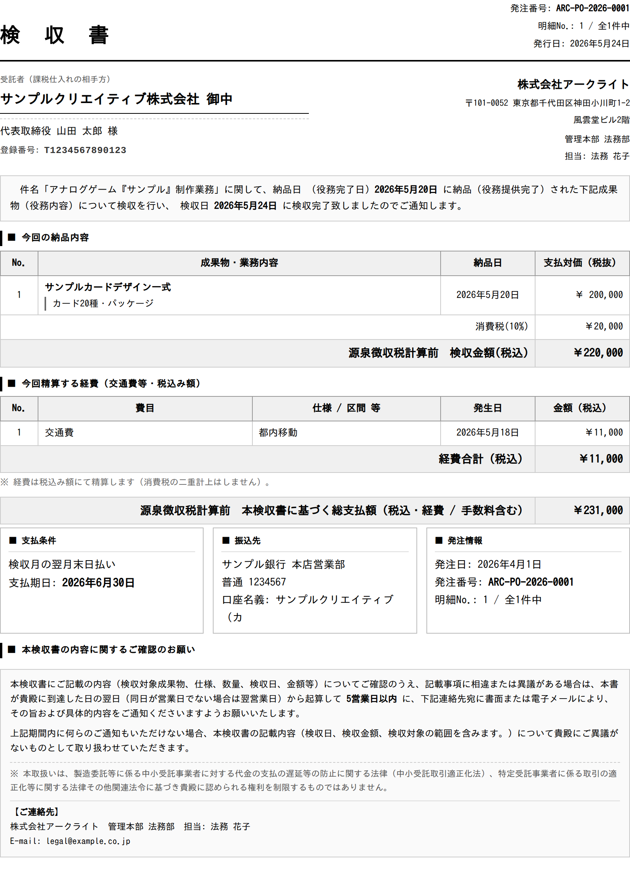
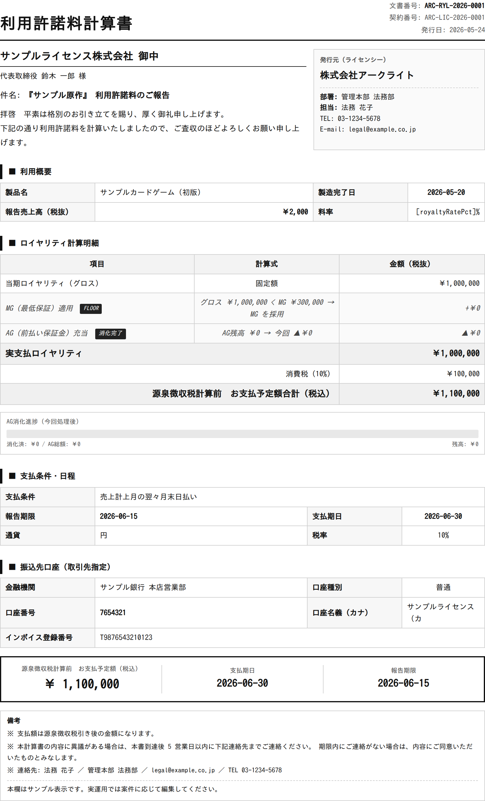
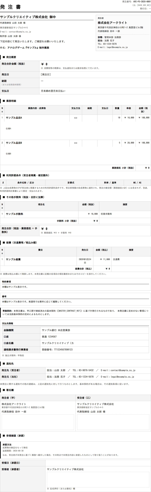
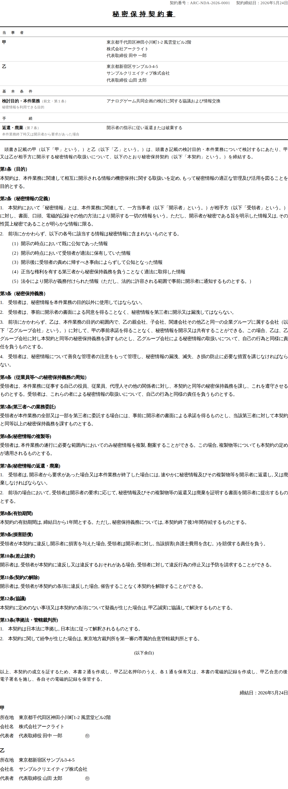

# LegalBridge 運用マニュアル（admin-ui / worker 中心・作業動線版）

> 対象: 法務・経理オペレーション担当者および運用管理者
> フォーカス: **admin-ui（編集アプリ）** と **worker（生成・ジョブ・送信）**
> 補助参照: `docs/service-architecture.md`, `docs/search-api-manual.md`

このマニュアルは「日々の作業の流れ（作業動線）」に沿って構成しています。
まず §3 のメインフローを上から読めば、1 件の案件が「課題受信 → 文書作成 → 締結/送信
→ 検収・計算 → 会計出力 → 条件明細で管理 → アーカイブ」と流れる全体像が掴めます。
各画面・各操作の詳細は §4 以降を辞書的に参照してください。

---

## 1. システム全体像

LegalBridge は 3 つのサービスで構成されます。

| サービス | 実体 | 役割 |
|---|---|---|
| **admin-ui** | React アプリ（`src/`） | 法務チームの**編集アプリ**。文書作成・送信操作・マスター編集・設定を行う管理画面。 |
| **worker** | `services/worker`（Cloud Run） | **書き込み・ジョブ・文書生成**の中枢。PDF生成、採番、CloudSign送信、メール送信、検収/条件明細、Excel出力、Backlog webhook、Slack通知など。 |
| **search-api** | `services/api`（Cloud Run） | **検索・閲覧ポータル**（IAP配下）。取引先/契約/条件明細の横断検索、ひな型プレビュー。一部マスター書込も担当。 |

### admin-ui とバックエンドの通信（`src/lib/apiRouter.ts`）
admin-ui は `fetch` を内部でフックし、**HTTPメソッドとパス**でルーティングします。

- **GET（参照）** → 既定は search-api。ただし templates / numbering / cloudsign / email /
  documents / condition-lines / drafts 等の worker 専用 read は worker へ。
- **POST/PUT/PATCH/DELETE（更新）** → 既定は worker。ただし一部マスター書込
  （取引先 upsert 等）は search-api へ。
- 内部呼び出しには共有シークレット（`X-LB-PORTAL-SECRET`）を付与。

> 運用上のポイント: 「文書を作る・送る・検収する」系はすべて **worker**、
> 「探す・プレビューする」系は **search-api** が処理します。

---

## 2. 用語・前提

- **課題（Backlog issue）**: 案件の起点。発注/契約/NDA 等の依頼が Backlog に起票される。
- **文書（documents）**: 生成された PDF/HTML 文書。`document_number`（採番）で一意管理。
- **条件明細（condition lines）**: 契約・発注の金銭条件の明細行。消化・残高・状態を管理。
- **成就文書**: 条件明細を「成就（履行）」させる文書（＝検収書・利用許諾料計算書）。
- **採番**: 文書番号の自動連番（`document_sequences`。例 `ARC-PO-2026-0001`）。
- 日時は DB は UTC 保存、画面/PDF/メールは JST（Asia/Tokyo）表示。

---

## 3. メインフロー（作業動線）

> 凡例: **【画面】** = admin-ui の操作画面 / **〔worker〕** = 裏で動く worker 処理。

### STEP 0. 課題受信（自動）
- Backlog で案件が起票 → **〔worker〕** `POST /api/webhooks/backlog` が受信。
- 課題種別（NDA / 購買 / ライセンス 等）を判定し、`legal_requests` を作成、起票者へ Slack 通知。
- **【Requests（`/requests`）】** に未対応課題が一覧表示される。

### STEP 1. 案件を開く
- **【Requests】** で課題を検索・絞り込み → クリックで **【課題詳細（`/issues/:key`）】** へ。
- 課題詳細では、その課題に紐づく**文書一覧**・ワークフロー・検収待ち・CloudSign 導線を確認。

### STEP 2. 文書作成
- **【New Document（`/documents/new`）】** または **【課題詳細】**「文書を作成」から起動。
- 手順:
  1. **文書種別を選択**（発注書 / NDA / 各種基本契約 / 検収書 / 利用許諾料計算書 等。§5 参照）。
  2. 課題に紐付け（または手動作成）。
  3. フォーム入力（取引先・金額・期間等。取引先/契約マスターから自動補完可）。
  4. 一時保存（DBSYNC）で下書き保存（`document-drafts`、正本ではない）。
  5. **プレビュー**（HTML/PDF）で内容確認。
  6. **生成**:**〔worker〕** `POST /api/documents/generate` →
     `documents` 行作成・**採番**・PDF生成・**Drive アップロード**・必要に応じ条件明細/イベント作成。

### STEP 3. 締結（CloudSign 電子契約）※契約書類
- **【課題詳細】**/契約一覧から「CloudSign 送信」。
  - 単体: **〔worker〕** `POST /api/contracts/:id/cloudsign/send`
  - 課題まとめ送信: **〔worker〕** `POST /api/issues/:key/cloudsign/send-bundle`
- worker が CloudSign API を呼び、`cloudsign_requests` に記録（status=sent、`sent_at`）。
- 署名完了の webhook で `completed` に更新し Slack 通知。
- **送信時刻**は search-api の契約詳細「送信時間」列、admin-ui 条件明細「送信」列に表示。

### STEP 4. 納品報告 → 検収（検収書）※発注/業務委託
- 納品報告（納品明細の登録）後、**【条件明細ハブ（`/condition-lines`）→ 検収待ちタブ】** に
  「検収書 未発行」の発注書が並ぶ。
- 「検収書を作成」→ **【New Document（検収書）】**（親 PO を自動プリフィル、分割検収可）。
- 生成すると、検収満額になった明細は状態「検収書発行済」が自動 ON、残額0で一覧から外れる。

### STEP 5. 利用許諾料計算書 ※ライセンス契約
- **【New Document（利用許諾料計算書）】** または課題詳細から作成。
- 原作（ledger）・製造数・契約条件（MG/AG）から利用許諾料を計算。

### STEP 6. メール送信（検収書 / 利用許諾料計算書を取引先へ）
- **送信ボタンの場所（2 箇所）**:
  1. **【条件明細 一覧（`/condition-lines`）】** の「送信」列 →「✉ 送信 / ✉ 再送信」。
  2. **【課題詳細（`/issues/:key`）】** の文書一覧、検収書/計算書の行 →「✉ 送信」。
- 動作: **〔worker〕** `POST /api/documents/:docNumber/email/send`
  - 対象は**検収書・利用許諾料計算書のみ**。
  - 宛先 = 取引先の主担当メール（プロンプトで上書き可）。
  - 文書 PDF を添付し、設定の本文テンプレで送信（Gmail API）。
  - 送信後 `email_sent_at` / 宛先を記録 → 各画面の「送信」列・履歴に反映。
- 事前設定が必要（§8 メール送信セットアップ）。

### STEP 7. Excel 出力（会計用）
- **【Excel Export（`/excel-batches`）】**。
  - **〔worker〕** `GET /api/excel-batches/pending` で「Excel 未発行」の検収書/計算書を、
    検収担当者 × 支払期日 × 種別でグルーピング表示。
  - 出力 → **〔worker〕** `POST /api/excel-batches/export` で 1 ファイルにまとめて生成・Drive 保存。
- 「支払申請ファイル出力済（`excel_issued_at`）」は条件明細の状態判定にも使われる。

### STEP 8. 条件明細で管理（消化・残高・状態）
- **【条件明細ハブ（`/condition-lines`）】**（admin-ui、worker `GET /api/condition-lines`）:
  - **Cockpit/一覧**: 残額・MG残・状態・**送信**列。列見出しクリックで**並び替え**。
  - **検収待ち**タブ（STEP 4）。
  - **横断検索/ツリー**タブ: 取引先/作品/原作で俯瞰。
- **状態フラグ**（発注書締結済 / 検収書発行済 / 支払申請ファイル出力済）は手動切替に加え、
  **search-api の条件明細ポータル（`/master/conditions`）** で自動機能あり（§7）。

### STEP 9. アーカイブ
- **【Archive（`/archive`）】**。締結済み・終了案件、過去文書（External Assets）の管理・再編集。

---

## 4. 画面リファレンス（admin-ui）

サイドバーは **Overview / Operate / Create / Configuration** の 4 グループ。

### Overview
| 画面 | パス | 用途 |
|---|---|---|
| Dashboard | `/` | システム状況・主要指標の概観。 |

### Operate（日次フロー）
| 画面 | パス | 用途 |
|---|---|---|
| Requests | `/requests` | Backlog 課題の受信箱。検索・絞り込み・一括選択。子課題のクイック作成。 |
| 条件明細 | `/condition-lines` | 統合ハブ（Cockpit / 検収待ち / 横断検索 / ツリー）。消化・残高・状態・送信を管理。 |
| 条件明細 詳細 | `/condition-lines/:lineCode` | 1 明細の詳細。紐付け文書・成就イベント・送信履歴（メール/CloudSign）。 |
| Excel Export | `/excel-batches` | 未発行 検収書/計算書の会計用 Excel 一括出力。 |
| Archive | `/archive` | 締結済み・終了案件、過去文書の管理・再編集。 |

### Create
| 画面 | パス | 用途 |
|---|---|---|
| New Document | `/documents/new` | 文書エディタ。種別選択 → フォーム入力 → プレビュー → 生成。 |
| Imports | `/imports` | 過去文書の一括取込（CSV / 一括検収取込 / 業務委託マスター取込）。 |
| 課題詳細 | `/issues/:issueKey` | 課題に紐づく文書一覧・CloudSign送信・メール送信・ワークフロー。 |

### Configuration
| 画面 | パス | 用途 |
|---|---|---|
| Masters | `/master/*` | 取引先・スタッフ・契約台帳・原作/作品モデル・稟議・下書き・分配構造マップ・ルール 等。 |
| Templates | `/templates`, `/templates/:id` | ひな型（HTML/フィールドスキーマ）の編集。 |
| 連結チェック | `/data-linkage` | データ整合性の点検・修復（孤立した条件明細・参照切れ）。 |
| Settings | `/settings` | 会社情報・Backlog/Slack/CloudSign/メール の設定・通知テンプレ。 |

> 検索・ひな型プレビューは search-api の**検索ポータル**（サイドバー外部リンク
> `Search Portal` / `Template Preview`）で行います。

---

## 5. 文書種別一覧

| キー | 日本語ラベル |
|---|---|
| `purchase_order` | 発注書（国内） |
| `intl_purchase_order` | 発注書（海外 / Overseas Purchase Order） |
| `nda` | 秘密保持契約書（NDA） |
| `license_master` | ライセンス利用許諾基本契約書 |
| `individual_license_terms` | 個別利用許諾条件書 |
| `service_master` | 業務委託基本契約書 |
| `sales_master_buyer` | 売買基本契約書（当社買手版） |
| `sales_master_standard` | 売買基本契約書（当社売手・前払/代引版） |
| `sales_master_credit` | 売買基本契約書（当社売手・保証金掛け売り版） |
| `royalty_statement` | 利用許諾料計算書 |
| `inspection_certificate` | 検収書 |
| `maintenance_spec` | 保守仕様書（別紙） |
| `legal_response` | 法務回答書 |
| `pub_master_individual` | 出版等許諾基本契約書（個人版） |
| `pub_master_corporate` | 出版等許諾基本契約書（法人版） |
| `pub_license_terms` | 出版等利用許諾条件書 |
| `pub_additional_terms` | 追加利用許諾条件書（商品化・映像化・デジタルゲーム化） |
| `notice_consent_personal_info_freelance` | 個人情報の取扱いに関する通知・同意書（フリーランス） |

---

## 6. worker エンドポイント早見表（運用上重要なもの）

> 完全な一覧ではなく、運用で意識する代表的なものを抜粋。

**文書生成・取得**
- `POST /api/documents/generate` — 文書生成（form_data → HTML+PDF+Drive、採番、条件明細生成）
- `POST /api/documents/:id/regenerate-pdf` — 既存文書の PDF 再生成
- `GET /api/documents/:id`, `GET /api/documents/by-number/:docNumber`, `GET /api/documents/search`

**採番**
- 文書生成時に `document_sequences` を原子的にインクリメント（種別×年でプレフィックス）

**CloudSign（電子契約）**
- `POST /api/contracts/:id/cloudsign/send` / `POST /api/issues/:key/cloudsign/send-bundle`
- `GET /api/contracts/:id/cloudsign`（履歴） / `GET /api/cloudsign/health`（接続テスト）

**メール送信**
- `POST /api/documents/:docNumber/email/send` — 検収書/計算書を取引先へ送信
- `GET /api/email/health` — Gmail 接続テスト（送信しない）

**条件明細・イベント**
- `GET /api/condition-lines` / `GET /api/condition-lines/:lineCode`
- `POST /api/condition-lines/:id/link-document` / `POST /api/condition-events/:id/void`

**Excel 出力（会計）**
- `GET /api/excel-batches/pending` / `POST /api/excel-batches/export`

**取込**
- `POST /api/imports/bulk/inspection`（一括検収）/ `POST /api/imports/service-master`

**設定・Webhook**
- `POST /api/master/app-settings` — システム設定保存
- `POST /api/webhooks/backlog` — Backlog 受信 / CloudSign 完了 webhook

---

## 7. 条件明細の自動機能（search-api 側ポータル `/master/conditions`）

admin-ui の条件明細（worker 由来）とは別に、**search-api の条件明細ポータル**には次の機能があります。

- **列の並び替え**: 見出しクリックで昇順/降順。
- **🔗 自動紐付け（auto-link）**: 原作/作品/基本契約/稟議を保守的に推定し**空欄のみ補完**（手動は温存）。
  - 基本契約=取引先一致 / 作品・原作=タイトル一意一致 / 稟議=テキスト中の5桁番号。
  - 提案（dry-run）→ 件数確認 → 適用、の安全フロー。
- **✅ 状態 自動判定（auto-status）**: 状態フラグを実データから**完全同期**（ON/OFF 上書き、手動切替も可）。
  - 発注書締結済=`contract_status='executed'` / 検収書発行済=検収満額 /
    支払申請ファイル出力済=対の文書が Excel 出力済（`excel_issued_at`）。
- **FIN 部署限定の閲覧ビュー**（`/view/conditions`）: 部署コード `FIN` の viewer のみ閲覧可・編集不可。

> API: `POST /api/conditions/auto-link`、`POST /api/conditions/auto-status`（いずれも `dryRun` 既定 true、admin 専用）。

---

## 8. メール送信セットアップ（Gmail・鍵レス ドメイン全体委任）

検収書/計算書のメール送信は **Gmail API**（worker のランタイム SA を代理＝鍵レス）で行います。

### 8-1. GCP 側（一度だけ）
```bash
PROJECT=<プロジェクトID>
SA=<worker のランタイム SA メール（例: 9999-compute@developer.gserviceaccount.com）>
# API 有効化
gcloud services enable gmail.googleapis.com iamcredentials.googleapis.com --project=$PROJECT
# SA に「自分を signJwt できる」権限
gcloud iam service-accounts add-iam-policy-binding "$SA" \
  --member="serviceAccount:$SA" --role="roles/iam.serviceAccountTokenCreator" --project=$PROJECT
# 委任に使う数値クライアントID
gcloud iam service-accounts describe "$SA" --project=$PROJECT --format='value(uniqueId)'
```

### 8-2. Google Workspace 管理コンソール
- セキュリティ → API の制御 → **ドメイン全体の委任** → 新規追加
- クライアントID = 上記の **uniqueId（数値）**
- OAuth スコープ = `https://www.googleapis.com/auth/gmail.send`

### 8-3. admin-ui 設定（Settings → メール送信タブ）
- **EMAIL_SENDER**（差出人にする実在の Workspace ユーザー）
- **連携の有効化 = 有効**
- 検証中は **EMAIL_ALLOWED_RECIPIENTS** に自分のアドレス（誤送信ガード）
- **件名/本文テンプレ**（検収書・計算書を個別に編集可。トークン: `{{vendorName}} {{documentNumber}} {{amount}} {{date}} {{link}}`）
- **接続テスト**で「認証 OK ✓」を確認 → テスト送信 → 問題なければ許可宛先を空にして本番運用。

---

## 9. 設定（Settings）一覧

| 区分 | 主な項目 | 用途 |
|---|---|---|
| 会社情報 | COMPANY_NAME / ADDRESS / REPRESENTATIVE | 契約・検収書の「自社（甲）」自動補完。 |
| Backlog | BACKLOG_API_KEY / HOST / PROJECT_KEY | 課題受信・取得・ステータス同期。 |
| Slack | SLACK_BOT_TOKEN / SIGNING_SECRET ＋通知テンプレ | 各種通知（受信DM・督促・文書生成・一括取込・チャンネル）。 |
| CloudSign | CLIENT_ID / ENABLED / ALLOWED_RECIPIENTS / BASE_URL | 電子契約の送信制御・テスト宛先制限。 |
| メール送信 | EMAIL_SENDER / ENABLED / ALLOWED_RECIPIENTS ＋本文テンプレ | 検収書/計算書のメール送信（§8）。 |

---

## 10. トラブルシュート / FAQ

- **条件明細の「送信」列ボタンが出ない**: その明細に送信対象の検収書/計算書（`send_doc_number`）が
  無い（未生成）。先に検収書/計算書を生成してください。
- **メール接続テストが NG**:
  - `signJwt が空応答 / PERMISSION_DENIED` → SA への tokenCreator 未付与 or 反映前。
  - `unauthorized_client` → ドメイン全体委任のクライアントIDが unique(数値) でない or 反映前。
  - `invalid_scope` → スコープ文字列ミス（`…/auth/gmail.send` 完全一致）。
  - `failed precondition` → EMAIL_SENDER が実在ユーザーでない/別ドメイン。
- **メールが弾かれる（テスト中は許可された宛先のみ）**: EMAIL_ALLOWED_RECIPIENTS に宛先が無い。
- **検収書の状態が自動で付かない**: 検収満額（`inspected_amount >= amount`）になっていない、または
  search-api 側の「状態 自動判定」を未実行。
- **過去文書のラベル/文言が古い**: テンプレ変更は今後の生成・プレビューに適用。過去 PDF は
  再生成しない限り旧版のまま。

---

## 11. ひな型 見本（サンプル）

主要なひな型をサンプル値でレンダリングした見本です（実際の「ひな型プレビュー」と同じ
レンダリング機構で生成）。検収書・利用許諾料計算書は最新の文言（「源泉徴収税計算前…」）を反映。

### 検収書（inspection_certificate）


> 金額ラベルが「**源泉徴収税計算前　検収金額(税込)**」「**源泉徴収税計算前　本検収書に基づく総支払額（税込・経費 / 手数料含む）**」になっている点に注目。

### 利用許諾料計算書（royalty_statement）


> 「**源泉徴収税計算前　お支払予定額合計（税込）**」「**源泉徴収税計算前　お支払予定額（税込）**」を反映。

### 発注書（purchase_order）


### 秘密保持契約書（NDA）


> 見本は**サンプル値**での表示です。実運用の値・レイアウトは案件データに依存します。
> 見本画像の再生成は `node scripts/render-template-samples.mjs`
> （`handlebars` / `puppeteer-core` と `PUPPETEER_EXECUTABLE_PATH`、日本語フォントが必要）。

---

## 12. 付録

### 命名規則（Drive ファイル名 / Backlog 課題）
- Drive ファイル名: `文書番号_取引先名_作成日YYYYMMDD.html`（検収書/計算書は親番号 or 取引先名）。
- Backlog 課題プレフィックス運用: 例「【文書作成】<取引先>｜<文書種別>」。

### デプロイ経路（参考）
- **admin-ui** … `main` へマージで反映。
- **worker** … `release/worker` への promote（push）で migration 適用 + デプロイ。
- **search-api** … `release/api` への promote で反映。
- DDL/テンプレ DB 反映は worker デプロイ（cloudbuild-worker ①）に統合。

### 参照ドキュメント
- `docs/service-architecture.md`（サービス構成の正典）
- `docs/search-api-manual.md`（検索ポータル）
- `docs/condition_lines_unification_design.md`（条件明細の設計）

---

*本マニュアルはコードベース（admin-ui `src/` / worker `services/worker`）に基づき作成。
エンドポイントや画面は実装更新に伴い変わることがあります。*
