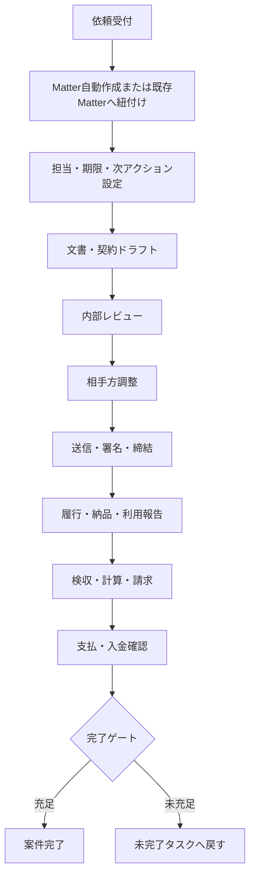
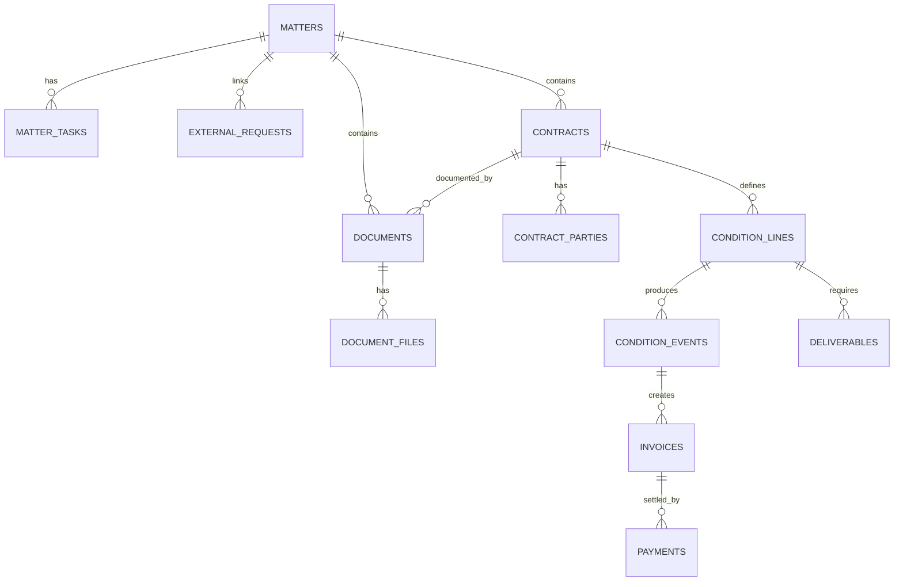
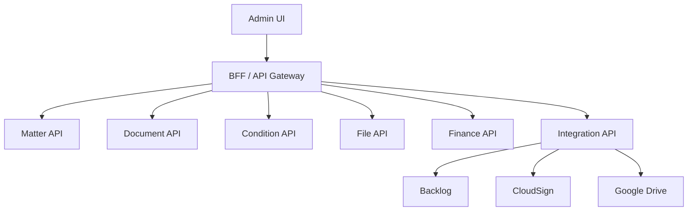

# LegalBridge AI 修正計画書

**Matterを中心とする一貫した法務業務基盤への再編**

| 項目 | 内容 |
|---|---|
| 対象 | `tatsuyakuramchi/LegalBridge_AI_GCP` |
| 基準 | `main` / `e7b25612e02003ab6f355197da58d9a416830ef6` |
| 作成日 | 2026-07-14 |
| 版 | 1.0 |
| 方針 | 現行運用を維持しながら段階的に改善する |

> [!IMPORTANT]
> 短期は `documents + condition_lines` を正本として安定化する。中長期は Matter を業務ハブとし、Contract、Document、File、Condition、Event、Invoice、Paymentを明確に分離する。

## 1. エグゼクティブサマリー

現行システムの最大の問題は、機能不足ではなく、依頼受付から契約・発注、送信・締結、履行、検収、請求・支払、完了までが一つの案件として連続していないことにある。

LegalBridgeを「機能別画面の集合」から「案件を完了させるワークスペース」へ変更する。Matterを業務上の主キーとして、依頼、契約、文書、署名、条件、履行、請求支払、ファイル、履歴を一か所で管理する。

### 優先順位

| 優先度 | テーマ | 主要変更 |
|---|---|---|
| P0 | 完了後導線 | 文書生成後に案件へ戻る。次アクションを表示する |
| P0 | DB正本確定 | `documents` と `condition_lines` をSSOTに固定する |
| P1 | Matterワークスペース | 概要、文書、署名、条件、ファイル、履歴を統合する |
| P1 | タスク・完了ゲート | 担当、期限、次アクション、ブロッカー、完了条件をDB化する |
| P1 | Drive管理 | 案件フォルダ、file ID、版、役割、ハッシュをDB保存する |
| P2 | 契約・金銭分離 | `contracts`、`invoices`、`payments`等を段階導入する |
| P2 | API・認証 | `window.fetch`差替えとブラウザ配布共有秘密を廃止する |

## 2. 現状評価

### 2.1 業務フロー

- Requests、Matter、Document Editor、Condition Hub、Archiveが別々の起点になっている。
- 文書生成完了後の操作が「閉じる」「新規作成」「Driveを開く」に限定され、送信、署名、検収、支払等に接続しない。
- Matter一覧に担当者、期限、現在工程、次アクション、ブロッカーがない。
- Matter詳細に日常操作と削除・吸収等の管理操作が混在している。
- Archiveが文書台帳、完了案件、版管理、再編集を兼ねており、意味が曖昧である。

### 2.2 DB

現行DBは新構造、旧構造、互換VIEW、トリガ、JSONBスナップショットが併存する移行期構造である。

- 最新方針は `documents + condition_lines` を物理的な真実源とする。
- 旧 `contract_capabilities`、`capability_*` は互換VIEWと `INSTEAD OF` トリガで残る。
- `documents` が契約実体、書面、フォーム、Drive URL、改訂、契約メタを兼ねている。
- Backlog課題キー、文書番号、URL等の文字列soft joinが残る。
- 検収、ロイヤリティ、利用報告、請求、支払・入金が分散している。
- DriveはURL保存が中心で、file ID、folder ID、版、正本、ハッシュを管理していない。

### 2.3 API・フロントエンド

- `src/lib/apiRouter.ts` が `window.fetch` を差し替え、URLとHTTPメソッドでサービスを振り分けている。
- ブラウザ配布されるVite環境変数に共有秘密を設定する構造がある。
- `AppDataContext` が多数の業務データを保持し、更新後の手動refreshに依存している。
- workerとsearch-apiに重複コードがあり、変更漏れが起こりやすい。

## 3. 基本設計方針

1. **Matter中心**：Issueは受付情報、Documentは成果物とし、Matterを業務ハブとする。
2. **SSOT**：同じ意味の業務データを複数の実表に保持しない。
3. **概念分離**：Contract＝法的関係、Document＝書面、File＝実ファイル、Condition＝条件、Event＝実績。
4. **予定と実績の分離**：契約条件・予定と、納品・検収・請求・支払実績を分ける。
5. **外部ID化**：Backlog、Drive、CloudSignのIDを内部主キーにしない。
6. **段階移行**：追加→読取移行→書込移行→バックフィル→旧構造削除の順とする。
7. **監査可能性**：重要操作を `audit_events` で追跡する。

### 短期の正本

| データ | 正本 | 補足 |
|---|---|---|
| 文書・契約メタ | `documents` | 当面の暫定正本 |
| 契約条件 | `condition_lines` | 金銭・業務条件を一本化 |
| 発行内容 | `documents.form_data` | 発行時点の不変スナップショット |
| 案件 | `matters` | Backlogは外部依頼情報 |
| 実ファイル | Google Drive | DBはfile IDとメタデータを保持 |

## 4. 目標業務フロー



### Matterライフサイクル

```text
intake
triage
drafting
internal_review
counterparty_review
signing
performance
inspection
invoicing_payment
completion_check
completed
cancelled
```

## 5. 目標画面構成

### 5.1 ナビゲーション

- ホーム：自分の次アクション、期限超過、署名待ち、検収待ち、支払待ち
- 案件：すべてのMatter。依頼・文書・条件・ファイルの共通入口
- 新規受付：依頼登録、外部Issue取込、既存案件への関連付け
- 台帳：契約、文書、条件、支払の参照画面
- マスター：取引先、担当者、作品、原作、製品、テンプレート
- 管理：インポート、連携、監査ログ、互換状況、システムヘルス

### 5.2 Matter一覧

表示項目を、件数中心から作業中心へ変更する。

- 案件番号・件名・相手方
- 現在工程
- 次アクション
- 担当者
- 期限
- ブロッカー
- 文書状態
- 金銭状態
- 最終更新

### 5.3 Matterワークスペース

| タブ | 内容 |
|---|---|
| 概要 | 案件要約、工程、担当、期限、次アクション、ブロッカー |
| 依頼・課題 | Backlog等の外部依頼と関係 |
| 契約・文書 | 基本、個別、覚書、ドラフト、発行、改訂、締結済み |
| 送信・署名 | 送付履歴、署名順、現在署名者、締結日時 |
| 条件・履行 | condition lines、成果物、納品、検収、利用報告 |
| 請求・支払 | 請求書、支払予定、入金予定、実績、残高 |
| ファイル | Drive案件フォルダ、正本、版、関連資料 |
| 履歴 | audit events、外部連携、状態遷移 |
| 管理 | 統合、削除、再紐付け等の低頻度操作 |

## 6. 目標データモデル



### 6.1 Matter補強

`matters` に以下を追加する。

- `lifecycle_stage`
- `owner_staff_id`
- `target_due_date`
- `blocked_reason`
- `drive_folder_id`
- `drive_folder_url`
- `completed_at`
- `completed_by`
- `completion_reason`

### 6.2 新規テーブル

#### `matter_tasks`

- matter_id
- task_type
- title / description
- assignee_staff_id
- due_at / completed_at
- status
- blocked_reason
- source_entity_type / source_entity_id
- is_primary

#### `document_files`

- document_id / matter_id
- drive_file_id / drive_folder_id
- file_role
- file_name / mime_type / size
- checksum_sha256
- revision
- is_current
- created_by / created_at

#### `audit_events`

- matter_id
- actor_id
- action
- entity_type / entity_id
- before_json / after_json
- request_id
- created_at

### 6.3 中長期の分離

- `contracts`：契約という法的関係
- `contract_parties`：契約当事者
- `documents`：発行・受領書面
- `document_files`：実ファイル
- `condition_lines`：契約条件
- `condition_events`：履行・検収・計算等の実績
- `deliverables` / `deliverable_revisions`：成果物と版・リテイク
- `invoices` / `invoice_lines`：請求・請求書受領
- `payments`：支払・入金の統一台帳

### 6.4 作品・原作・製品

推奨モデルは次のとおり。

- `source_ips`：社外に権利がある原作・IP
- `source_ip_materials`：原作配下の素材
- `works`：当社が制作・出版・販売する作品
- `products`：初版、再版、拡張、電子版等のSKU
- `work_material_uses`：作品と原作素材のN:N関係

## 7. Drive・ファイル保存計画

```text
LegalBridge/
└─ YYYY/
   └─ MTR-YYYY-NNNN_相手方_案件名/
      ├─ 01_Request/
      ├─ 02_Draft/
      ├─ 03_Review/
      ├─ 04_Final/
      ├─ 05_Signed/
      ├─ 06_Deliverables_Inspection/
      ├─ 07_Invoice_Payment/
      └─ 90_Reference/
```

- Matter作成時に案件フォルダを生成し、folder IDとURLを保存する。
- URLだけでなくDrive file IDを保存する。
- 正本、ドラフト、レビュー版、締結済み、検収書、請求書等を `file_role` で区別する。
- 改訂は上書きせず、新しいrevisionとして保存する。
- checksumとfile IDで重複を検出する。
- DB登録file IDの存在・権限を定期検査する。

## 8. API・認証・キャッシュ

### 目標構成



### 修正内容

- `window.fetch` monkey patchへの新規依存を停止する。
- `matterClient`、`documentClient`等のドメインAPIクライアントを導入する。
- ブラウザ配布共有秘密を廃止し、Cloud Run IAM、IAP、ID token等へ移行する。
- TanStack Query等でmutation後のinvalidateを定義する。
- `AppDataContext`は認証・UI設定等に縮小する。
- DB型、validation、mapping、error codeをshared packageへ移す。
- request ID、matter ID、user IDをログへ付与し、外部連携を再実行可能にする。

## 9. 段階別修正計画

| Phase | 目的 | 主な作業 |
|---|---|---|
| 0 | 基準固定 | 本番migration、実表・VIEW・トリガ、依存箇所、データ品質を確認 |
| 1 | 完了導線 | 文書完了画面、Matter復帰、次アクション、Matter必須化 |
| 2 | Matter中心化 | lifecycle、owner、due、tasks、workspace、completion gate |
| 3 | Drive管理 | 案件フォルダ、document_files、版・役割・ハッシュ、欠損監視 |
| 4 | DB安定化 | documents/condition_lines直読直書、form_data不変化、互換依存削減 |
| 5 | 契約・金銭分離 | contracts、deliverables、invoices、payments導入 |
| 6 | API・認証 | domain client、BFF/IAM、query cache、shared package |
| 7 | レガシー撤去 | 旧API、互換VIEW、INSTEAD OFトリガ、不要テーブル削除 |

### Phase 1 受入条件

- PDF生成とDB登録のみの双方で完了結果画面が表示される。
- 「案件へ戻る」が主操作として表示される。
- 送信、CloudSign、内部レビュー、検収、Drive等の次アクションが提示される。
- 文書は原則Matterに必ず紐付く。
- RequestsのMatter判定は `primary_issue_key` だけでなく `matter_issues` 全体を参照する。

### Phase 2 受入条件

- Matter一覧から、担当、期限、現在工程、次アクション、ブロッカーが分かる。
- Matter詳細の日常操作と管理操作が分離される。
- 未署名、未検収、未払、未入金、未保存ファイルをcompletion gateが検出する。
- 権限者のみ理由付き例外完了ができる。

### Phase 4 受入条件

- 新規コードは互換VIEWを経由しない。
- `form_data`は発行時に構造化データから生成され、発行後は更新されない。
- 編集はrevision追加として扱う。
- 互換VIEW・トリガごとに参照件数と撤去条件が記録される。

## 10. 移行・リリース

標準順序は以下とする。

1. Additive schema
2. 読み取りAPI対応
3. バックフィル・整合性検証
4. UI読み取り切替
5. 書込みAPI切替
6. 監査期間
7. 旧書込み停止
8. 旧読取り停止
9. 互換VIEW・トリガ・旧列削除

### 互換VIEW撤去基準

- 旧テーブル名参照がゼロ、またはmigration/compatテストのみ。
- 本番クエリログで一定期間アクセスがない。
- 新旧の件数、主要金額、文書番号、条件明細が一致する。
- 主要業務シナリオが新APIのみで完結する。
- バックアップと復旧手順が確認済み。

## 11. テスト

### 業務シナリオ

- 業務委託：依頼→Matter→発注書→送付→納品→検収→請求書→支払→完了
- ライセンスIN：契約→作品・原作→利用報告→ロイヤリティ計算→支払
- ライセンスOUT：契約→条件→製造・販売報告→請求→入金
- NDA：CLゼロで署名・保存・完了
- 基本＋個別：親子契約、条件、検収を追跡
- 覚書・改定：旧版を保持し最新条件を判定
- 案件統合：duplicate/partial IssueをMatterへ集約

### DB整合性

- Matter未紐付けの業務文書がない。
- condition line、file、invoice、paymentに孤児がない。
- 締結済み正本は対象文書につき原則1件。
- 発行済み `form_data` が上書きされない。
- invoiceとpaymentから残高を再現できる。

## 12. 実装バックログ案

| ID | Issue | 優先度 |
|---|---|---|
| EPIC-01 | Matter-Centered Workflow Redesign | P0 |
| LB-01 | 文書生成完了画面に案件復帰・次アクションを追加 | P0 |
| LB-02 | 文書生成時のMatter解決を必須化 | P0 |
| LB-03 | RequestsのMatter判定をmatter_issues全体へ拡張 | P0 |
| LB-04 | Matter lifecycle / owner / due / completion列追加 | P1 |
| LB-05 | matter_tasksと次アクションパネル | P1 |
| LB-06 | Matter一覧へ工程・期限・ブロッカー追加 | P1 |
| LB-07 | Matter詳細を業務タブと管理タブへ再編 | P1 |
| LB-08 | Drive案件フォルダ自動作成 | P1 |
| LB-09 | document_filesテーブル・File API | P1 |
| LB-10 | 文書台帳と完了案件の分離 | P1 |
| LB-11 | form_data不変化・revision再発行 | P1 |
| LB-12 | 互換VIEW依存メトリクスと撤去ゲート | P1 |
| LB-13 | contracts / contract_parties導入 | P2 |
| LB-14 | deliverables / revisions導入 | P2 |
| LB-15 | invoices / payments統一台帳 | P2 |
| LB-16 | window.fetch差替えの段階廃止 | P2 |
| LB-17 | ブラウザ共有秘密の廃止とIAM認証 | P2 |
| LB-18 | Query cache移行 | P2 |
| LB-19 | works / source_ips / productsモデル確定 | P2 |
| LB-20 | 旧VIEW・トリガ・レガシーテーブル撤去 | P3 |

## 13. 完了定義

- 案件一覧から未完了業務と次アクションを判断できる。
- 依頼から完了まで主要業務がMatter内で連続する。
- 同じ業務データの正本が一つに定義される。
- 契約書面、締結済み正本、成果物、請求書等をDrive file IDで追跡できる。
- 条件から納品、検収、請求、支払・入金まで追跡できる。
- 案件完了時に未署名、未検収、未払、未入金、未保存を検出できる。
- ブラウザ配布物にサーバー共有秘密が含まれない。
- 互換VIEW、トリガ、旧テーブルの撤去状況が可視化される。

## 参考対象

- `src/App.tsx`
- `src/pages/DocumentEditorPage.tsx`
- `src/lib/apiRouter.ts`
- `AppDataContext`
- Matter / Requests / Archive / Condition Hub各画面
- `migrations/0101_simplify_condition_core.sql`
- `migrations/0102_matter_management.sql`
- `migrations/0063_condition_lines_unification.sql`
- `docs/design/schema-simplification-plan.md`
- `docs/schema-redesign-proposal.md`
- `docs/data-model-simplification-migration-plan.md`
- `docs/system-overview-and-manual.md`
- `docs/phase24_ux_todo.md`

## 文書管理ルール

- 設計方針変更時は版、対象コミット、要決定事項、該当Phaseを更新する。
- 旧設計書を残す場合は `Superseded by: <path>` を明記する。
- 実装Issueは本書の `LB-xx` を参照し、対象画面、API、DB、受入条件を記載する。
- 互換VIEW、トリガ、二重書込みを追加する場合は、同じ変更内で撤去条件を定義する。
