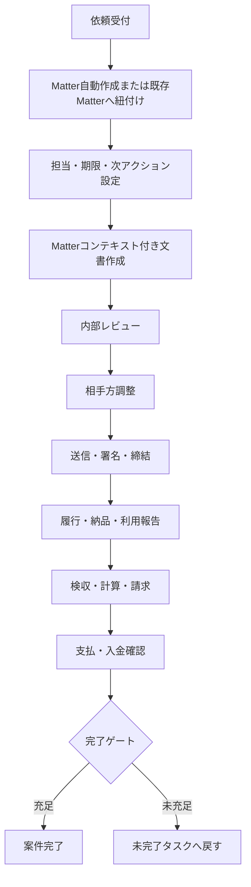
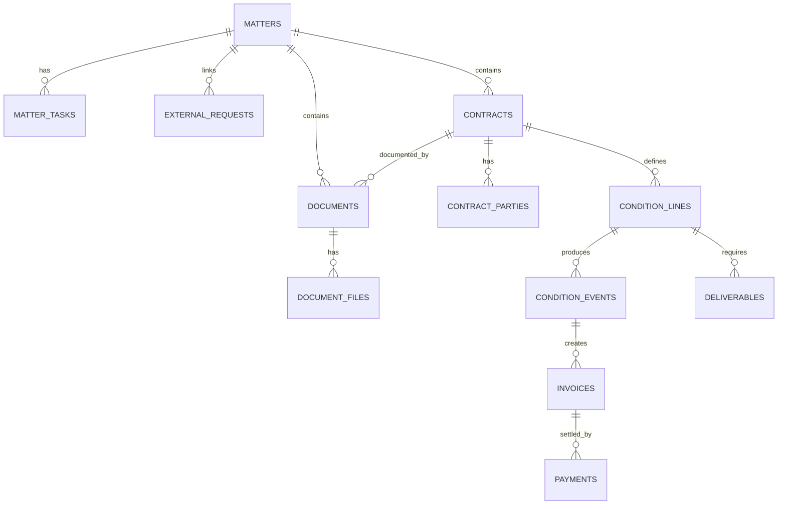
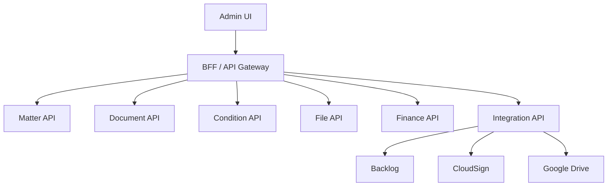

# LegalBridge AI 修正計画書

**Matterを中心とする一貫した法務業務基盤への再編**

| 項目 | 内容 |
|---|---|
| 対象 | `tatsuyakuramchi/LegalBridge_AI_GCP` |
| 基準 | `main` / `e7b25612e02003ab6f355197da58d9a416830ef6` |
| 作成日 | 2026-07-14 |
| 版 | 1.1 |
| 方針 | 現行運用を維持しながら段階的に改善する |
| 更新内容 | 文書作成フォームの配置・動線・Matter連携・完了後導線を追加 |

> [!IMPORTANT]
> 短期は `documents + condition_lines` を正本として安定化する。中長期は Matter を業務ハブとし、Contract、Document、File、Condition、Event、Invoice、Paymentを明確に分離する。

## 1. エグゼクティブサマリー

現行システムの最大の問題は、機能不足ではなく、依頼受付から契約・発注、送信・締結、履行、検収、請求・支払、完了までが一つの案件として連続していないことにある。

LegalBridgeを「機能別画面の集合」から「案件を完了させるワークスペース」へ変更する。Matterを業務上の主キーとして、依頼、契約、文書、署名、条件、履行、請求支払、ファイル、履歴を一か所で管理する。

文書作成機能については、フォーム項目そのものよりも、Matterからの遷移、前提情報の重複選択、同じ検索・補完操作の重複、主操作と管理操作の混在、生成後の次アクション不足が主要課題である。文書作成を独立作業ではなくMatter内の一工程として再設計する。

### 優先順位

| 優先度 | テーマ | 主要変更 |
|---|---|---|
| P0 | 文書作成導線 | Matterから直接作成、Matterコンテキスト継承、生成後にMatterへ復帰 |
| P0 | 文書フォーム制御 | 請求方向をテンプレート別制御、非金銭文書から不要項目を撤去 |
| P0 | DB正本確定 | `documents` と `condition_lines` をSSOTに固定する |
| P1 | Matterワークスペース | 概要、文書、署名、条件、ファイル、履歴を統合する |
| P1 | フォームUX | 入力点一本化、固定アクションバー、セクションナビ、状態表示 |
| P1 | タスク・完了ゲート | 担当、期限、次アクション、ブロッカー、完了条件をDB化する |
| P1 | Drive管理 | 案件フォルダ、file ID、版、役割、ハッシュをDB保存する |
| P2 | 契約・金銭分離 | `contracts`、`invoices`、`payments`等を段階導入する |
| P2 | API・認証 | `window.fetch`差替えとブラウザ配布共有秘密を廃止する |

## 2. 現状評価

### 2.1 業務フロー

- Requests、Matter、Document Editor、Condition Hub、Archiveが別々の起点になっている。
- 文書生成完了後の操作が「閉じる」「新規作成」「Driveを開く」に限定され、送信、署名、検収、支払等に接続しない。
- Matter一覧に担当者、期限、現在工程、次アクション、ブロッカーがない。
- Matter詳細に日常操作と削除・吸収等の管理操作が混在している。
- Archiveが文書台帳、完了案件、版管理、再編集を兼ねており、意味が曖昧である。

### 2.2 DB

現行DBは新構造、旧構造、互換VIEW、トリガ、JSONBスナップショットが併存する移行期構造である。

- 最新方針は `documents + condition_lines` を物理的な真実源とする。
- 旧 `contract_capabilities`、`capability_*` は互換VIEWと `INSTEAD OF` トリガで残る。
- `documents` が契約実体、書面、フォーム、Drive URL、改訂、契約メタを兼ねている。
- Backlog課題キー、文書番号、URL等の文字列soft joinが残る。
- 検収、ロイヤリティ、利用報告、請求、支払・入金が分散している。
- DriveはURL保存が中心で、file ID、folder ID、版、正本、ハッシュを管理していない。

### 2.3 API・フロントエンド

- `src/lib/apiRouter.ts` が `window.fetch` を差し替え、URLとHTTPメソッドでサービスを振り分けている。
- ブラウザ配布されるVite環境変数に共有秘密を設定する構造がある。
- `AppDataContext` が多数の業務データを保持し、更新後の手動refreshに依存している。
- workerとsearch-apiに重複コードがあり、変更漏れが起こりやすい。

### 2.4 文書作成フォーム

#### Matterからの遷移

Matter詳細の「文書作成」はDocument Editorへ直接遷移せず、代表Backlog課題の詳細画面へ戻る。Matterを作成しても、文書作成時には課題を起点として再度処理するため、案件コンテキストが切れる。

現在の動線は次のとおりである。

```text
Matter詳細
  ↓
代表Backlog課題
  ↓
文書作成
  ↓
課題・テンプレート・担当者・取引先等を再確認
```

#### 上部設定バー

上部設定バーは4列グリッドである一方、実際には次の5項目が存在する。

1. Backlog課題
2. 文書テンプレート
3. 請求の向き
4. 担当者
5. 取引先

取引先が次行へ回りやすく、担当者と取引先が視覚的に分断される。番号も `① → ② → ②′ → ③ → ④` となっており、処理順として分かりにくい。

#### 請求の向き

`selectedDirection` は生成時に全文書で必須となっているが、NDA、同意書、通知書、法務相談回答書等には支払・受取の方向が存在しない。非金銭文書でも「当社が払う」「当社が受け取る」のいずれかを選ばせる構造は、業務・DBの双方で不適切である。

#### 検索・補完操作の重複

同じ情報を複数箇所から設定できる。

- 上部バーの取引先選択
- フォーム内の取引先検索
- DB補完バーの取引先・自社・担当者ボタン
- エディターヘッダーのBacklog Sync
- フォーム内のBacklog Sync
- 法務アセット検索
- 条件明細・ラインID検索

入力点が複数あるため、どの操作が正本を変更し、どの操作が単なる補完かが分かりにくい。

#### ヘッダー・フッター操作

ヘッダーには保存、番号呼出し、プレビュー、条件明細、ラインID、Backlog Sync、リセットが並ぶ。フッターにはプレビュー、Excel、内部修正・再発行、個人情報同意書、単独契約、ファイルリンク、DB登録のみ、`Finalize & Sync`が並ぶ。

通常作成、例外登録、管理操作が同列に表示され、誤操作リスクがある。また、プレビューが上下に重複している。

#### ステータス表示

`Draft valid`、`Ready for sync`、`Live syncing`等の表示は実際の必須項目充足、未保存変更、外部API状態と必ずしも連動していない。利用者に誤った安心感を与える可能性がある。

#### フォームレイアウト

新しいSchemaフォームは2カラム、旧 `FormSection` は3カラム、専用フォームは独自レイアウトであり、テンプレートを切り替えると視覚規則が変わる。Schema移行は進んでいるが、全フォーム共通の配置基準は未確立である。

#### 完了後導線

完了モーダルの主要操作は「閉じる」「新しい文書を作成」「Driveで開く」であり、Matterへ戻る、メール送信、CloudSign送信、検収、支払処理へ進む操作がない。

## 3. 基本設計方針

1. **Matter中心**：Issueは受付情報、Documentは成果物とし、Matterを業務ハブとする。
2. **SSOT**：同じ意味の業務データを複数の実表に保持しない。
3. **概念分離**：Contract＝法的関係、Document＝書面、File＝実ファイル、Condition＝条件、Event＝実績。
4. **予定と実績の分離**：契約条件・予定と、納品・検収・請求・支払実績を分ける。
5. **外部ID化**：Backlog、Drive、CloudSignのIDを内部主キーにしない。
6. **段階移行**：追加→読取移行→書込移行→バックフィル→旧構造削除の順とする。
7. **監査可能性**：重要操作を `audit_events` で追跡する。
8. **入力点一本化**：Matter、取引先、担当者、基本契約等の入力点を一つにする。
9. **業務語彙優先**：`Finalize & Sync`等の技術用語ではなく「文書を作成」「検収書を確定」等を使用する。
10. **例外操作の隔離**：DB登録のみ、単独契約登録、内部修正等は通常操作から分離する。

### 短期の正本

| データ | 正本 | 補足 |
|---|---|---|
| 文書・契約メタ | `documents` | 当面の暫定正本 |
| 契約条件 | `condition_lines` | 金銭・業務条件を一本化 |
| 発行内容 | `documents.form_data` | 発行時点の不変スナップショット |
| 案件 | `matters` | Backlogは外部依頼情報 |
| 実ファイル | Google Drive | DBはfile IDとメタデータを保持 |

## 4. 目標業務フロー



### Matterライフサイクル

```text
intake
triage
drafting
internal_review
counterparty_review
signing
performance
inspection
invoicing_payment
completion_check
completed
cancelled
```

## 5. 目標画面構成

### 5.1 ナビゲーション

- ホーム：自分の次アクション、期限超過、署名待ち、検収待ち、支払待ち
- 案件：すべてのMatter。依頼・文書・条件・ファイルの共通入口
- 新規受付：依頼登録、外部Issue取込、既存案件への関連付け
- 台帳：契約、文書、条件、支払の参照画面
- マスター：取引先、担当者、作品、原作、製品、テンプレート
- 管理：インポート、連携、監査ログ、互換状況、システムヘルス

### 5.2 Matter一覧

表示項目を、件数中心から作業中心へ変更する。

- 案件番号・件名・相手方
- 現在工程
- 次アクション
- 担当者
- 期限
- ブロッカー
- 文書状態
- 金銭状態
- 最終更新

### 5.3 Matterワークスペース

| タブ | 内容 |
|---|---|
| 概要 | 案件要約、工程、担当、期限、次アクション、ブロッカー |
| 依頼・課題 | Backlog等の外部依頼と関係 |
| 契約・文書 | 基本、個別、覚書、ドラフト、発行、改訂、締結済み |
| 送信・署名 | 送付履歴、署名順、現在署名者、締結日時 |
| 条件・履行 | condition lines、成果物、納品、検収、利用報告 |
| 請求・支払 | 請求書、支払予定、入金予定、実績、残高 |
| ファイル | Drive案件フォルダ、正本、版、関連資料 |
| 履歴 | audit events、外部連携、状態遷移 |
| 管理 | 統合、削除、再紐付け等の低頻度操作 |

### 5.4 常設「次アクション」パネル

Matter内の全タブに次を表示する。

- 現在工程
- 次に行う操作
- 担当者
- 期限
- ブロッカー
- 完了条件
- 関連操作ボタン

### 5.5 文書作成フォーム

#### 5.5.1 起動経路

文書作成画面は原則としてMatterから起動する。

```text
/matters/:matterId/documents/new
```

既存ルートを維持する場合は、少なくとも次のクエリを受け取る。

```text
/documents/new?matter_id=123&issue_key=ARC-456&template=purchase_order
```

Matterから次を自動設定する。

- `matter_id`
- Matterコード・案件名
- 代表課題・関連課題
- `vendor_id`・相手方
- 担当者
- 関連基本契約
- 関連文書
- Drive案件フォルダ
- 現在工程・次アクション

Backlog課題は作成対象案件を選ぶための主キーではなく、Matter内の依頼原票として参照表示する。

#### 5.5.2 上部Matterコンテキスト

常時プルダウンを5個並べず、次の3ブロックにする。

```text
┌ Matter・依頼 ─────────┬ 作成文書 ──────────┬ 当事者・担当 ─────────┐
│ MTR-2026-0123        │ 発注書              │ 取引先: 株式会社〇〇   │
│ 商品開発業務委託     │ 支払方向: 当社支払   │ 担当: 山田             │
│ Request: ARC-456     │ 基本契約: あり       │                        │
└──────────────────────┴─────────────────────┴───────────────────────┘
```

各ブロックは読み取り表示を基本とし、必要な場合のみ「変更」を押して編集する。

#### 5.5.3 テンプレート選択

テンプレート名一覧から直接選ばせるのではなく、業務目的から絞り込む。

```text
何を行いますか？

○ 契約を締結する
○ 発注する
○ 納品・検収を処理する
○ 利用許諾料を計算する
○ 通知・回答を行う
○ 既存文書を登録する
```

Matter種別、既存契約、現在工程から第一候補を自動選択する。高度な利用者向けにテンプレート名検索を残す。

#### 5.5.4 請求方向の制御

`FLOW_DIRECTION`を全文書共通必須から外し、テンプレート属性で制御する。

```ts
type DirectionMode =
  | "required"
  | "auto_in"
  | "auto_out"
  | "inherit_parent"
  | "condition_line"
  | "not_applicable"
```

| 文書 | directionMode |
|---|---|
| 発注書 | `auto_in` |
| 検収書 | `inherit_parent` |
| 利用許諾料計算書 | `inherit_parent` または条件明細から決定 |
| ライセンスアウト条件書 | `auto_out` |
| 支払・受取混在文書 | `condition_line` |
| NDA・通知書・同意書・回答書 | `not_applicable` |
| 基本契約 | 原則 `not_applicable`。必要な場合のみ個別指定 |

最終的な金銭方向は `condition_lines.direction` を正本とし、文書レベルの方向は初期値または集計属性に限定する。

#### 5.5.5 入力点の一本化

| 情報 | 唯一の入力点 |
|---|---|
| Matter | 文書作成開始時 |
| Request | Matter内の依頼原票 |
| 取引先 | Matterコンテキスト |
| 担当者 | Matter担当者 |
| 基本契約 | フォームの契約関係セクション |
| 対象作品・原作 | フォームの作品・権利セクション |
| 条件明細 | フォームの条件・金銭セクション |
| 過去文書 | 関連文書検索 |

フォーム内で再度同じ取引先を検索するのではなく、次の表示とする。

```text
Matterの取引先情報を反映済み
［別の取引先に変更］
```

#### 5.5.6 Backlog Sync

起動時に依頼原票から自動取込みする。手動操作は「依頼原票から再取得」一つに統一する。

再取得時は、上書き項目を選択させる。

```text
更新対象
☑ 件名
☑ 相手方
☐ 明細
☐ 納期
```

現在入力済みの値を一括で無条件に置き換えない。

#### 5.5.7 画面レイアウト

デスクトップでは次の3ペイン構成を基本とする。

```text
パンくず
案件一覧 > MTR-2026-0123 > 発注書作成

┌ セクションナビ ┐ ┌ 入力フォーム ─────────────┐ ┌ 案件サマリー ┐
│ ✓ 基本情報     │ │ 1. 発注概要               │ │ Matter       │
│ ✓ 当事者       │ │                            │ │ 相手方       │
│ ! 契約関係     │ │ 2. 取引先・基本契約       │ │ 関連契約     │
│ ! 成果物       │ │                            │ │ 未入力3件    │
│   金銭条件     │ │ 3. 成果物                 │ │ 次の処理     │
│   その他       │ │                            │ │              │
└───────────────┘ └───────────────────────────┘ └──────────────┘
```

- 左：セクションナビ、完了・未入力状態、アンカー移動
- 中央：入力フォーム
- 右：Matter、相手方、関連契約、関連文書、未入力、次アクション
- タブレット以下：右サマリーを上部カード、セクションナビを横スクロールまたはドロワー化
- モバイル：1カラム

#### 5.5.8 フォーム配置基準

- 通常テキスト入力：2カラム
- 住所、備考、条項、長文：全幅
- 金額、率、日付：3〜4列のコンパクトグリッド
- 明細、条件表、作品・原作割当：全幅
- 当事者情報：左右比較または役割別カード
- 任意項目・管理項目：折りたたみ
- 必須項目：セクション単位で不足件数を表示

`FormSection`、`FkGrid`、専用Schemaフォームのカラム規則を統一する。

#### 5.5.9 固定アクションバー

ヘッダー・フッターに操作を重複配置せず、画面下部に固定する。

```text
未保存の変更あり　最終保存 14:32
［下書き保存］［プレビュー］［文書を作成］
```

主操作は原則として次の3つに限定する。

1. 下書き保存
2. プレビュー
3. 文書を作成・確定

`Finalize & Sync`は廃止し、テンプレートに応じて表示を変える。

- 発注書を作成
- 契約書を作成
- 検収書を確定
- 利用許諾料計算書を作成

#### 5.5.10 例外・管理操作

次は「その他の操作」または管理者向けドロワーへ移す。

- PDFを作成せずDB登録
- 既存ファイルを登録
- 単独契約として登録
- 内部修正
- 再発行
- 条件明細コード・旧capability IDによる読込み
- フォーム全消去

操作前に結果、対象文書番号、既存データへの影響を表示する。

#### 5.5.11 状態表示

固定アクションバーまたは右サマリーに実状態を表示する。

```text
下書き状態
● サーバー保存済み
▲ 未保存の変更あり

入力確認
▲ 必須項目 3件未入力

外部連携
● Backlog取得済み
● Drive接続済み
```

表示は実際のバリデーション、保存状態、API応答と連動させる。固定文言として `Draft valid` や `Live syncing` を表示しない。

### 5.6 文書作成完了画面

文書種別とMatterの現在工程に応じて、次アクションを出し分ける。

#### 契約書

- Matterへ戻る
- 内部レビューを依頼
- CloudSignで送信
- メールで共有
- Driveで確認

#### 発注書

- Matterへ戻る
- 受注者へ送信
- 検収待ちに設定
- 関連条件明細を確認
- Driveで確認

#### 検収書

- Matterへ戻る
- 支払処理へ進む
- 会計Excelを開く
- 請求書受領状況を確認
- Driveで確認

#### DB登録のみ

DB登録のみの場合もtoastだけで終了せず、登録した文書番号、Matter、ファイル有無、PDF未作成キュー、次アクションを完了画面へ表示する。

### 5.7 アーカイブの分離

| 画面 | 役割 |
|---|---|
| 完了案件 | 業務が完了したMatter。原則読み取り専用。再開は理由付き操作 |
| 文書台帳 | 発行・受領した書面の検索、版、正本、関連契約を表示 |
| ファイル台帳 | Driveファイルの保存状態、版、ハッシュ、欠損を表示 |
| 監査履歴 | 削除、統合、再発行、正本切替等の操作履歴 |

## 6. 目標データモデル



### 6.1 Matter補強

`matters` に以下を追加する。

- `lifecycle_stage`
- `owner_staff_id`
- `target_due_date`
- `blocked_reason`
- `drive_folder_id`
- `drive_folder_url`
- `completed_at`
- `completed_by`
- `completion_reason`

### 6.2 documents補強

短期は `documents` を文書・契約メタの正本として利用する。文書作成導線に必要な次の関係を明確化する。

- `matter_id`：原則必須
- `primary_issue_key`または外部依頼中間表への参照
- `vendor_id`
- `contract_id`：中長期導入
- `document_purpose`
- `direction_mode`
- `flow_direction`：適用文書のみ
- `lifecycle_status`
- `revision` / `superseded_by`

### 6.3 新規テーブル

#### `matter_tasks`

- matter_id
- task_type
- title / description
- assignee_staff_id
- due_at / completed_at
- status
- blocked_reason
- source_entity_type / source_entity_id
- is_primary

#### `document_files`

- document_id / matter_id
- drive_file_id / drive_folder_id
- file_role
- file_name / mime_type / size
- checksum_sha256
- revision
- is_current
- created_by / created_at

#### `audit_events`

- matter_id
- actor_id
- action
- entity_type / entity_id
- before_json / after_json
- request_id
- created_at

#### `external_requests`

- source_system
- external_key
- external_url
- summary_snapshot
- status_snapshot
- last_synced_at

#### `matter_requests`

- matter_id
- external_request_id
- relation
- is_primary

### 6.4 中長期の分離

- `contracts`：法的関係
- `contract_parties`：契約当事者と役割
- `documents`：発行・受領した書面
- `document_files`：実ファイル
- `condition_lines`：契約条件
- `condition_events`：履行、検収、計算等の実績
- `deliverables` / `deliverable_revisions`：成果物と版・リテイク
- `invoices` / `invoice_lines`：請求・請求書受領
- `payments`：支払・入金の統一台帳

### 6.5 作品・原作・製品

推奨モデルは次のとおり。

- `source_ips`：社外に権利がある原作・IP
- `source_ip_materials`：原作配下の素材
- `works`：当社が制作・出版・販売する作品
- `products`：初版、再版、拡張、電子版等のSKU
- `work_material_uses`：作品と原作素材のN:N関係

## 7. Drive・ファイル保存計画

```text
LegalBridge/
└─ YYYY/
   └─ MTR-YYYY-NNNN_相手方_案件名/
      ├─ 01_Request/
      ├─ 02_Draft/
      ├─ 03_Review/
      ├─ 04_Final/
      ├─ 05_Signed/
      ├─ 06_Deliverables_Inspection/
      ├─ 07_Invoice_Payment/
      └─ 90_Reference/
```

- Matter作成時に案件フォルダを生成し、folder IDとURLを保存する。
- URLだけでなくDrive file IDを保存する。
- 正本、ドラフト、レビュー版、締結済み、検収書、請求書等を `file_role` で区別する。
- 改訂は上書きせず、新しいrevisionとして保存する。
- checksumとfile IDで重複を検出する。
- DB登録file IDの存在・権限を定期検査する。
- Document Editorから生成するファイルは、Matterのfolder IDを明示的にworkerへ渡す。

## 8. API・認証・キャッシュ

### 目標構成



### 修正内容

- `window.fetch` monkey patchへの新規依存を停止する。
- `matterClient`、`documentClient`等のドメインAPIクライアントを導入する。
- ブラウザ配布共有秘密を廃止し、Cloud Run IAM、IAP、ID token等へ移行する。
- TanStack Query等でmutation後のinvalidateを定義する。
- `AppDataContext`は認証、UI設定、限定的な参照マスタ等に縮小する。
- DB型、validation、mapping、error codeをshared packageへ移す。
- request ID、matter ID、user IDをログへ付与し、外部連携を再実行可能にする。
- 文書作成APIはMatterコンテキスト、directionMode、保存先folder IDを明示的なDTOで受け取る。

## 9. 段階別修正計画

| Phase | 目的 | 主な作業 |
|---|---|---|
| 0 | 基準固定 | 本番migration、実表・VIEW・トリガ、依存箇所、データ品質を確認 |
| 1 | 文書作成導線 | Matter直結、コンテキスト継承、方向制御、完了画面、次アクション |
| 2 | Matter・フォーム中心化 | lifecycle、tasks、workspace、入力点一本化、セクションナビ、固定アクションバー |
| 3 | Drive管理 | 案件フォルダ、document_files、版・役割・ハッシュ、欠損監視 |
| 4 | DB安定化 | documents/condition_lines直読直書、form_data不変化、互換依存削減 |
| 5 | 契約・金銭分離 | contracts、deliverables、invoices、payments導入 |
| 6 | API・認証 | domain client、BFF/IAM、query cache、shared package |
| 7 | レガシー撤去 | 旧API、互換VIEW、INSTEAD OFトリガ、不要テーブル削除 |

### Phase 0: 基準固定

- 本番Cloud SQLのmigration適用履歴を確認する。
- 実テーブル、VIEW、トリガ、関数を一覧化する。
- documents、condition_lines、互換VIEWへの読取・書込箇所を棚卸しする。
- 文書作成テンプレートごとに、Schema移行状況、必須項目、direction適用、Matter依存を一覧化する。
- 設計資料の正本を一本化し、旧資料へSuperseded表記を付ける。

### Phase 1: 文書作成導線

- Matter詳細の「文書作成」をDocument Editorへの直接遷移に変更する。
- `matter_id`、代表課題、取引先、担当者、関連契約、Drive folder IDをDocument Editorへ渡す。
- 文書生成APIで `matter_id` を保存する。解決不能時の扱いを明確化する。
- directionModeをテンプレート定義へ追加し、非金銭文書から請求方向を撤去する。
- DB登録のみの場合も完了画面を表示する。
- 完了画面にMatter復帰、送信、CloudSign、検収、支払、Drive等の次アクションを追加する。
- RequestsのMatter判定を `matter_issues` 全体へ拡張する。

### Phase 2: Matter・フォーム中心化

- mattersへstage、owner、due、blocked、completion列を追加する。
- `matter_tasks`を新設し、現在の次アクションを1件選定する。
- Matter一覧へ現在工程、次アクション、担当、期限、ブロッカーを追加する。
- Document Editor上部をMatterコンテキスト表示へ変更する。
- 取引先、担当者、Backlog Sync、関連文書の入力点を一本化する。
- ヘッダー・フッターの重複操作を固定アクションバーへ統合する。
- DB登録のみ、単独契約、再発行等を「その他の操作」へ隔離する。
- 左セクションナビと右案件サマリーを導入する。
- 必須項目、未保存変更、API接続状態を実状態に連動して表示する。
- フォームの2カラム、全幅、金額グリッド等の配置基準を統一する。

### Phase 3: Drive管理

- Matter作成時にDrive案件フォルダを自動生成する。
- `document_files`を追加し、既存 `drive_link` からfile IDをバックフィルする。
- 文書生成、外部ファイル登録、締結済み登録、成果物登録を共通File APIへ集約する。
- Drive欠損、権限不整合、DB未登録ファイルを検出する。

### Phase 4: DB安定化

- 新規コードは `documents` / `condition_lines` を直接読み書きする。
- `form_data`は発行時に構造化データから生成し、発行後は更新しない。
- 編集はrevision追加として扱う。
- 互換VIEW・トリガごとに参照件数と撤去条件を記録する。
- データ辞書、ER図、状態遷移、directionMode一覧を管理する。

### Phase 5: 契約・金銭分離

- `contracts`と`contract_parties`を追加する。
- `documents.contract_id`を追加し、1契約に複数文書を紐付ける。
- `deliverables` / revisionsを導入する。
- `invoices` / `invoice_lines` / `payments`を導入する。
- 作品、原作、製品の概念モデルを確定する。

### Phase 6: API・認証

- `window.fetch` monkey patchに新規ルートを追加しない。
- ドメインAPIクライアントを導入する。
- ブラウザ配布共有秘密を廃止する。
- mutation後のinvalidateルールを定義する。
- 共通DTO、validation、DB mappingをshared packageへ移す。

### Phase 7: レガシー撤去

- 旧capability API・旧テーブル名への参照ゼロをCIで確認する。
- 互換VIEW、INSTEAD OFトリガ、不要syncトリガを削除する。
- 古い設計書・READMEをMatter中心へ更新する。
- 削除前後で件数、金額、文書、条件、ファイルを照合する。

## 10. 移行・リリース

標準順序は以下とする。

1. Additive schema
2. 読み取りAPI対応
3. バックフィル・整合性検証
4. UI読み取り切替
5. 書込みAPI切替
6. 監査期間
7. 旧書込み停止
8. 旧読取り停止
9. 互換VIEW・トリガ・旧列削除

### 互換VIEW撤去基準

- 旧テーブル名参照がゼロ、またはmigration/compatテストのみ。
- 本番クエリログで一定期間アクセスがない。
- 新旧の件数、主要金額、文書番号、条件明細が一致する。
- 主要業務シナリオが新APIのみで完結する。
- バックアップと復旧手順が確認済み。

## 11. テスト・受入基準

### 11.1 業務シナリオ

- 業務委託：依頼→Matter→発注書→送付→納品→検収→請求書→支払→完了
- ライセンスIN：契約→作品・原作→利用報告→ロイヤリティ計算→支払
- ライセンスOUT：契約→条件→製造・販売報告→請求→入金
- NDA：CLゼロ、directionなしで署名・保存・完了
- 基本＋個別：親子契約、条件、検収を追跡
- 覚書・改定：旧版を保持し最新条件を判定
- 案件統合：duplicate/partial IssueをMatterへ集約

### 11.2 文書作成フォーム

- Matter詳細から1クリックでDocument Editorへ直接遷移する。
- Matter、代表課題、取引先、担当者、関連契約が自動表示される。
- 文書生成時に `documents.matter_id` が保存される。
- NDA、通知書、同意書等では請求方向が表示されず、未選択でも生成できる。
- 発注書・検収書等ではdirectionが自動設定または親文書から継承される。
- 支払・受取混在文書では明細単位のdirectionを保存できる。
- 取引先・担当者・Backlog Syncの主入力点が各1箇所である。
- 例外操作は通常の作成ボタンと視覚的に分離されている。
- 必須項目不足時は該当セクションと最初の未入力フィールドへ移動できる。
- 未保存、保存済み、必須不足、外部連携状態が実状態と一致する。
- キーボードのみでセクション移動、入力、保存、プレビュー、生成ができる。
- モバイルでは1カラムで操作でき、固定アクションが入力欄を隠さない。
- 完了画面からMatterへ戻り、文書種別に応じた次アクションを実行できる。
- DB登録のみでも完了結果とPDF未作成状態が表示される。

### 11.3 DB整合性

- Matter未紐付けの業務文書がない。
- condition line、file、invoice、paymentに孤児がない。
- 締結済み正本は対象文書につき原則1件。
- 発行済み `form_data` が上書きされない。
- invoiceとpaymentから残高を再現できる。
- directionModeと保存されたdirectionの組合せがテンプレート定義に適合する。

### 11.4 非機能

- 権限：案件、文書、ファイル、管理操作を制御する。
- 性能：Matter・テンプレート・取引先を引き継いだ初期表示が実用時間内に完了する。
- 可用性：Drive、Backlog、CloudSign障害時に下書き保存と再実行が可能である。
- 監査：重要操作をuser、matter、entity、before/after、request ID付きで追跡する。
- アクセシビリティ：ラベル、フォーカス、キーボード、reduced motion、レスポンシブ表示を確認する。

## 12. 実装バックログ案

| ID | Issue | 優先度 |
|---|---|---|
| EPIC-01 | Matter-Centered Workflow Redesign | P0 |
| LB-01 | 文書生成完了画面に案件復帰・次アクションを追加 | P0 |
| LB-02 | 文書生成時のMatter解決を必須化 | P0 |
| LB-03 | RequestsのMatter判定をmatter_issues全体へ拡張 | P0 |
| LB-F01 | MatterからDocument Editorへ直接遷移 | P0 |
| LB-F02 | matter_idとMatterコンテキストを文書生成へ引継ぎ | P0 |
| LB-F03 | directionModeをテンプレート定義へ追加 | P0 |
| LB-F04 | 非金銭文書から請求方向選択を撤去 | P0 |
| LB-F05 | DB登録のみ・単独契約登録をその他操作へ移動 | P0 |
| LB-F06 | 上部設定バーをMatterコンテキスト表示へ変更 | P1 |
| LB-F07 | 取引先・担当者検索の入力点を一本化 | P1 |
| LB-F08 | Backlog Syncの重複撤去と項目別再取得 | P1 |
| LB-F09 | 固定アクションバーを導入 | P1 |
| LB-F10 | 入力・保存・連携ステータスを実状態へ連動 | P1 |
| LB-F11 | フォームのカラム・全幅配置基準を統一 | P1 |
| LB-F12 | セクションナビと未入力件数を導入 | P1 |
| LB-F13 | 右パネルをMatter・関連契約・次アクション中心へ変更 | P1 |
| LB-F14 | 完了画面に送信・署名・検収・支払導線を追加 | P1 |
| LB-F15 | テンプレート選択を業務目的ベースへ変更 | P2 |
| LB-04 | Matter lifecycle / owner / due / completion列追加 | P1 |
| LB-05 | matter_tasksと次アクションパネル | P1 |
| LB-06 | Matter一覧へ工程・期限・ブロッカー追加 | P1 |
| LB-07 | Matter詳細を業務タブと管理タブへ再編 | P1 |
| LB-08 | Drive案件フォルダ自動作成 | P1 |
| LB-09 | document_filesテーブル・File API | P1 |
| LB-10 | 文書台帳と完了案件の分離 | P1 |
| LB-11 | form_data不変化・revision再発行 | P1 |
| LB-12 | 互換VIEW依存メトリクスと撤去ゲート | P1 |
| LB-13 | contracts / contract_parties導入 | P2 |
| LB-14 | deliverables / revisions導入 | P2 |
| LB-15 | invoices / payments統一台帳 | P2 |
| LB-16 | window.fetch差替えの段階廃止 | P2 |
| LB-17 | ブラウザ共有秘密の廃止とIAM認証 | P2 |
| LB-18 | Query cache移行 | P2 |
| LB-19 | works / source_ips / productsモデル確定 | P2 |
| LB-20 | 旧VIEW・トリガ・レガシーテーブル撤去 | P3 |

### Issue共通受入条件

- 対象画面、API、DB変更を明記する。
- 既存データ、通常作成、一括インポート、DB登録のみへの影響を確認する。
- Matter、Document、Condition、Driveのどの正本を更新するか明記する。
- 成功時だけでなく、外部連携失敗、再実行、取消しを確認する。
- 監査ログと権限制御を含める。
- 互換レイヤーを増やす場合は撤去条件を記載する。
- フォーム変更では対象テンプレート、directionMode、初期値、必須条件、モバイル表示を記載する。

## 13. 要決定事項・完了定義

### 13.1 設計判断が必要な項目

| 論点 | 選択肢 | 推奨 |
|---|---|---|
| 契約と文書 | 最終的にcontractsを独立させる | 独立。documentsは発行書面に限定 |
| 作品・原作 | works統合かsource_ips分離か | source_ips / works / productsを分離 |
| Matter作成 | 依頼受付時に自動作成か手動選択か | 原則自動。既存案件候補がある場合のみ選択 |
| 文書作成起点 | Issue起点かMatter起点か | Matter起点。Issueは依頼原票 |
| direction | 文書必須か条件明細単位か | テンプレート属性＋condition_lines.direction |
| テンプレート選択 | 名称一覧か業務目的か | 業務目的を主、名称検索を補助 |
| 完了ゲート | 未払等を強制ブロックするか | 原則ブロック。権限者が理由付き例外完了可能 |
| ファイル正本 | DriveかDBバイナリか | Drive正本、DBはfile IDとメタデータ |
| API境界 | BFF一本化かサービス直結か | UI向けBFFを設け、内部で各サービスへ接続 |

### 13.2 システム全体の完了定義

- 案件一覧から未完了業務と次アクションを判断できる。
- 依頼から完了まで主要業務がMatter内で連続する。
- 文書作成時にMatter、取引先、担当者、関連契約を再選択する必要がない。
- 文書種別に不要な請求方向や管理項目が表示されない。
- 同じ業務データの正本が一つに定義される。
- 契約書面、締結済み正本、成果物、請求書等をDrive file IDで追跡できる。
- 条件から納品、検収、請求、支払・入金まで追跡できる。
- 案件完了時に未署名、未検収、未払、未入金、未保存を検出できる。
- ブラウザ配布物にサーバー共有秘密が含まれない。
- 互換VIEW、トリガ、旧テーブルの撤去状況が可視化される。

> [!IMPORTANT]
> まずPhase 1〜4を完了し、文書作成をMatter中心に接続するとともに、`documents + condition_lines`の正本を安定させる。その後、実運用で必要な境界が確認できた段階でcontracts、document_files、invoices、paymentsを導入する。

## 参考対象

- `src/App.tsx`
- `src/pages/MatterDetailPage.tsx`
- `src/pages/DocumentEditorPage.tsx`
- `src/components/document/DocumentForm.tsx`
- `src/components/document/SchemaDocumentForm.tsx`
- `src/components/document/documentFormSchemas.ts`
- `src/components/document/FormSection.tsx`
- `src/components/document/formkit/DocFormKit.tsx`
- `src/components/document/schemas/purchaseOrder.tsx`
- `src/lib/apiRouter.ts`
- `AppDataContext`
- Matter / Requests / Archive / Condition Hub各画面
- `migrations/0101_simplify_condition_core.sql`
- `migrations/0102_matter_management.sql`
- `migrations/0063_condition_lines_unification.sql`
- `docs/design/schema-simplification-plan.md`
- `docs/schema-redesign-proposal.md`
- `docs/data-model-simplification-migration-plan.md`
- `docs/system-overview-and-manual.md`
- `docs/phase24_ux_todo.md`

## 文書管理ルール

- 設計方針変更時は版、対象コミット、要決定事項、該当Phaseを更新する。
- 旧設計書を残す場合は `Superseded by: <path>` を明記する。
- 実装Issueは本書の `LB-xx` または `LB-Fxx` を参照し、対象画面、API、DB、受入条件を記載する。
- 互換VIEW、トリガ、二重書込みを追加する場合は、同じ変更内で撤去条件を定義する。
