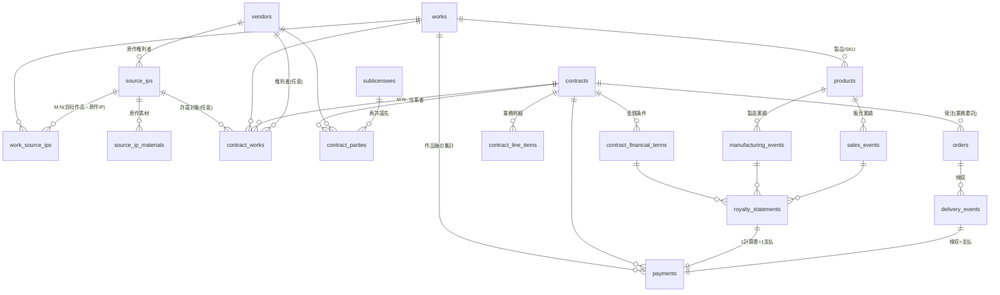

# テーブル構造 刷新案 ― 作品(Work)を軸とした契約・ロイヤリティ・業務委託報酬の統合管理

> 対象: LegalBridge AI (PostgreSQL / Cloud SQL)
> 目的: **作品(Work)を中心軸**に据え、(1) 契約管理、(2) ロイヤリティ支払管理、(3) 業務委託報酬の支払管理 を一貫して追跡・集計できるデータ構造へ再編する。

---

## 0. 前提 ― 当社の事業構造

| 事業部 | 事業内容 | 「作品」の単位 | 主な金銭フロー |
| :--- | :--- | :--- | :--- |
| 出版事業部 | TRPGを題材にした書籍出版 | 書籍タイトル / シリーズ | 著者印税(ロイヤリティ支払)、編集・イラスト等の業務委託報酬、原作許諾料 |
| ボードゲーム事業部 | アナログゲーム開発 | ボードゲームタイトル | 原作IPロイヤリティ支払、サブライセンス収入、制作の業務委託報酬 |

両事業部に共通して、**1つの「作品」に対して** 複数の契約・複数の支払(印税/許諾料/委託費)がぶら下がる構造になる。ここを軸に据えるのが本提案の核心。

---

## 1. 現状構造の課題

現状(Phase 28時点)を調査した結果、以下の構造的問題を確認した。

### 1.1 「作品」の軸が分散・文字列依存になっている

- `ledgers`(原作マスター)が実質的な作品軸だが、**事業部の自社作品と外部原作IPが同一テーブルに混在**している(`division` タグで区別)。
- 契約(`contract_capabilities`)から作品への参照は **`ledger_code VARCHAR(40)` の文字列リンク**1本のみ。さらに `work_name` / `original_work` / `product_name` / `covered_works` といった**自由記述テキスト列が重複**して存在し、正規化されていない。
- ロイヤリティ系(`manufacturing_events` / `royalty_calculations` / `royalty_payments`)から作品・契約への参照は、**`license_contract_id`(FK制約は撤去済み)** と **`work_id VARCHAR(120)` のフォールバック文字列キー** に依存している。

### 1.2 Phase 23.6.5 統合の「死んだ外部キー」が残置

`license_contracts` / `license_financial_conditions` を `contract_capabilities` / `capability_financial_conditions` に統合した結果、以下が **FK制約なしの孤児カラム**として残っている:

- `manufacturing_events.license_contract_id`
- `royalty_payments.license_contract_id`
- `royalty_calculations.license_contract_id`, `license_financial_condition_id`
- `work_sublicensees.license_contract_id`, `work_id`

参照整合性がDBレベルで保証されず、アプリ側の「優先ID、なければ文字列でfallback」ロジックに依存している。

### 1.3 支払(金銭)が一元化されていない

- **ロイヤリティ支払** → `royalty_payments` / `royalty_calculations`
- **業務委託報酬** → `delivery_events`(検収) + `delivery_line_items` + `capability_line_items` に暗黙的に分散。**支払を集約する台帳が存在しない。**
- サブライセンス収入(入金)を扱う統一的な場所もない。

→ 「**この作品にこれまでいくら払った/受け取ったか**(印税+許諾料+委託費)」を1クエリで出せない。

### 1.4 すべてが `backlog_issue_key`(文字列)で疎結合

ドキュメント・契約・検収・ロイヤリティが Backlog課題キー(文字列)で紐づいており、エンティティ間の関係がDB上のFKではなく文字列マッチに依存している。

### 1.5 製品(SKU)概念の欠如

「作品(IP/クリエイティブ)」と「製品(売り物のSKU = 初版/第2版/拡張/電子版)」が分離されていない。ロイヤリティは本来「製品の製造数・販売数 × 料率」で計算されるため、製品単位の実体が必要。

---

## 2. 設計方針

1. **作品(`works`)を単一のハブ**にする。契約・製品・支払はすべて作品にFKで紐づく。
   - `works` は **自社が開発・出版する自社作品のみ** を対象とする。
   - 外部から許諾を受ける **原作IPは別マスター(`source_ips`)に分離**し、作品とは M:N(`work_source_ips`)で結ぶ(1作品が複数原作をミックスする/1原作が複数作品に展開されるケースに対応)。
2. **自由記述・文字列キー・JSONB疎結合を、実FK + 中間テーブルに正規化**する。
3. **支払を1つの統一台帳(`payments`)に集約**し、ロイヤリティ/業務委託/許諾料/入金を `payment_kind` + `direction` で区別する。各行に必ず `work_id` を持たせ、作品軸の集計を可能にする。
4. **契約⇔作品は M:N**(包括契約は複数作品をカバー、1作品に複数契約)を中間テーブルで表現する。
5. 現行の Backlog連携・採番・帳票生成ロジックを壊さないよう、`backlog_issue_key` / `document_number` 列は**補助キーとして温存**しつつ、主従関係はFKで張り直す。

---

## 3. 新テーブル構造(ER概観)



### 3.1 マスター層

#### `works`(自社作品) ― **新ハブ。自社の開発・出版作品のみ**

外部原作の属性(権利者・クレジット・承認条件)は持たせず、後述の `source_ips` 側に集約する。`works` は「当社が世に出すタイトル」に純化する。

| 列 | 型 | 説明 |
| :--- | :--- | :--- |
| id | SERIAL PK | |
| work_code | VARCHAR(40) UNIQUE | `W-YYYY-NNNN` |
| title / title_kana | TEXT | 作品名 |
| alternative_titles | TEXT[] | 別名 |
| division | TEXT[] | `{BDG, PUB}` 事業部タグ(現行踏襲, GIN索引) |
| work_type | VARCHAR(50) | board_game / trpg_book / supplement / digital など |
| status | VARCHAR(20) | planning / in_production / released / suspended / discontinued |
| publisher_vendor_id | INTEGER FK→vendors | 出版元(自社外の場合) |
| is_original | BOOLEAN | 完全自社オリジナル(原作なし)か。FALSE の場合 `work_source_ips` に1件以上を期待 |
| remarks, is_active, created_at, updated_at | | |

#### `source_ips`(原作IP) ― **新規。外部から許諾を受ける原作の独立マスター**

現 `ledgers` が抱えていた「原作の権利者・帳票デフォルト・承認条件」はこちらへ移す。license-in ロイヤリティ契約は原則この `source_ips` を許諾対象として参照する。

| 列 | 型 | 説明 |
| :--- | :--- | :--- |
| id | SERIAL PK | |
| source_code | VARCHAR(40) UNIQUE | `IP-YYYY-NNNN`(現 `ledger_code` LO- を継承可) |
| title / title_kana | TEXT | 原作名 |
| alternative_titles | TEXT[] | 別名 |
| rights_holder_vendor_id | INTEGER FK→vendors | 原作権利者(現 `creator_name` 自由記述を実FK化) |
| original_publisher | TEXT | 原作出版元 |
| default_rights_holder / default_credit_display / default_work_supplement | TEXT | 帳票デフォルト(現 ledgers 踏襲) |
| default_approval_target / default_approval_timing | TEXT | 承認条件デフォルト(現 ledgers 踏襲) |
| remarks, is_active, created_at, updated_at | | |

#### `work_source_ips`(自社作品⇔原作IP 中間) ― **新規**

| work_id FK→works | source_ip_id FK→source_ips | role(原作/題材/イラスト原案 等) | UNIQUE(work_id, source_ip_id) |

#### `source_ip_materials`(原作素材) ― 現 `materials` を移設・拡張

現 `materials` を `source_ips` 配下へ移設(`ledger_id`→`source_ip_id`)。`rights_holder TEXT`(自由記述)を **`rights_holder_vendor_id INTEGER FK→vendors`** に置換し権利者を正規化する(自由記述は `rights_holder_label` として併存可)。素材単位で権利者・許諾条件が異なるケースに対応。

#### `products`(製品 / SKU) ― **新規**

作品から生まれる具体的な売り物。**ロイヤリティ計算と製造/販売実績はここに紐づく**(作品とSKUの分離)。

| 列 | 型 | 説明 |
| :--- | :--- | :--- |
| id | SERIAL PK | |
| work_id | INTEGER FK→works | |
| product_code | VARCHAR(60) UNIQUE | `P-{work_code}-NNN` |
| product_name | TEXT | |
| edition | VARCHAR(100) | 初版 / 第2版 / 拡張パック 等(現 manufacturing_events.edition を昇格) |
| format | VARCHAR(30) | physical / ebook / print_on_demand |
| msrp | DECIMAL(15,2) | 希望小売価格 |
| jan_code / isbn | VARCHAR | |
| release_date / status | | |

#### `vendors`(取引先) / `sublicensees`(再許諾先)

現行を踏襲。中長期的には `sublicensees` を `vendors` + 役割フラグに統合することを推奨するが(再許諾先も取引先になりうるため)、影響範囲が大きいため**本提案では現行2テーブルを維持**し、`contract_parties` 経由で双方を当事者として扱えるようにする。

### 3.2 契約層

#### `contracts`(契約) ― 現 `contract_capabilities` を整理

役割を「契約そのもの」に純化。作品への参照は文字列 `ledger_code` を廃し、後述の `contract_works` 中間テーブルへ移す。

| 列 | 型 | 説明 |
| :--- | :--- | :--- |
| id | SERIAL PK | |
| document_number | VARCHAR(100) UNIQUE | 採番(現行踏襲) |
| record_type | VARCHAR(50) | master_contract / license_condition / publication_condition(現行踏襲) |
| contract_category | VARCHAR(30) | **license_in / license_out / service(業務委託) / publication / sales / nda** に再整理 |
| contract_type | VARCHAR(100) | service_basic / license_basic / individual_license_terms 等 |
| contract_title | TEXT | |
| primary_vendor_id | INTEGER FK→vendors | 主取引先 |
| contract_status / effective_date / expiration_date / auto_renewal | | 現行踏襲 |
| renewal_notice_months / alert_lead_months / last_renewal_alert_at / alert_slack_* | | 更新アラート(現行踏襲) |
| legalon_url / cloudsign_url / drive_url / source_system | | 現行踏襲 |
| purpose_codes | TEXT[] | 現行踏襲(GIN) |
| 許諾範囲フラグ群(overseas_allowed, translation_allowed, sublicense_allowed, ebook_allowed, merchandising_allowed, video_adaptation_allowed, game_adaptation_allowed, scope 等) | | 現行踏襲 |
| risk_flags / legal_review_required / scope_confidence | | 現行踏襲 |

> **削除/移設**: `ledger_code`, `work_name`, `original_work`, `product_name`, `covered_works`, `covered_products` 等の作品関連自由記述列は `contract_works` へ移設。`additional_parties JSONB` は `contract_parties` へ移設。

#### `contract_works`(契約⇔作品 中間) ― **新規・最重要**

契約と作品の M:N を解決する。包括基本契約が複数作品をカバーするケース、1作品に複数契約(基本契約+個別条件書)が付くケースの両方を表現。

| 列 | 型 | 説明 |
| :--- | :--- | :--- |
| id | SERIAL PK | |
| contract_id | INTEGER FK→contracts | |
| work_id | INTEGER FK→works NULL | 契約対象の自社作品 |
| source_ip_id | INTEGER FK→source_ips NULL | license-in契約で許諾を受ける原作IP |
| product_id | INTEGER FK→products NULL | 製品単位で結ぶ場合 |
| role | VARCHAR(30) | licensed_in(原作許諾を受ける) / licensed_out(再許諾する) / service_target(委託対象) / publication_target(出版対象) |
| rights_holder_vendor_id | INTEGER FK→vendors NULL | 当該対象の権利者(契約ごとに異なる場合) |
| CHECK(work_id IS NOT NULL OR source_ip_id IS NOT NULL) | | 作品か原作IPのいずれかは必須 |

#### `contract_parties`(契約当事者) ― 現 `additional_parties JSONB` を正規化

| contract_id FK | vendor_id FK(or sublicensee_id) | party_role(主/副/連帯保証/権利者/再許諾先) | sort_order |

> これにより3者以上契約をGINではなく実FK + 索引で検索できる。現 `work_sublicensees` の役割も、`contract_parties`(再許諾先) + `contract_financial_terms`(地域別条件)に吸収できる。

#### `contract_financial_terms`(金銭条件) ― 現 `capability_financial_conditions` を踏襲

`capability_id` → `contract_id` に改名し、ほぼそのまま。地域・言語別に複数行(料率, MG, AG, 計算期間, 通貨, 計算式)。

#### `contract_line_items`(業務明細) ― 現 `capability_line_items` を踏襲

`capability_id` → `contract_id` に改名。業務委託契約の成果物明細(業務名, 単価, 数量, 納期, 支払サイクル)。検収書の自動補完元。

### 3.3 実績・支払層

#### `payments`(支払・入金 統一台帳) ― **新規・最重要**

ロイヤリティ/業務委託報酬/原作許諾料/サブライセンス入金を**1テーブルに集約**。各行が作品を指すことで作品軸の集計を実現。

| 列 | 型 | 説明 |
| :--- | :--- | :--- |
| id | SERIAL PK | |
| payment_no | VARCHAR(40) UNIQUE | `PAY-YYYY-NNNN` |
| direction | VARCHAR(10) | **outbound(支払) / inbound(入金)** |
| payment_kind | VARCHAR(30) | **royalty / service_fee(業務委託報酬) / advance(MG・AG前払) / lump_sum(一時金) / sublicense_income** |
| work_id | INTEGER FK→works | **作品軸(原則必須)** |
| product_id | INTEGER FK→products NULL | |
| contract_id | INTEGER FK→contracts | |
| financial_term_id | INTEGER FK→contract_financial_terms NULL | 適用した金銭条件 |
| counterparty_vendor_id | INTEGER FK→vendors | 支払先 / 入金元 |
| period | VARCHAR(7) NULL | YYYY-MM(ロイヤリティ期) |
| amount_ex_tax / tax_rate / tax_amount | | |
| withholding_tax | DECIMAL(15,2) | 源泉徴収(印税・個人委託) |
| total_amount | DECIMAL(15,2) | |
| currency | VARCHAR(10) | |
| status | VARCHAR(20) | planned / calculated / approved / paid / received |
| due_date / paid_date | DATE | |
| source_document_number / backlog_issue_key | | 補助キー(現行連携用) |

#### `manufacturing_events`(製造実績) / `sales_events`(販売実績)

現 `manufacturing_events` を `product_id FK→products` 紐付けに変更(死んだ `license_contract_id` を撤去)。売上報告ベースのロイヤリティ(Phase 28 で追加)のために `sales_events`(販売数/売上金額)を新設し、`royalty_statements` の計算元を製造/販売の両方に対応させる。

#### `royalty_statements`(利用許諾料計算書) ― 現 `royalty_calculations` を整理

死んだ `license_contract_id` / `license_financial_condition_id` を撤去し、**`contract_id` / `financial_term_id` / `product_id` の実FK**に張り直す。MG/AG累積消化のロジック列(現行)はそのまま維持。1計算書 = 1 `payments` 行(`payment_id FK`)に連結。

#### `orders`(発注) / `delivery_events`(検収) ― 業務委託フロー

業務委託の発注書を `orders`(現状は `documents` + `contract_capabilities(record_type=purchase_order)` に分散)として明示化し、`contract_id` / `work_id` に紐付け。`delivery_events`(検収)→ 確定額を `payments`(payment_kind=service_fee)に1対1で連結。

---

## 4. 3つの業務フローと作品軸の貫通

### ① 業務委託報酬の支払
```
works ─ contracts(service) ─ contract_line_items ─ orders(発注書) ─ delivery_events(検収) ─ payments(service_fee, outbound)
```

### ② ロイヤリティ支払(license-in:原作権利者へ / 印税:著者へ)
```
works ─ products ─ manufacturing_events / sales_events
                                   │
contracts(license_in) ─ contract_financial_terms ─ royalty_statements(MG/AG消化) ─ payments(royalty, outbound)
```

### ③ サブライセンス収入(license-out:入金)
```
works ─ contracts(license_out) ─ contract_parties(再許諾先) ─ contract_financial_terms ─ royalty_statements ─ payments(royalty/sublicense_income, inbound)
```

すべての終端 `payments` が `work_id` を持つため、**作品1本の損益・支払総額を横断集計**できる。

---

## 5. 現行 → 新構造 マッピング / 移行方針

| 現行 | 新 | 移行方法 |
| :--- | :--- | :--- |
| `ledgers`(自社作品相当の行) | `works` | 自社タイトルの行を移行。`ledger_code`→`work_code`、列追加(work_type, status, publisher_vendor_id)。原作属性(権利者/クレジット/承認)は持ち込まない。 |
| `ledgers`(外部原作相当の行) | `source_ips` | 外部原作の行を分離移行。`ledger_code`→`source_code`、`creator_name`→`rights_holder_vendor_id`(名寄せ)、default_* 群を移設。自社作品との関係は `work_source_ips` に展開。 |
| `materials` | `source_ip_materials` | `ledger_id`→`source_ip_id`、`rights_holder`→`rights_holder_vendor_id`(名寄せ)。 |
| (なし) | `products` | `manufacturing_events` の product_name/edition から逆生成して初期投入。 |
| `contract_capabilities` | `contracts` + `contract_works` + `contract_parties` | 作品関連列を `contract_works` へ、`additional_parties` を `contract_parties` へ展開。`ledger_code` → `contract_works.work_id`。 |
| `capability_financial_conditions` | `contract_financial_terms` | `capability_id`→`contract_id` リネームのみ。 |
| `capability_line_items` | `contract_line_items` | 同上。 |
| `manufacturing_events` | `manufacturing_events`(改) | `license_contract_id`(死)撤去、`product_id` FK追加。 |
| `royalty_calculations` | `royalty_statements` | 死んだFKを `contract_id`/`financial_term_id`/`product_id` に張り直し。 |
| `royalty_payments` | `payments`(kind=royalty) | 統一台帳へ移行。 |
| `delivery_events` / `delivery_line_items` | 維持 + `payments`連結 | 検収確定額を payments(service_fee) に集約。 |
| `work_sublicensees` / `sublicensees` | `contract_parties` + `contract_financial_terms` / `sublicensees`維持 | 作品×再許諾先の条件を契約配下へ正規化。 |

### 移行ステップ(推奨)
1. **追加フェーズ**: 新テーブル(`works`/`source_ips`/`work_source_ips`/`source_ip_materials`/`products`/`contract_works`/`contract_parties`/`payments`/`sales_events`)を `CREATE` し、既存データをバックフィル(現行テーブルは温存)。`ledgers` は自社作品行と外部原作行を判別して `works` / `source_ips` に振り分ける。
2. **二重書き込み期間**: アプリを新FK経由の読み出しに切替え、旧文字列キーは fallback として残す。
3. **撤去フェーズ**: 死んだ `license_contract_id` 系、`ledger_code` 文字列、`additional_parties JSONB` を物理削除(現行 `scripts/phase23_migrate_to_capabilities.ts --drop` と同じ作法)。

---

## 6. 作品軸クエリ例(刷新後)

```sql
-- 作品1本の支払総額を種別(印税/許諾料/委託費)別に集計
SELECT w.title,
       p.payment_kind,
       p.direction,
       SUM(p.total_amount) AS total
FROM works w
JOIN payments p ON p.work_id = w.id
WHERE w.work_code = 'W-2025-0007'
GROUP BY w.title, p.payment_kind, p.direction;

-- 作品にぶら下がる全契約と満期アラート
SELECT w.title, c.contract_title, c.contract_category, c.expiration_date
FROM works w
JOIN contract_works cw ON cw.work_id = w.id
JOIN contracts c ON c.id = cw.contract_id
WHERE w.id = $1;

-- 期またぎのMG消化状況(製品単位)
SELECT pr.product_name, rs.period, rs.mg_consumed_after, rs.mg_remaining
FROM royalty_statements rs
JOIN products pr ON pr.id = rs.product_id
WHERE pr.work_id = $1
ORDER BY rs.period;
```

---

## 7. 期待効果

- **作品軸の一元集計**: 1作品の契約・印税・許諾料・委託費・収入を横断で即時把握。
- **参照整合性の回復**: 死んだFK・文字列キー・JSONB疎結合を実FKに置換し、データ破損リスクを低減。
- **製品(SKU)単位のロイヤリティ精緻化**: 版・形態ごとの製造/販売実績に基づく正確なMG/AG消化計算。
- **支払台帳の統一**: ロイヤリティと業務委託報酬を同一ビューで支払予定・実績管理。
- **拡張容易性**: 入金(サブライセンス収入)も同一台帳で扱え、将来の損益管理へ発展可能。

---

> 本ドキュメントは設計提案であり、DDLの実装(マイグレーション)は別フェーズで段階的に行うことを想定している。
