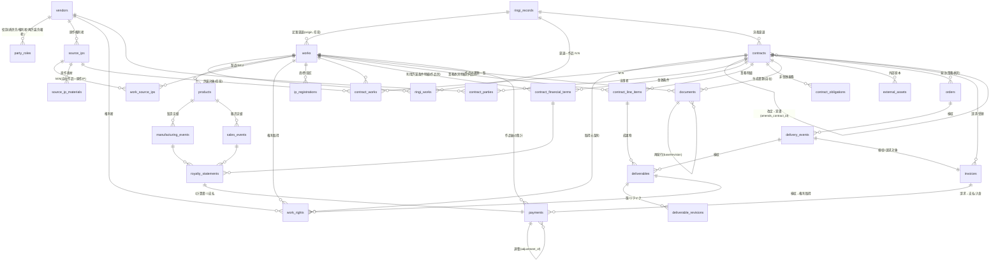

# テーブル構造 刷新案 ― 作品(Work)を軸とした知財・契約・支払の統合管理

> 対象: LegalBridge AI (PostgreSQL / Cloud SQL)
> 目的: **作品(Work)を中心軸**に据え、(1) 知的財産管理、(2) 契約管理、(3) ロイヤリティ・業務委託報酬の支払管理 を、
> **「権利の取得 → 保有 → 活用 → 請求 → 支払/入金」** の循環で漏れなく・ダブりなく(MECE)追跡できるデータ構造へ再編する。

---

## 0. 前提 ― 当社の事業構造

| 事業部 | 事業内容 | 「作品」の単位 | 主な金銭フロー |
| :--- | :--- | :--- | :--- |
| 出版事業部 | TRPGを題材にした書籍出版 | 書籍タイトル / シリーズ | 著者印税(ロイヤリティ支払)、編集・イラスト等の業務委託報酬、原作許諾料 |
| ボードゲーム事業部 | アナログゲーム開発 | ボードゲームタイトル | 原作IPロイヤリティ支払、サブライセンス収入、制作の業務委託報酬 |

両事業部に共通して、**1つの「作品」に対して** 複数の契約・複数の支払(印税/許諾料/委託費)がぶら下がる構造になる。ここを軸に据えるのが本提案の核心。

---

## 1. 現状構造の課題

現状(Phase 28時点)を調査した結果、以下の構造的問題を確認した。

### 1.1 「作品」の軸が分散・文字列依存になっている

- `ledgers`(原作マスター)が実質的な作品軸だが、**事業部の自社作品と外部原作IPが同一テーブルに混在**している(`division` タグで区別)。
- 契約(`contract_capabilities`)から作品への参照は **`ledger_code VARCHAR(40)` の文字列リンク**1本のみ。さらに `work_name` / `original_work` / `product_name` / `covered_works` といった**自由記述テキスト列が重複**して存在し、正規化されていない。
- ロイヤリティ系(`manufacturing_events` / `royalty_calculations` / `royalty_payments`)から作品・契約への参照は、**`license_contract_id`(FK制約は撤去済み)** と **`work_id VARCHAR(120)` のフォールバック文字列キー** に依存している。

### 1.2 Phase 23.6.5 統合の「死んだ外部キー」が残置

`license_contracts` / `license_financial_conditions` を `contract_capabilities` / `capability_financial_conditions` に統合した結果、以下が **FK制約なしの孤児カラム**として残っている:

- `manufacturing_events.license_contract_id`
- `royalty_payments.license_contract_id`
- `royalty_calculations.license_contract_id`, `license_financial_condition_id`
- `work_sublicensees.license_contract_id`, `work_id`

参照整合性がDBレベルで保証されず、アプリ側の「優先ID、なければ文字列でfallback」ロジックに依存している。

### 1.3 支払(金銭)が一元化されていない

- **ロイヤリティ支払** → `royalty_payments` / `royalty_calculations`
- **業務委託報酬** → `delivery_events`(検収) + `delivery_line_items` + `capability_line_items` に暗黙的に分散。**支払を集約する台帳が存在しない。**
- サブライセンス収入(入金)を扱う統一的な場所もない。

→ 「**この作品にこれまでいくら払った/受け取ったか**(印税+許諾料+委託費)」を1クエリで出せない。

### 1.4 すべてが `backlog_issue_key`(文字列)で疎結合

ドキュメント・契約・検収・ロイヤリティが Backlog課題キー(文字列)で紐づいており、エンティティ間の関係がDB上のFKではなく文字列マッチに依存している。

### 1.5 製品(SKU)概念の欠如

「作品(IP/クリエイティブ)」と「製品(売り物のSKU = 初版/第2版/拡張/電子版)」が分離されていない。ロイヤリティは本来「製品の製造数・販売数 × 料率」で計算されるため、製品単位の実体が必要。

### 1.6 MECE 監査で判明した「抜け」と「重複」

3ドメインを MECE で監査した結果、骨格に加えて以下の補完が必要と判明した(本提案に反映済み)。

| 区分 | 指摘 | 反映先 |
| :--- | :--- | :--- |
| 抜け(知財) | **自社作品の権利取得**(委託成果物の譲渡/許諾区分)を持つ場所が無い | `work_rights`(§3.2) |
| 抜け(知財) | 商標・意匠等の**産業財産権と更新期限**が未カバー | `ip_registrations`(§3.2) |
| 抜け(契約) | マスター↔個別の階層、改定・覚書チェーン、契約↔書類↔稟議の実FK | `contracts.master_contract_id` / `amends_contract_id` / `documents.contract_id`(§3.3) |
| 抜け(契約) | **金銭以外の契約義務**(最低製造義務・クレジット表記・報告義務・監査権) | `contract_obligations`(§3.3) |
| 抜け(支払) | 支払前の**「請求」フェーズ**(適格請求書の受領 / 入金請求の発行) | `invoices`(§3.4) |
| 抜け(支払) | **為替レート**(多通貨・海外送金の換算) | `payments` FX列(§3.4) |
| 抜け(支払) | 前払金 / 債権債務の**残高把握** | 残高ビュー(§3.4) |
| 抜け(成果物) | 納品物の**実ファイル・版・リテイク・受領ステータス**を持つ実体が無い | `deliverables` / `deliverable_revisions`(§3.4) |
| 重複(ME) | **取引先 vs 再許諾先の二重管理** | `vendors` + `party_roles` に一元化(§3.1) |
| 重複(ME) | 契約 vs 書類 vs 外部資産の境界が曖昧 | `contracts`=実体 / `documents`=物理ファイル と役割分離(§3.3) |

---

## 2. 設計方針

1. **作品(`works`)を単一のハブ**にする。知財・契約・製品・支払はすべて作品にFKで紐づく。
   - `works` は **自社が開発・出版する自社作品のみ** を対象とする。
   - 外部から許諾を受ける **原作IPは別マスター(`source_ips`)に分離**し、作品とは M:N(`work_source_ips`)で結ぶ。
2. **権利の循環を閉じる**: 「取得(委託)→ 保有(IP)→ 活用(契約)→ 請求 → 支払/入金」の各フェーズに実体テーブルを置き、抜け・ダブりを排除する。
3. **自由記述・文字列キー・JSONB疎結合を、実FK + 中間テーブルに正規化**する。
4. **当事者は `vendors` に一元化**し、役割(委託先 / 権利者 / 再許諾先 / 著者 / 出版元)は `party_roles` で多重付与する(取引先と再許諾先の二重管理を解消)。
5. **支払を1つの統一台帳(`payments`)に集約**し、ロイヤリティ/業務委託/許諾料/入金を `payment_kind` + `direction` で区別する。
   - 帰属先は **「作品費(`work_id`)」XOR「全社・部門経費(`department_code` + `expense_category`)」** の2系統。会計士委託・システム保守・顧問料・賃料など**作品に紐づかない契約・支払**は後者で分類する(`work_id` は NULL)。
   - 「作品別の支払」+「全社経費(費目別)」を合算すれば総支払が漏れなく(MECE)集計できる。
6. **契約⇔作品は M:N**(包括契約は複数作品をカバー、1作品に複数契約)を中間テーブルで表現する。
7. 現行の Backlog連携・採番・帳票生成ロジックを壊さないよう、`backlog_issue_key` / `document_number` 列は**補助キーとして温存**しつつ、主従関係はFKで張り直す。

---

## 3. 新テーブル構造(ER概観)



### 3.1 マスター層

#### `works`(自社作品) ― **新ハブ。自社の開発・出版作品のみ**

外部原作の属性(権利者・クレジット・承認条件)は持たせず、後述の `source_ips` 側に集約する。`works` は「当社が世に出すタイトル」に純化する。

| 列 | 型 | 説明 |
| :--- | :--- | :--- |
| id | SERIAL PK | |
| work_code | VARCHAR(40) UNIQUE | `W-YYYY-NNNN` |
| title / title_kana | TEXT | 作品名 |
| alternative_titles | TEXT[] | 別名 |
| division | TEXT[] | `{BDG, PUB}` 事業部タグ(現行踏襲, GIN索引) |
| work_type | VARCHAR(50) | board_game / trpg_book / supplement / digital など |
| status | VARCHAR(20) | planning / in_production / released / suspended / discontinued |
| publisher_vendor_id | INTEGER FK→vendors | 出版元(自社外の場合) |
| origin_ringi_id | INTEGER FK→ringi_records NULL | **起案稟議(作品稟議)**。作品の「生まれ」を1本参照。識別子は一体化しない |
| is_original | BOOLEAN | 完全自社オリジナル(原作なし)か。FALSE の場合 `work_source_ips` に1件以上を期待 |
| remarks, is_active, created_at, updated_at | | |

> **稟議との関係(独立 + FK)**: 稟議は「決定イベント」、作品は「長寿命マスター」で別物。1作品は生涯で複数の稟議(企画/増刷/海外展開/続編)を経て、1稟議が複数作品を一括決裁することもある(N:N)。よって**稟議番号を作品キーにせず**、`origin_ringi_id`(起案1本)と下記 `ringi_works`(生涯のN:N)で結ぶ。作品稟議は `ringi_records.category='work'` で判別する。

#### `ringi_works`(稟議⇔作品 中間) ― **新規**

既存 `ringi_documents`(稟議↔書類)と同型。増刷・海外展開・続編など、作品に対する複数の稟議を紐付ける。

| ringi_id FK→ringi_records | work_id FK→works | role(企画/増刷/海外展開/続編/価格改定 等) | linked_at | PK(ringi_id, work_id, role) |

#### `source_ips`(原作IP) ― **新規。外部から許諾を受ける原作の独立マスター**

現 `ledgers` が抱えていた「原作の権利者・帳票デフォルト・承認条件」はこちらへ移す。license-in ロイヤリティ契約は原則この `source_ips` を許諾対象として参照する。

| 列 | 型 | 説明 |
| :--- | :--- | :--- |
| id | SERIAL PK | |
| source_code | VARCHAR(40) UNIQUE | `IP-YYYY-NNNN`(現 `ledger_code` LO- を継承可) |
| title / title_kana | TEXT | 原作名 |
| alternative_titles | TEXT[] | 別名 |
| rights_holder_vendor_id | INTEGER FK→vendors | 原作権利者(現 `creator_name` 自由記述を実FK化) |
| original_publisher | TEXT | 原作出版元 |
| default_rights_holder / default_credit_display / default_work_supplement | TEXT | 帳票デフォルト(現 ledgers 踏襲) |
| default_approval_target / default_approval_timing | TEXT | 承認条件デフォルト(現 ledgers 踏襲) |
| remarks, is_active, created_at, updated_at | | |

#### `work_source_ips`(自社作品⇔原作IP 中間) ― **新規**

| work_id FK→works | source_ip_id FK→source_ips | role(原作/題材/イラスト原案 等) | UNIQUE(work_id, source_ip_id) |

#### `source_ip_materials`(原作素材) ― 現 `materials` を移設・拡張

現 `materials` を `source_ips` 配下へ移設(`ledger_id`→`source_ip_id`)。`rights_holder TEXT`(自由記述)を **`rights_holder_vendor_id INTEGER FK→vendors`** に置換し権利者を正規化する(自由記述は `rights_holder_label` として併存可)。素材単位で権利者・許諾条件が異なるケースに対応。

#### `products`(製品 / SKU) ― **新規**

作品から生まれる具体的な売り物。**ロイヤリティ計算と製造/販売実績はここに紐づく**(作品とSKUの分離)。

| 列 | 型 | 説明 |
| :--- | :--- | :--- |
| id | SERIAL PK | |
| work_id | INTEGER FK→works | |
| product_code | VARCHAR(60) UNIQUE | `P-{work_code}-NNN` |
| product_name | TEXT | |
| edition | VARCHAR(100) | 初版 / 第2版 / 拡張パック 等(現 manufacturing_events.edition を昇格) |
| format | VARCHAR(30) | physical / ebook / print_on_demand |
| msrp | DECIMAL(15,2) | 希望小売価格 |
| jan_code / isbn | VARCHAR | |
| release_date / status | | |

#### `vendors`(取引先) + `party_roles`(役割) ― **当事者を一元化(MECE: ダブり解消)**

現 `sublicensees`(再許諾先)を `vendors` に統合する。同一企業が「委託先かつ再許諾先」になりうるため、別マスターは相互排他でない。役割は `party_roles` で多重付与する。

| `party_roles` 列 | 型 | 説明 |
| :--- | :--- | :--- |
| id | SERIAL PK | |
| vendor_id | INTEGER FK→vendors | |
| role | VARCHAR(30) | service_provider(委託先) / rights_holder(権利者) / sublicensee(再許諾先) / author(著者) / publisher(出版元) |
| attributes | JSONB | 役割固有属性(再許諾先の default_region / default_language 等、旧 sublicensees の列) |
| UNIQUE(vendor_id, role) | | |

> `vendors` 本体の銀行口座・住所・連絡先・インボイス登録番号(現行 `vendor_addresses` / `vendor_bank_accounts` / `vendor_contacts`)はそのまま踏襲。

#### `expense_categories`(費目マスター) ― **新規。作品に紐づかない経費の分類軸**

会計士委託・システム保守・法務顧問・賃料など、**作品費にならない全社/部門経費**を分類するための費目マスター(現 `contract_purposes` と同型の参照テーブル)。

| 列 | 型 | 説明 |
| :--- | :--- | :--- |
| expense_code | VARCHAR(40) PK | accounting_audit / system_maintenance / legal_advisory / rent / communication / advertising 等 |
| label | TEXT | 会計監査 / システム保守 / 法務顧問 / 賃料 … |
| account_category | VARCHAR(50) | 販管費 / 一般管理費 等(会計連携用) |
| is_active / sort_order | | |

> 帰属部門は現行の `staff.department_code` / `department_workflow_rules` と同じ部門コード体系を用いる(必要なら軽量な `departments` マスターに昇格)。

### 3.2 知的財産権層 ― **新規(MECE: 知財の抜け解消)**

#### `work_rights`(作品権利要素) ― **最重要の抜け。自社作品の権利取得を記録**

自社作品を構成する委託成果物(イラスト・シナリオ・デザイン・楽曲)を、**「誰から・どの契約で・どう権利取得したか(譲渡/許諾)」** で管理する。業務委託(契約)→ 権利取得 → IP保有 を結ぶ要。将来ロイヤリティが発生するか否か(`is_royalty_bearing`)もここで決まる。
**権利留保パターン**(作成は委託するが権利は相手方に留保し、当社は利用許諾を受けて使う)もここで表現する: `rights_type='license'` + `rights_holder_vendor_id=制作者` + `is_royalty_bearing=TRUE` + `license_financial_term_id`(料率/MG)。当社は所有せず許諾で利用していることが IP 台帳上も明確になる。

| 列 | 型 | 説明 |
| :--- | :--- | :--- |
| id | SERIAL PK | |
| work_id | INTEGER FK→works | 対象の自社作品 |
| component_name | TEXT | 権利要素(キービジュアル / コマイラスト / シナリオ / BGM 等) |
| component_type | VARCHAR(50) | illustration / scenario / design / music / text |
| rights_holder_vendor_id | INTEGER FK→vendors | 権利者(=委託先クリエイター) |
| source_contract_id | INTEGER FK→contracts | 権利を取得した業務委託契約 |
| source_deliverable_id | INTEGER FK→deliverables NULL | 権利の元となった納品成果物(§3.4) |
| rights_type | VARCHAR(30) | **copyright_assignment(著作権譲渡) / license(利用許諾) / joint(共有)** |
| moral_rights_waiver | BOOLEAN | 著作者人格権の不行使特約 |
| scope | TEXT | 利用範囲(媒体・地域・期間) |
| is_royalty_bearing | BOOLEAN | 二次利用で印税/利用許諾料が発生するか(TRUE なら payments と連動) |
| license_financial_term_id | INTEGER FK→contract_financial_terms NULL | **権利留保→利用許諾**の場合の料率/MG条件(§3.3)。royalty_statements の計算根拠 |
| secondary_use_flags | JSONB | 海外/グッズ化/映像化/ゲーム化 等の可否 |
| remarks, created_at, updated_at | | |

#### `ip_registrations`(産業財産権) ― **商標・意匠の登録と更新期限**

ボードゲームタイトル・ロゴ・パッケージ等の商標/意匠を、出願〜登録〜更新で管理する。更新期限は契約満期と同じくアラート対象にできる。

| 列 | 型 | 説明 |
| :--- | :--- | :--- |
| id | SERIAL PK | |
| work_id | INTEGER FK→works NULL | 紐づく作品(全社共通マークは NULL) |
| ip_type | VARCHAR(20) | trademark(商標) / design(意匠) / patent(特許) |
| registration_no / application_no | VARCHAR | 登録番号 / 出願番号 |
| classes | TEXT[] | 商標区分(第28類=ゲーム 等) |
| status | VARCHAR(20) | applied / registered / abandoned / expired |
| application_date / registration_date | DATE | |
| next_renewal_date | DATE | **更新期限(アラート対象)** |
| holder_vendor_id | INTEGER FK→vendors NULL | 権利者(自社=NULL or 自社ベンダー) |
| agent_vendor_id | INTEGER FK→vendors NULL | 代理人(特許事務所) |
| remarks, created_at, updated_at | | |

### 3.3 契約層

#### `contracts`(契約) ― 現 `contract_capabilities` を整理

役割を「契約そのもの(=論理的な契約の実体)」に純化。作品への参照は文字列 `ledger_code` を廃し `contract_works` へ移す。**物理ファイルは `documents` / `external_assets` に持たせ、`contracts` はその束ねとする(MECE: 境界の明確化)。**

| 列 | 型 | 説明 |
| :--- | :--- | :--- |
| id | SERIAL PK | |
| document_number | VARCHAR(100) UNIQUE | 採番(現行踏襲) |
| contract_level | VARCHAR(20) | **master(基本契約) / individual(個別契約) / standalone(単独契約)**。条件明細を持つのは individual と standalone のみ |
| master_contract_id | INTEGER FK→contracts NULL | `individual` のとき、ぶら下がる**基本契約**を参照(マスター+個別パターン) |
| amends_contract_id | INTEGER FK→contracts NULL | **改定・覚書**のとき、改定対象の契約を参照(master/individual/standalone いずれにも付き得る。階層とは別軸) |
| record_type | VARCHAR(50) | 現行値(master_contract/license_condition/publication_condition)は contract_level × contract_category から導出可。互換のため残置 |
| contract_category | VARCHAR(30) | **license_in / license_out / service(業務委託) / publication / sales / nda / mixed(委託+許諾の複合)** に再整理 |
| contract_type | VARCHAR(100) | service_basic / license_basic / individual_license_terms 等 |
| contract_title | TEXT | |
| primary_vendor_id | INTEGER FK→vendors | 主取引先 |
| is_work_related | BOOLEAN | 作品に紐づくか。FALSE の場合は `contract_works` を持たず全社/部門経費として扱う |
| department_code | VARCHAR(50) NULL | **作品に紐づかない契約の帰属部門**(例: 経理部)。会計士委託・保守等 |
| expense_category | VARCHAR(40) FK→expense_categories NULL | **同・費目**(accounting_audit / system_maintenance 等) |
| contract_status / effective_date / expiration_date / auto_renewal | | 現行踏襲 |
| renewal_notice_months / alert_lead_months / last_renewal_alert_at / alert_slack_* | | 更新アラート(現行踏襲) |
| ringi_id | INTEGER FK→ringi_records NULL | **締結根拠の稟議**(現行は書類経由のみ) |
| legalon_url / cloudsign_url / drive_url / source_system | | 現行踏襲 |
| purpose_codes | TEXT[] | 現行踏襲(GIN) |
| 許諾範囲フラグ群(overseas_allowed, translation_allowed, sublicense_allowed, ebook_allowed, merchandising_allowed, video_adaptation_allowed, game_adaptation_allowed, scope 等) | | 現行踏襲 |
| risk_flags / legal_review_required / scope_confidence | | 現行踏襲 |

> **削除/移設**: `ledger_code`, `work_name`, `original_work`, `product_name`, `covered_works`, `covered_products` 等の作品関連自由記述列は `contract_works` へ移設。`additional_parties JSONB` は `contract_parties` へ移設。
> **書類リンク**: `documents` / `external_assets` に **`contract_id INTEGER FK→contracts`** を追加し、`backlog_issue_key` 文字列依存を脱却。

##### 契約階層の2パターンと「条件明細が付く層」

```
パターン1: マスター + 個別                パターン2: スタンドアローン
  contracts(level=master)                   contracts(level=standalone)
    │  一般条項のみ・条件明細なし               │  条件明細あり ★
    └─ contracts(level=individual)            └─ contract_financial_terms / contract_line_items
         │ master_contract_id で親を参照
         └─ contract_financial_terms / contract_line_items  ★
```

| level | master_contract_id | 条件明細(financial_terms / line_items) | 例 |
| :--- | :--- | :--- | :--- |
| master(基本契約) | NULL | **持たない** | 業務委託基本契約 / ライセンス基本契約 / 出版基本契約 |
| individual(個別契約) | **必須(→master)** | **持つ** | 個別利用許諾条件書(ILT) / 個別発注 / 出版利用許諾条件 |
| standalone(単独契約) | NULL | **持つ** | 単発NDA / 単独の売買・委託契約 |

- **条件明細を持つのは `individual` と `standalone` のみ**(`master` は一般条項の器)。アプリ層で「`master` には financial_terms/line_items を作らせない」ガードを置く。
- マスターの一般条件(料率レンジ・支払サイト等の包括条項)を保持したい場合は、`master` 側にも参考値として `contract_financial_terms` を許容してよいが、**金銭計算(royalty_statements / payments)の根拠となる確定明細は individual / standalone に限定**する。
- マスター↔個別(`master_contract_id`)と、改定↔覚書(`amends_contract_id`)は**直交する別軸**。個別契約自体も覚書で改定され得る。

#### `contract_works`(契約⇔作品 中間) ― **新規・最重要**

契約と作品の M:N を解決する。包括基本契約が複数作品をカバーするケース、1作品に複数契約(基本契約+個別条件書)が付くケースの両方を表現。**作品に紐づかない契約(会計士委託・システム保守等)は、この中間テーブルに行を持たず**、`contracts.department_code` + `expense_category` で全社/部門経費として分類する。

| 列 | 型 | 説明 |
| :--- | :--- | :--- |
| id | SERIAL PK | |
| contract_id | INTEGER FK→contracts | |
| work_id | INTEGER FK→works NULL | 契約対象の自社作品 |
| source_ip_id | INTEGER FK→source_ips NULL | license-in契約で許諾を受ける原作IP |
| product_id | INTEGER FK→products NULL | 製品単位で結ぶ場合 |
| role | VARCHAR(30) | licensed_in(原作許諾を受ける) / licensed_out(再許諾する) / service_target(委託対象) / publication_target(出版対象) |
| rights_holder_vendor_id | INTEGER FK→vendors NULL | 当該対象の権利者(契約ごとに異なる場合) |
| CHECK(work_id IS NOT NULL OR source_ip_id IS NOT NULL) | | 作品か原作IPのいずれかは必須 |

#### `contract_parties`(契約当事者) ― 現 `additional_parties JSONB` を正規化

| contract_id FK | vendor_id FK→vendors | party_role(主/副/連帯保証/権利者/再許諾先) | sort_order |

> 当事者は `vendors` に一元化済みのため、再許諾先も `vendor_id` で参照する(旧 `sublicensee_id` は廃止)。3者以上契約を GIN ではなく実FK + 索引で検索可能。

#### `contract_financial_terms`(利用許諾条件明細 / 金銭条件) ― 現 `capability_financial_conditions` を踏襲・拡張

**`individual` / `standalone` 契約にのみ付く**(master には付けない)。`capability_id` → `contract_id` に改名。地域・言語別に複数行(料率, MG, AG, 計算期間, 通貨, 計算式)。
**追加**: `work_id INTEGER FK→works NULL` / `product_id INTEGER FK→products NULL` を持たせ、基本契約が複数作品をカバーする場合でも**作品(製品)単位で許諾条件明細を直接引ける**ようにする(法的根拠の `contract_id` は必須で残す)。これが「利用許諾料報告(`royalty_statements`)」→ `payments` の発火元になる。

#### `contract_line_items`(業務委託明細) ― 現 `capability_line_items` を踏襲・拡張

**`individual` / `standalone` 契約にのみ付く**(master には付けない)。`capability_id` → `contract_id` に改名。業務委託契約の成果物明細(業務名, 単価, 数量, 納期, 支払サイクル)。検収書の自動補完元。
**追加**: `work_id INTEGER FK→works NULL` / `product_id INTEGER FK→products NULL` を持たせ、**作品単位で委託明細を直接引ける**ようにする。これが「納品・検収(`delivery_events`)」→ `invoices` → `payments` の発火元になる。

> **複合(mixed)契約**: 1つの契約(`category=mixed`)に `contract_line_items`(作成料=業務委託)と `contract_financial_terms`(利用許諾料=ロイヤリティ)の**双方をぶら下げてよい**。「創作委託 + 権利留保 + 利用許諾」(§4-⑤)はこの形で表現する。

#### `contract_obligations`(契約義務) ― **新規(MECE: 非金銭義務の抜け解消)**

金額ではない契約上の約束と期限を管理し、満期アラートと同じ仕組みで通知する。

| 列 | 型 | 説明 |
| :--- | :--- | :--- |
| id | SERIAL PK | |
| contract_id | INTEGER FK→contracts | |
| obligation_type | VARCHAR(40) | min_manufacturing(最低製造義務) / credit_display(クレジット表記) / reporting(報告義務) / audit(監査権) / exclusivity(独占) / sample_delivery(サンプル提供) |
| description | TEXT | |
| due_rule | TEXT | 期日ルール(毎年◯月 / 製造前 等) |
| next_due_date | DATE | 次回期限(アラート対象) |
| status | VARCHAR(20) | active / fulfilled / breached / waived |
| last_alert_at | TIMESTAMPTZ | |

### 3.4 実績・請求・支払層

#### `manufacturing_events`(製造実績) / `sales_events`(販売実績)

現 `manufacturing_events` を `product_id FK→products` 紐付けに変更(死んだ `license_contract_id` を撤去)。売上報告ベースのロイヤリティ(Phase 28 で追加)のために `sales_events`(販売数/売上金額)を新設し、`royalty_statements` の計算元を製造/販売の両方に対応させる。

#### `royalty_statements`(利用許諾料計算書) ― 現 `royalty_calculations` を整理

死んだ `license_contract_id` / `license_financial_condition_id` を撤去し、**`contract_id` / `financial_term_id` / `product_id` の実FK**に張り直す。**追加**: `work_right_id INTEGER FK→work_rights NULL` ― 権利留保→利用許諾の成果物(イラスト等)に対する利用許諾料を計算する場合、対象の権利要素を指す。MG/AG累積消化のロジック列(現行)はそのまま維持。1計算書 = 1 `payments` 行(`payment_id FK`)に連結。

#### `orders`(発注) / `delivery_events`(検収) ― 業務委託フロー

業務委託の発注書を `orders`(現状は `documents` + `contract_capabilities(record_type=purchase_order)` に分散)として明示化し、`contract_id` / `work_id` に紐付け。`delivery_events`(検収)で確定した金額が次段の `invoices` の請求対象になる。

#### `deliverables`(成果物) / `deliverable_revisions`(版・リテイク) ― **新規(納品管理)**

イラスト・原稿・デザイン・楽曲など、業務委託で**納品された成果物そのもの**を管理する。「何を発注したか(`contract_line_items`)」と「いくら検収したか(`delivery_events`)」の間に立ち、**実ファイル・版・受領ステータス・リテイク履歴**を保持する。

`deliverables`

| 列 | 型 | 説明 |
| :--- | :--- | :--- |
| id | SERIAL PK | |
| deliverable_code | VARCHAR(60) | 任意の管理番号 |
| contract_id | INTEGER FK→contracts | 委託契約(individual/standalone) |
| contract_line_item_id | INTEGER FK→contract_line_items NULL | 由来する発注明細 |
| work_id | INTEGER FK→works NULL | 紐づく作品 |
| product_id | INTEGER FK→products NULL | 紐づく製品 |
| vendor_id | INTEGER FK→vendors | 制作者(委託先) |
| deliverable_name | TEXT | 成果物名(キービジュアル / コマイラスト 等) |
| deliverable_type | VARCHAR(40) | illustration / manuscript / design / music / data |
| spec | TEXT | 仕様(サイズ・解像度・形式) |
| current_version | INTEGER | 現在の版番号 |
| status | VARCHAR(20) | submitted(提出) / in_review(確認中) / revision_requested(リテイク) / accepted(検収済) / rejected |
| accepted_delivery_event_id | INTEGER FK→delivery_events NULL | 検収したイベント |
| file_asset_id | INTEGER FK→external_assets NULL | 最新ファイル(または drive_link) |
| drive_link | TEXT | 格納先(fallback) |
| created_at / updated_at | | |

`deliverable_revisions`(ラフ→リテイク→決定稿の履歴)

| 列 | 型 | 説明 |
| :--- | :--- | :--- |
| id | SERIAL PK | |
| deliverable_id | INTEGER FK→deliverables | |
| revision_no | INTEGER | v1, v2, … |
| file_asset_id / drive_link | | この版のファイル |
| submitted_at | TIMESTAMPTZ | 提出日時 |
| review_status | VARCHAR(20) | pending / approved / retake |
| review_comment | TEXT | リテイク指示 |
| reviewer_slack_id | VARCHAR(50) | 確認者 |
| UNIQUE(deliverable_id, revision_no) | | |

> **連携**: `delivery_line_items` に `deliverable_id INTEGER FK→deliverables NULL` を追加し検収明細と成果物を結ぶ。検収(`status=accepted`)した成果物は `work_rights.source_deliverable_id` 経由で権利取得レコードに繋がり、報酬は `invoices → payments(service_fee)` で支払う。実ファイルは `external_assets`(asset_type=design 等)/ Google Drive に格納し、DAM 的な重い管理(サムネイル等)は専用ツールに委ねる。

#### `invoices`(請求 / 受領) ― **新規(MECE: 請求フェーズの抜け解消)**

「検収=確定額」「請求=請求額」「支払=実支払額」は別概念。支払の手前に請求を1段挟み、**支払側(適格請求書の受領)と入金側(請求書の発行)** の双方を扱う。

| 列 | 型 | 説明 |
| :--- | :--- | :--- |
| id | SERIAL PK | |
| invoice_no | VARCHAR(40) | 自社発行番号 or 受領請求書番号 |
| direction | VARCHAR(10) | received(受領=支払側) / issued(発行=入金側) |
| contract_id | INTEGER FK→contracts | |
| work_id | INTEGER FK→works NULL | 作品軸 |
| delivery_event_id | INTEGER FK→delivery_events NULL | 業務委託の検収根拠 |
| counterparty_vendor_id | INTEGER FK→vendors | 請求元 / 請求先 |
| amount_ex_tax / tax_amount / total_amount | DECIMAL | |
| qualified_invoice | BOOLEAN | 適格請求書(インボイス)要件充足 |
| invoice_registration_number | VARCHAR(50) | 受領した登録番号(検証用) |
| received_date / issued_date / due_date | DATE | |
| status | VARCHAR(20) | draft / sent / received / matched / paid |

#### `payments`(支払・入金 統一台帳) ― **新規・最重要**

ロイヤリティ/業務委託報酬/原作許諾料/サブライセンス入金を**1テーブルに集約**。各行が作品を指すことで作品軸の集計を実現。

| 列 | 型 | 説明 |
| :--- | :--- | :--- |
| id | SERIAL PK | |
| payment_no | VARCHAR(40) UNIQUE | `PAY-YYYY-NNNN` |
| direction | VARCHAR(10) | **outbound(支払) / inbound(入金)** |
| payment_kind | VARCHAR(30) | **royalty / service_fee(業務委託報酬) / advance(MG・AG前払) / lump_sum(一時金) / sublicense_income / overhead(全社・部門経費)** |
| work_id | INTEGER FK→works NULL | **作品費の場合の作品軸**(全社経費では NULL) |
| product_id | INTEGER FK→products NULL | |
| department_code | VARCHAR(50) NULL | **全社・部門経費の帰属部門**(work_id が NULL のとき必須) |
| expense_category | VARCHAR(40) FK→expense_categories NULL | **同・費目**(会計監査/システム保守 等) |
| contract_id | INTEGER FK→contracts | |
| invoice_id | INTEGER FK→invoices NULL | 対応する請求 |
| financial_term_id | INTEGER FK→contract_financial_terms NULL | 適用した金銭条件 |
| counterparty_vendor_id | INTEGER FK→vendors | 支払先 / 入金元 |
| paid_from_bank_account_id | INTEGER FK→vendor_bank_accounts NULL | 使用した送金先口座(スナップショット) |
| period | VARCHAR(7) NULL | YYYY-MM(ロイヤリティ期) |
| amount_ex_tax / tax_rate / tax_amount | | |
| withholding_tax | DECIMAL(15,2) | 源泉徴収(印税・個人委託) |
| total_amount | DECIMAL(15,2) | 取引通貨での総額 |
| currency | VARCHAR(10) | 取引通貨 |
| fx_rate | DECIMAL(15,6) | **適用為替レート**(海外送金/外貨ロイヤリティ) |
| amount_jpy | DECIMAL(15,2) | **JPY換算額**(集計・会計用) |
| fx_rate_date | DATE | レート基準日 |
| adjustment_of_payment_id | INTEGER FK→payments NULL | **前期修正・相殺・返金の補正対象** |
| status | VARCHAR(20) | planned / calculated / approved / paid / received |
| due_date / paid_date | DATE | |
| source_document_number / backlog_issue_key | | 補助キー(現行連携用) |

> **帰属ルール(MECE)**: `CHECK (work_id IS NOT NULL OR department_code IS NOT NULL)` で、全支払が「作品費」か「全社・部門経費」のいずれかに必ず帰属する。両者を合算すれば総支払が漏れなく集計できる。

#### 残高ビュー(前払金 / 債権債務) ― **新規(MECE: 残高把握の抜け解消)**

実テーブルではなくビュー(または集計テーブル)として、契約・作品単位の残高を即時把握する。

- **前払金残高(recoupment)**: `contract_financial_terms.mg_amount + ag_amount − SUM(royalty_statements.mg/ag_consumed)`
- **未払残高(AP)**: `SUM(invoices.received where unpaid) − SUM(payments.outbound)`
- **売掛残高(AR)**: `SUM(invoices.issued) − SUM(payments.inbound)`

### 3.5 書類層 ― 契約書の「管理」と「制作」

「契約(実体 = `contracts`)」と「契約書(成果物ファイル)」を分離する。現行の生成エンジン(テンプレート/採番/ワークフロー)は優れた資産のため**作り替えず、作品・契約へFKで接続するだけ**にとどめる。

#### 制作(生成エンジン)層 ― 現行を踏襲

| テーブル | 役割 | 刷新方針 |
| :--- | :--- | :--- |
| `templates_config.json` + `templates/`(HTML/Handlebars) | テンプレート定義・入力フィールド構成 | **ファイルベースを維持**(要件「HTML+JSON追加だけで新書類対応」を尊重)。ガバナンス強化が必要なら任意で `document_templates`(template_key / version / prefix / applicable_category / field_schema)へ登録制化。 |
| `document_sequences`(kind, year, current_value) | 採番(PO/LIC/ILT/ROY/PAY 等) | 維持。新カテゴリ(invoice 等)の prefix を追加。 |
| `workflow_settings`(allowed_templates, variable_mappings, status_configs, document_prefix) | テンプレート許可・変数マッピング・ステータス連動 | 維持。 |
| `issue_workflows`(document_draft, generated_documents, approval_at, stamp_at) | 課題単位のドラフト・生成履歴・承認/押印 | 維持 + 補助FK `contract_id` / `work_id` を追加。 |

#### 管理(版・保管)層

##### `documents`(自社生成 成果物の正本ストア) ― 現行を拡張

契約書だけでなく発注書・検収書・利用許諾料計算書・支払通知も保持する成果物ストア。**追加FK**で実体に接続する。

| 列 | 説明 |
| :--- | :--- |
| document_number / template_type / form_data(JSONB=生成時スナップショット) / drive_link / excel_link | 現行踏襲 |
| **base_document_number / revision / is_primary / superseded_by / lifecycle_status**(final/archived_draft/reissued) | **版管理(再発行チェーン)** ― 現行の優れた仕組みを維持 |
| **contract_id INTEGER FK→contracts NULL** | 由来する契約(契約書・覚書・別紙の場合) |
| **work_id INTEGER FK→works NULL** | 作品からの書類一覧引き |
| **source_kind / source_id** | 由来業務(order / delivery_event / royalty_statement / payment / invoice)への参照 |

##### `external_assets`(外部原本) ― 現行を拡張

LegalOn / CloudSign / スキャンPDF 等、外部で締結・取込んだ原本。**追加FK** `contract_id` / `work_id`。

##### 統一ビュー `v_contract_documents`

`contract_id` で `documents` ∪ `external_assets` を束ね、**「この契約のすべての書類(ドラフト/締結済/覚書/別紙/付随帳票)」** を1リストで取得する。

#### 業務テーブル ↔ 成果物の相互参照

`orders` / `delivery_events` / `royalty_statements` / `payments` / `invoices` に `document_id INTEGER FK→documents NULL` を持たせ、各業務レコードと生成PDFを双方向に辿れるようにする。

#### 版・改定の二層管理

- **契約書の再発行(reissue)**: `documents` の `base_document_number` / `revision` / `superseded_by` で表現(現行踏襲)。
- **契約の改定(覚書/amendment)**: `contracts.amends_contract_id`(§3.3)で新旧契約をチェーンし、覚書PDFは新しい `documents` 行 + `contract_id` で紐付け。

> これにより「契約という実体」「その時々の書類(版)」「制作の元データ(テンプレート/フォーム)」が**それぞれ独立して追跡**でき、再発行・覚書・別紙が混在しても正本(`is_primary`)を一意に特定できる。

---

## 4. 業務フローと作品軸の貫通(権利の循環)

### 作品中心ビュー(運用イメージ)

1作品を開くと、**利用許諾条件明細**と**業務委託明細**がぶら下がり、各明細に対して**納品(検収)**または**利用許諾料報告**で支払が実行される、という運用イメージをそのまま表現する。

```
作品 (works)
 ├─ 利用許諾条件明細 (contract_financial_terms: work_id/product_id)
 │     └─ 利用許諾料報告 (royalty_statements) ── invoices ── payments(royalty)
 └─ 業務委託明細 (contract_line_items: work_id)
       └─ 納品・検収 (orders → delivery_events) ── invoices ── payments(service_fee)
```

> 明細の**法的根拠は契約**(`contract_id`)に置きつつ、`work_id`/`product_id` で**作品から直接引ける**ため、「作品に明細が付き、そこに支払が実行される」イメージと完全に一致する。

### ① 業務委託報酬の支払 + 成果物 + 権利取得
```
works ─ contracts(service) ─ contract_line_items(発注明細)
                                   │
                          deliverables(成果物) ─ deliverable_revisions(ラフ→リテイク→決定稿)
                                   │
                          delivery_events(検収) ─┬─ work_rights(権利取得: 譲渡/許諾)
                                                  └─ invoices(請求受領) ─ payments(service_fee, outbound)
```

### ② ロイヤリティ支払(license-in:原作権利者へ / 印税:著者へ)
```
works ─ products ─ manufacturing_events / sales_events
                                   │
contracts(license_in) ─ contract_financial_terms ─ royalty_statements(MG/AG消化) ─ invoices ─ payments(royalty, outbound)
```

### ③ サブライセンス収入(license-out:入金)
```
works ─ contracts(license_out) ─ contract_parties(再許諾先=vendor) ─ contract_financial_terms
                                   │
                          royalty_statements ─ invoices(発行) ─ payments(sublicense_income, inbound)
```

### ⑤ 創作委託 + 権利留保 + 利用許諾(複合パターン)
作成は委託するが権利は相手方に留保。当社は利用許諾を受けて使い、**作成料(業務委託報酬)** と **利用許諾料(ロイヤリティ)** を二重に支払う。
```
contracts(category=mixed: service + license_in)
  ├─ contract_line_items ─ deliverables ─ delivery_events(検収) ─ invoices ─ payments(service_fee)   ← 作成料(一時)
  └─ contract_financial_terms(料率/MG)
        └ work_rights(rights_type=license / 権利者=制作者 / is_royalty_bearing=TRUE / license_financial_term_id)
            └ products 製造・販売 ─ royalty_statements(work_right_id) ─ payments(royalty, outbound)    ← 利用許諾料(継続)
```
1契約に業務委託明細と利用許諾条件明細の双方がぶら下がり、権利は `work_rights` で「相手方留保・許諾利用」と記録される。

### ④ 全社・部門経費(作品に紐づかない業務委託)
```
contracts(service, is_work_related=FALSE, department_code=経理部, expense_category=accounting_audit)
        └─ contract_line_items ─ delivery_events(検収) ─ invoices ─ payments(overhead, work_id=NULL, department_code/expense_category)
```
会計士委託・システム保守・法務顧問・賃料などは `contract_works` を持たず、部門×費目で分類する。

作品費の `payments` は `work_id` を持つため**作品1本の損益・支払総額を横断集計**でき、全社経費は `department_code`/`expense_category` で集計できる。両者の和が総支払。

---

## 5. 現行 → 新構造 マッピング / 移行方針

| 現行 | 新 | 移行方法 |
| :--- | :--- | :--- |
| `ledgers`(自社作品相当の行) | `works` | 自社タイトルの行を移行。`ledger_code`→`work_code`、列追加。原作属性は持ち込まない。 |
| `ledgers`(外部原作相当の行) | `source_ips` | 外部原作の行を分離移行。`creator_name`→`rights_holder_vendor_id`、default_* 群を移設。 |
| `materials` | `source_ip_materials` | `ledger_id`→`source_ip_id`、`rights_holder`→`rights_holder_vendor_id`(名寄せ)。 |
| (なし) | `products` | `manufacturing_events` の product_name/edition から逆生成して初期投入。 |
| (なし) | `work_rights` | 既存の業務委託契約・素材情報から権利区分を初期登録(要・運用入力)。 |
| (なし) | `ip_registrations` | 商標台帳(Excel等)から初期投入。 |
| `sublicensees` | `vendors` + `party_roles(role=sublicensee)` | 再許諾先を取引先に名寄せ統合。固有属性は `party_roles.attributes` へ。 |
| `contract_capabilities` | `contracts` + `contract_works` + `contract_parties` | 作品関連列を `contract_works` へ、`additional_parties` を `contract_parties` へ展開。`record_type` から `contract_level`(master/individual/standalone)を導出し、個別契約は `master_contract_id` で基本契約へ接続。 |
| `capability_financial_conditions` | `contract_financial_terms` | `capability_id`→`contract_id` リネームのみ。 |
| `capability_line_items` | `contract_line_items` | 同上。 |
| (なし) | `contract_obligations` | 契約レビュー時に非金銭義務を抽出登録。 |
| `manufacturing_events` | `manufacturing_events`(改) | `license_contract_id`(死)撤去、`product_id` FK追加。 |
| `royalty_calculations` | `royalty_statements` | 死んだFKを `contract_id`/`financial_term_id`/`product_id` に張り直し。 |
| `royalty_payments` | `payments`(kind=royalty) + `invoices` | 統一台帳へ移行。請求段階を分離。 |
| `delivery_events` / `delivery_line_items` | 維持 + `invoices`/`payments`連結 + `delivery_line_items.deliverable_id` | 検収確定額を invoices→payments(service_fee) に集約。検収明細を成果物に紐付け。 |
| (なし) | `deliverables` / `deliverable_revisions` | 納品成果物の実ファイル・版・リテイク・受領ステータスを管理。既存の design 系 `external_assets` から初期紐付け可。 |
| `work_sublicensees` | `contract_parties` + `contract_financial_terms` | 作品×再許諾先の条件を契約配下へ正規化。 |
| `documents` / `external_assets` | 維持 + `contract_id` / `work_id` / `source_kind`,`source_id` FK追加 | 成果物・外部原本を契約/作品/業務に紐付け。版管理列(base/revision/superseded_by/lifecycle_status)は現行踏襲。 |
| `templates_config.json` / `templates/` | 維持(ファイルベース) | テンプレート定義は現行どおりコード/設定で管理。必要時のみ `document_templates` へ登録制化。 |
| `document_sequences` / `workflow_settings` / `issue_workflows` | 維持 + `issue_workflows` に補助FK | 採番・テンプレート許可・ドラフト/承認/押印の制作ワークフローを踏襲。 |

### 移行ステップ(推奨)
1. **追加フェーズ**: 新テーブル(`works`/`source_ips`/`work_source_ips`/`source_ip_materials`/`products`/`party_roles`/`expense_categories`/`work_rights`/`ip_registrations`/`ringi_works`/`contract_works`/`contract_parties`/`contract_obligations`/`deliverables`/`deliverable_revisions`/`invoices`/`payments`/`sales_events`)を `CREATE` し、既存データをバックフィル(現行テーブルは温存)。`ledgers` は自社作品行と外部原作行を判別して `works` / `source_ips` に振り分け、作品稟議(`ringi_records.category='work'`)があれば `origin_ringi_id` / `ringi_works` を紐付ける。
2. **二重書き込み期間**: アプリを新FK経由の読み出しに切替え、旧文字列キーは fallback として残す。
3. **撤去フェーズ**: 死んだ `license_contract_id` 系、`ledger_code` 文字列、`additional_parties JSONB`、`sublicensees` を物理削除(現行 `scripts/phase23_migrate_to_capabilities.ts --drop` と同じ作法)。

---

## 6. 作品軸クエリ例(刷新後)

```sql
-- 作品1本の支払総額を種別(印税/許諾料/委託費)別に集計(JPY換算)
SELECT w.title, p.payment_kind, p.direction, SUM(p.amount_jpy) AS total_jpy
FROM works w
JOIN payments p ON p.work_id = w.id
WHERE w.work_code = 'W-2025-0007'
GROUP BY w.title, p.payment_kind, p.direction;

-- 全社・部門経費(作品に紐づかない業務委託等)を費目別に集計
SELECT p.department_code, ec.label AS expense, SUM(p.amount_jpy) AS total_jpy
FROM payments p
JOIN expense_categories ec ON ec.expense_code = p.expense_category
WHERE p.work_id IS NULL
GROUP BY p.department_code, ec.label;

-- 作品にぶら下がる全契約と満期/更新アラート
SELECT w.title, c.contract_title, c.contract_category, c.expiration_date
FROM works w
JOIN contract_works cw ON cw.work_id = w.id
JOIN contracts c ON c.id = cw.contract_id
WHERE w.id = $1;

-- 作品を構成する権利要素と取得形態(譲渡/許諾)・印税発生の有無
SELECT wr.component_name, wr.rights_type, wr.is_royalty_bearing, v.vendor_name
FROM work_rights wr
JOIN vendors v ON v.id = wr.rights_holder_vendor_id
WHERE wr.work_id = $1;

-- 直近で更新期限が来る商標・契約義務(アラート対象)
SELECT '商標' AS kind, registration_no AS ref, next_renewal_date AS due FROM ip_registrations WHERE next_renewal_date <= now() + interval '90 days'
UNION ALL
SELECT '契約義務', obligation_type, next_due_date FROM contract_obligations WHERE status='active' AND next_due_date <= now() + interval '90 days'
ORDER BY due;
```

---

## 7. 期待効果(MECE で閉じる権利の循環)

- **権利の循環が漏れなく閉じる**: 「取得(`work_rights`)→ 保有(`works`/`ip_registrations`)→ 活用(`contracts`)→ 請求(`invoices`)→ 支払/入金(`payments`)」が一気通貫。
- **作品軸の一元集計 + 全社経費の分離**: 1作品の契約・印税・許諾料・委託費・収入・残高を横断把握しつつ、**作品に紐づかない業務委託(会計士・システム保守・顧問・賃料)は部門×費目で分類**。作品費と全社経費の和で総支払が漏れなく出る。
- **当事者のダブり解消**: `vendors` + `party_roles` で取引先/再許諾先を一元管理。
- **参照整合性の回復**: 死んだFK・文字列キー・JSONB疎結合を実FKに置換し、データ破損リスクを低減。
- **製品(SKU)単位のロイヤリティ精緻化**: 版・形態ごとの製造/販売実績に基づく正確なMG/AG消化計算。
- **インボイス・源泉・為替に対応した支払管理**: 適格請求書の受領検証、源泉徴収、外貨換算(`amount_jpy`)を含む正確な金銭管理。
- **金銭以外の義務もアラート化**: 最低製造義務・クレジット表記・報告義務・商標更新を満期アラートと同じ仕組みで監視。
- **契約書(実体/版/制作)の分離管理**: 「契約という実体」「その時々の書類(再発行・覚書・別紙)」「制作の元データ(テンプレート/フォーム)」を独立追跡し、正本(`is_primary`)を一意特定。生成エンジンは現行資産を維持したまま作品・契約へFK接続。
- **成果物の納品・リテイク・権利取得の一気通貫**: イラスト等の成果物を `deliverables` + `deliverable_revisions` で版・受領ステータス込みで管理し、発注明細→納品→検収→権利取得(`work_rights`)→報酬支払(`payments`)を1本で追跡。
- **創作委託+権利留保+利用許諾の複合に対応**: 作成は委託・権利は相手方留保・当社は許諾利用、という形態を1契約(mixed)で表現し、作成料(service_fee)と利用許諾料(royalty)の二重支払を成果物単位で正しく処理。

---

> 本ドキュメントは設計提案であり、DDLの実装(マイグレーション)は別フェーズで段階的に行うことを想定している。
