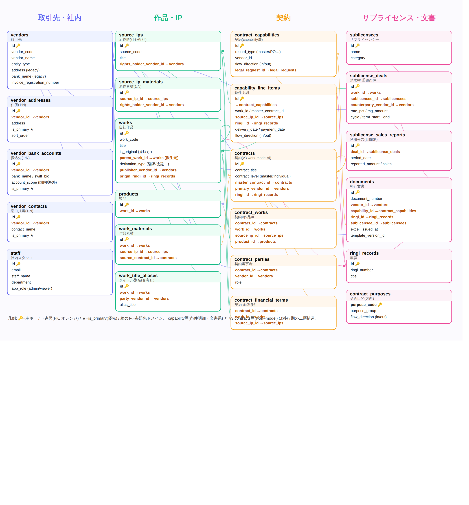
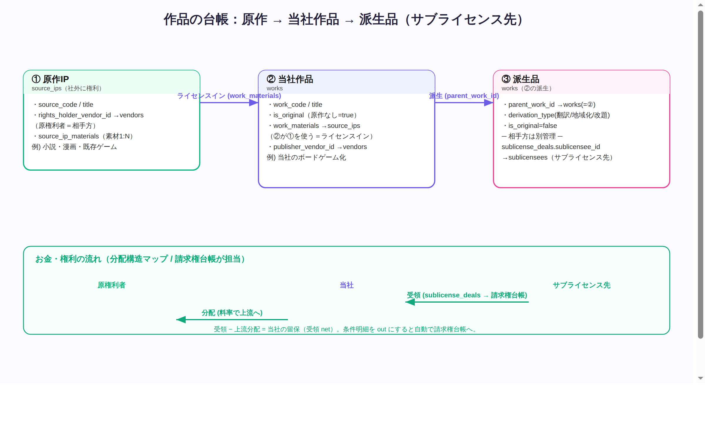
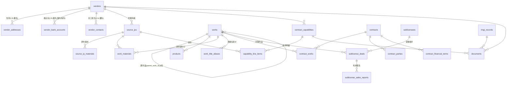

# LegalBridge AI — システム全体構造 & 運用マニュアル

法務文書（契約・発注・検収・ライセンス・サブライセンス受領）と、作品/IP・取引先・
お金（支払/受領）を一元管理するプラットフォームです。本書はシステム構造とデータ
モデル、各画面の使い方、典型業務フロー、CSV仕様をまとめたものです。

> 最終更新の主目的：契約とお金の整理（誰に・何を・いくら払う/受け取るか）を、
> 作品（原作→自社作品→派生）の系譜とともに台帳化する。

---

## 1. システム構成（アーキテクチャ）

3つの Cloud Run サービスで構成されます。

| サービス | 役割 | デプロイブランチ |
|---|---|---|
| **legalbridge-admin-ui** | 管理者向け React アプリ（編集・文書生成・各種台帳UI） | `main` |
| **legalbridge-search-api** | 読み取り系API＋検索ポータル（viewer向け）＋マスタ書込の正規実装 | `release/api` |
| **legalbridge-document-worker** | 文書生成（PDF）・ジョブ・一括取込・書込み系 | `release/worker` |

- **admin-ui（React）** は `apiRouter`（`src/lib/apiRouter.ts`）が `window.fetch` を
  インターセプトし、`/api/*` を search-api（READ）／worker（WRITE）に振り分けます。
  - 既定：GET → search-api、POST/PUT/PATCH/DELETE → worker。
  - 例外（マスタ書込・条件明細・請求権・作品モデル等）は search-api へ明示ルート。
- 認証はGCPの **IAP**（Google SSO）。アプリ側は `staff.app_role` で `admin`/`viewer` を判定。
  - **admin-ui = 管理者(admin)専用エディタ**、**viewer = search-api の検索ポータル**、という役割分担。
  - `ADMIN_UI_ENFORCE_ROLE=true`（既定OFF）で admin-ui を admin 限定ゲート化できる。
  - サービス間（admin-ui → search-api/worker）は共有シークレット `LB_PORTAL_SECRET`
    （`X-LB-PORTAL-SECRET`）で認証。

### 入口（ログイン後の動線）
- 未認証 → ブランドのログイン画面（Google SSO 導線）。
- **admin** → React admin-ui（`ADMIN_UI_URL`）。
- **viewer** → search-api の検索ポータル（取引先・契約検索／ひな型プレビュー等）。

---

## 2. データモデル（中核テーブル）

全65テーブルのうち、業務で扱う中核は以下。ドメイン別に整理します。

### 2.1 ER（中核ドメイン）

中核23テーブルの ER 図（画像）と、GitHub等でレンダリングできる Mermaid 版を併載します。

作品の3階層（原作→自社作品→派生）とお金の流れ：

### 2.2 主要テーブル

| ドメイン | テーブル | 要点 |
|---|---|---|
| 取引先 | `vendors` | 取引先本体。`address`/`bank_*` はレガシー単一カラム（メイン値のミラー）。 |
| 取引先 | `vendor_addresses` / `vendor_bank_accounts` / `vendor_contacts` | **1:N ＋ `is_primary`（★メイン）**。★がレガシー単一カラムへミラー→PDF/Excelに転記。口座は `account_scope`(国内/海外)＋SWIFT/IBAN等。 |
| 作品/IP | `source_ips`（＋`source_ip_materials`） | **原作IP**（社外に権利）。`rights_holder_vendor_id` が原権利者。 |
| 作品/IP | `works` | **自社作品**。`is_original`（原作なしの完全オリジナルか）、`parent_work_id`＋`derivation_type`（翻訳/版/改題/地域化/翻案）で派生系譜。 |
| 作品/IP | `work_materials` | 自社作品 ↔ 原作IP の紐付け（権利台帳）。 |
| 作品/IP | `work_title_aliases` | 他社/改題タイトルの名寄せ。 |
| 契約 | `contract_capabilities` ＋ `capability_line_items` | **capability層**（実務系：条件明細・発注書/検収書・文書発行）。`record_type`(master/purchase_order…)、`flow_direction`(in/out)、明細の `status_flags`（po_signed/**inspection_issued**/payment_exported）。 |
| 契約 | `contracts` ＋ `contract_works/parties/financial_terms` | **v3 work-model層**。作品モデルの契約。 |
| サブライセンス | `sublicensees` | サブライセンス先（相手方）マスタ。 |
| サブライセンス | `sublicense_deals` | **請求権の受領条件**（自社作品 × サブライセンシー × 料率/MG/周期）。種別＝サブライセンス/出版印税/ライセンスアウト/役務/その他。 |
| サブライセンス | `sublicense_sales_reports` | 期間別の利用報告。 |
| 文書 | `documents` | 発行文書（PDF）。`template_type`、`capability_id`（親PO等）、`excel_issued_at` 等。 |
| 共通 | `staff` / `ringi_records` / `contract_purposes` | 社内スタッフ（`app_role`）／稟議／契約目的(flow_direction)。 |

> **二層構造の注意**：契約は `contract_capabilities`（実務・伝票系）と `contracts`（v3 work-model）
> の2層があり移行期です。発注書・検収書・条件明細・文書発行は **capability層** を使います。

### 2.3 「向き(flow_direction)」と台帳の関係

- 条件明細（`capability_line_items`）は明細ごとに **in/out** を持ちます。
  - **in（当社が払う）** → 検収書・支払Excel側で処理。
  - **out（当社が受け取る）** → **請求権台帳（受領）へ自動取込**。
- 文書作成フォームの「請求の向き」2択（当社が払う/受け取る）が、この `flow_direction` を決めます。

---

## 3. 画面・機能マニュアル（admin-ui）

サイドバー：**Workspace**（Dashboard / New Document / Imports / Excel Export / 検収待ち /
Requests / Archive）、**Configuration**（Masters / Templates / Settings）。

### 3.1 文書作成（New Document）
1. **テンプレート**を選ぶ（発注書・検収書・各種契約・利用許諾・ロイヤリティ等）。
2. **請求の向き（必須・2択）**：当社が払う(in) / 当社が受け取る(out)。
   - 「当社が受け取る」は請求権台帳へ自動取込されます。
3. **担当者**・取引先・明細などを入力 → **生成**（PDF＋DB登録）。
4. **検収書**は親発注書を選ぶと、その発注書の明細が検収テーブルに展開され、
   **明細別の検収数量・歩留率・納品日**を入力できます（**分割検収**対応）。
   - 明細別の納品日は各行で編集でき、検収書PDF/会計Excelに反映されます。

### 3.2 マスター（Masters）

- **Vendors（取引先）**
  - 住所・振込先は **複数登録＋★メイン**（担当者と同方式）。★が帳票に転記。
  - 振込先は **国内/海外**切替（海外＝SWIFT/BIC・IBAN・英字名義・銀行所在国・通貨・中継銀行）。
  - インボイス登録番号（T番号）も登録。検収書Excelの「インボイス登録」列に出力。
  - CSV一括取込（search-api 側ページを別タブで開く）。
- **Staff（担当者・役割管理）**
  - カードに admin/viewer ロールピル。編集ダイアログで **役割（app_role）トグル**。
- **条件明細（capability_line_items 横断検索）**
  - 支払日/納期/種類/取引先/担当/キーワードで横断検索、CSV（選択/全件）。
  - 行クリックで **紐付け編集**（原作/作品/基本契約/稟議/**状態フラグ**/方向in-out）。
  - 状態フラグの **「検収書発行済(inspection_issued)」** をここで手動ON/OFFできます。
- **請求権(受領)台帳（sublicense）**
  - 上段：受領条件(deal) のCRUD（種別×相手方×料率/MG/前払/周期/期間、net試算）。
  - 下段：受領予定一覧（条件を各回に展開）＋請求状態（未請求/請求済/入金済）＋CSV。
  - 行クリックで利用報告（期間別）の登録/削除。利用報告 **CSV一括取込**（ドライラン対応）。
  - 起動時に条件明細(out)を自動取込（冪等）。
- **分配マップ（receivable-map）**
  - 作品中心の3層フロー：**上流(当社が分配)←当社←下流(当社が受領)**。
  - 系譜合計（受領/分配/留保）、派生コネクタ、タイトル別名（名寄せ）管理。
  - 他社/改題タイトルで作品検索（名寄せ）。
- **作品モデル（work-model / v3）**
  - **原作IP / 自社作品 / 契約** を作品軸でCRUD（スキーマ駆動フォーム＋詳細＋CSV取込）。
  - 自社作品は **親→派生のツリー表示**。派生元（親作品）は **検索付きピッカー**で選択。
  - 各作品から **🔀分配マップ / 💴受領条件を作成 / 🧬派生元を設定**。
  - **🔗紐付け待ちインボックス**：受領(deal)はあるが親作品(再許諾元)が未設定の作品を抽出。

### 3.3 検収待ち（Pending Inspections）
- **発注書はあるが検収書が未発行/未完了**のものを一覧。
- 判定は **未発行明細（`inspection_issued≠true` かつ 未完了）** が1つ以上ある発注書。
- 状態（未検収/一部検収%）・発注額/既検収/残額/検収率・**未発行明細数**・**取込バッジ**を表示。
- **個別**：「検収書を作成」→ 親発注書を事前選択した検収書フォームが開く。
- **一括**：チェック選択 → 「選択をまとめて検収」 → 共通の **検収日・検収者** を1回入力 →
  **未着手明細を残額全額で検収**して一括作成（PDFは既定で後生成キュー）。
  - 一部検収済・対象外（発行済）の明細はスキップ。

### 3.4 Excel出力（Excel Export）
- 「発行済みだが Excel 未出力」の検収書/利用許諾料計算書を、
  **種別 × 検収担当者 × 支払期日** ごとに **1ファイル複数行**で出力（Drive）。
- 出力済みは `excel_issued_at` が打刻され、再出力されません。
- 担当者・支払期日が異なれば別ファイル。

### 3.5 Imports（過去文書の登録・CSV一括）
- 発注書・各種契約・検収書などを **CSV一括取込**（v2統一 `/api/imports/v2/bulk`）。
- ドライラン → 結果確認 → 本番取込。サンプルCSVは各タブの「サンプルDL」から。

---

## 4. 典型業務フロー

### 4.1 発注 → 検収 → 支払
1. 発注書を作成（個別）または CSV一括取込（課題番号なしでもOK＝`IMPORT-…`）。
2. 「検収待ち」に未発行明細として出現。
3. 検収書を **個別**（親PO事前選択）または **一括**（共通設定・残額全額）で発行。
4. **完全検収（残額0）で明細が自動「発行済」** → 検収待ちから外れる。
5. 検収書を「Excel Export」で会計用にまとめ出力（担当者×支払期日）。

> 「この明細は検収書不要」は条件明細で `inspection_issued` を手動ONして待ち列から外す。

### 4.2 サブライセンス（当社が受領）
1. サブライセンス先 → **Sublicensees** マスタ。
2. サブライセンスする作品 → **作品モデル(works)**。
3. **請求権(受領)** で受領条件(deal) を作成（作品×相手方×料率/MG/周期）。
   - 作品モデルの作品カード **「💴受領条件を作成」** から、work_id 引き継ぎで起票可。
4. 受領予定が各回に展開 → 請求状態（未請求/請求済/入金済）を管理、利用報告で実額算定。

### 4.3 作品の系譜（原作 → 自社作品 → 派生）
- **原作（社外IP）** = `source_ips`。**自社作品** = `works`（原作紐付けは契約/条件明細の料率で分配計算）。
- **サブライセンス先の派生品** = `works` の派生レコード（`parent_work_id` で親に紐付け）。
  - 原作は親作品経由でチェーンするため、**派生品は親作品にだけ繋げばよい**。
  - 「作品名は分かるが親が未確定」→ まず登録 → **紐付け待ち**インボックス → 確認でき次第
    「🧬派生元を設定」で親を紐付け（検索付き、CSVは `parent_work_code` / `parent_work_title` でも可）。

---

## 5. CSVフォーマット仕様

### 5.1 作品（works）CSV
ヘッダ名は日本語/英語可・順不同。`title` 必須。`work_code` 空で自動採番（既存コードは更新）。

| 列 | 内容 |
|---|---|
| `title`（必須） | 作品名 |
| `work_code` | 作品コード（空で自動採番） |
| `work_type` | board_game / trpg_book / supplement / digital |
| `status` | planning / in_production / released / suspended / discontinued |
| `is_original` | 完全オリジナルか（true/1/はい/○…）。派生品は false |
| `parent_work_code` | 親作品コードで派生紐付け |
| `parent_work_title` | 親作品名で派生紐付け（コードを知らないとき） |
| `derivation_type` | translation / edition / title_change / localization / adaptation |
| `division` / `alternative_titles` | カンマ等区切り（複数） |
| `publisher_vendor_code` | 出版社の取引先コード |

- ドライランの結果に **「親解決(OK/未解決✗)」** と「親未解決 N」を表示。
- ドライランは未書込なので、**同一ファイル内で新規作成する親は解決されません**。
  親は先に取込む／親行を子行より上に置く。

### 5.2 発注書（purchase_order）CSV
1発注書 = 同じ `import_key` の行（ヘッダ1行＋明細N行）。`row_type` で種別切替。

- 共通（先頭行）：`import_key`(必須) / `record_type`=`purchase_order` / `contract_category`=`service` /
  `contract_title` / `document_number`(空で自動) / `vendor_code`(or `vendor_name`) /
  `tax_rate` / `due_date` / `issue_date_po` / `ringi_numbers` 等。
- 明細（`row_type=line`）：`line_no` / `item_name` / `quantity` / `unit_price` /
  `amount_ex_tax`（空なら数量×単価で自動） / `delivery_date` / `payment_date` /
  `calc_method`(FIXED/SUBSCRIPTION/ROYALTY) 等。
- 経費（`row_type=expense`）：`expense_name`(必須) / `amount_inc_tax` / `spent_date`。
- 手数料（`row_type=fee`）：`fee_name`(必須) / `amount`。
- 文字コードUTF-8、日付は `YYYY-MM-DD`。使う列だけ残せばよい（ヘッダ名で対応）。

### 5.3 利用報告（請求権台帳）CSV
- タイトル→作品→請求権(deal) に名寄せして期間別の利用報告を登録（ドライラン対応）。

---

## 6. 用語集

| 用語 | 意味 |
|---|---|
| 原作IP（source_ips） | 社外に権利がある原作（小説/漫画/既存ゲーム等）。 |
| 自社作品（works） | 当社の作品。`is_original`＝原作なしの完全オリジナルか。 |
| 派生（parent_work_id/derivation_type） | 自社作品の翻訳版/改題版/地域版 等の系譜。 |
| capability層 | `contract_capabilities`＋`capability_line_items`（実務・伝票系）。 |
| flow_direction（in/out） | 当社が払う(in)/受け取る(out)。out は請求権台帳へ。 |
| inspection_issued | 明細の「検収書発行済」フラグ（status_flags）。検収待ち制御の主キー。 |
| is_primary（★） | 住所/振込先/担当のメイン。帳票に転記。 |
| IMPORT-… | 課題番号なしで一括取込した文書の合成 issue_key（取込バッジ）。 |

---

## 7. 運用メモ（インフラ・有効化）

- **admin-ui を admin 限定で本番運用**する場合（任意）：
  1. admin-ui を IAP 配下化（`--no-allow-unauthenticated` + LB + IAP）。
  2. admin-ui Cloud Run に `LB_PORTAL_SECRET` を runtime バインド（/whoami・role解決用）。
  3. `ADMIN_UI_ENFORCE_ROLE=true` ＋ search-api に `ADMIN_UI_URL`。
  - 未設定の間は安全側（全通し・従来挙動）で動作。
- **search-api コンソール（旧admin HTML）** は React 移植後も様子見で並行稼働中。
  本番でReact各画面が安定したら撤去予定。
- **デプロイ**：admin-ui→`main`、search-api→`release/api`、worker→`release/worker`。
  feature ブランチで開発→各 release ブランチへマージで反映。

---

## 8. 主要エンドポイント早見

| 用途 | メソッド/パス | サービス |
|---|---|---|
| 契約/発注書 検索（検収進捗・未発行明細） | `GET /api/contracts/search?record_types=purchase_order` | search-api |
| 契約 詳細（明細・検収残・inspection_issued） | `GET /api/contracts/:id` | search-api |
| 条件明細 横断検索 / 紐付け更新 | `GET /api/conditions/search` / `PUT /api/conditions/:id/links` | search-api |
| 請求権(受領) deals/receipts/reports | `/api/sublicense/*` | search-api |
| 分配マップ | `/api/receivable-map/*` | search-api |
| 作品モデル v3 | `/api/v3/*`（取込：`/api/v3/import/:entity`） | search-api |
| 取引先 upsert | `POST /api/master/vendors` | search-api |
| 役割更新 | `PATCH /api/master/staff/:email/role` | search-api |
| 文書生成（PDF） | `POST /api/documents/generate` | worker |
| 一括取込（v2） | `POST /api/imports/v2/bulk` / `GET /api/imports/v2/templates` | worker |
| 一括検収 | `POST /api/imports/bulk/inspection` | worker |
| Excel バッチ | `GET /api/excel-batches/pending` / `POST /api/excel-batches/export` | worker |

---

*本書はシステムの現状に基づくスナップショットです。仕様変更時は更新してください。*
